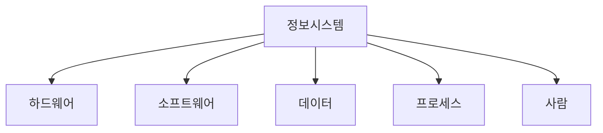
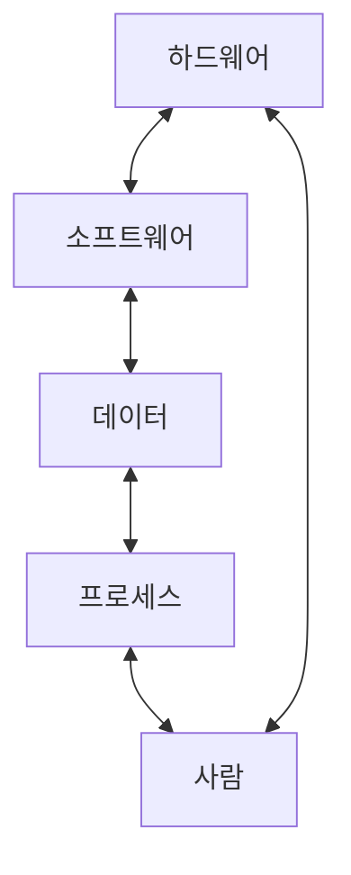

# 정보시스템의 구성요소

## 정보시스템의 기본 구성요소

### 개요
정보시스템은 여러 구성요소가 유기적으로 결합되어 작동하는 복합 시스템입니다. 이 장에서는 정보시스템의 5대 핵심 구성요소인 하드웨어, 소프트웨어, 데이터, 프로세스, 사람에 대해 살펴보고, 각 구성요소의 역할과 상호작용을 이해합니다.

### 정보시스템의 5대 구성요소

정보시스템은 다음 5가지 핵심 구성요소로 이루어져 있습니다:

#### 1. 하드웨어(Hardware)
하드웨어는 정보시스템의 물리적 구성요소로, 데이터를 입력, 처리, 출력, 저장하는 장치들을 포함합니다.

**주요 하드웨어 구성요소:**
- **입력 장치**: 키보드, 마우스, 스캐너, 센서 등
- **처리 장치**: CPU(중앙처리장치), GPU(그래픽처리장치) 등
- **출력 장치**: 모니터, 프린터, 스피커 등
- **저장 장치**: 하드 디스크, SSD, 메모리(RAM) 등
- **통신 장치**: 네트워크 카드, 라우터, 모뎀 등

**보안 관점에서의 하드웨어:**
- 물리적 접근 통제
- 하드웨어 장애 대비 이중화 구성
- 하드웨어 기반 암호화 모듈(HSM)
- 생체인식 장치

#### 2. 소프트웨어(Software)
소프트웨어는 하드웨어를 제어하고 데이터를 처리하는 프로그램과 절차의 집합입니다.

**소프트웨어의 분류:**
- **시스템 소프트웨어**: 운영체제, 드라이버, 유틸리티 등
- **응용 소프트웨어**: 워드프로세서, 스프레드시트, 데이터베이스 관리 시스템 등
- **미들웨어**: 운영체제와 응용 프로그램 사이에서 중개 역할을 하는 소프트웨어
- **보안 소프트웨어**: 방화벽, 백신, 침입탐지시스템(IDS) 등

**보안 관점에서의 소프트웨어:**
- 소프트웨어 취약점 관리
- 패치 및 업데이트 관리
- 안전한 소프트웨어 개발 방법론(SDL)
- 악성코드 대응

#### 3. 데이터(Data)
데이터는 정보시스템에서 처리되는 사실, 수치, 텍스트 등의 원시 자료와 이를 구조화한 정보를 의미합니다.

**데이터의 형태:**
- **구조화 데이터**: 관계형 데이터베이스에 저장된 데이터
- **비구조화 데이터**: 텍스트 문서, 이미지, 동영상 등
- **반구조화 데이터**: XML, JSON 등의 형식으로 저장된 데이터

**데이터 관리:**
- **데이터베이스 관리 시스템(DBMS)**: 데이터의 저장, 검색, 관리를 위한 시스템
- **데이터 웨어하우스**: 의사결정 지원을 위한 통합 데이터 저장소
- **빅데이터 플랫폼**: 대용량 데이터 처리 및 분석 플랫폼

**보안 관점에서의 데이터:**
- 데이터 암호화
- 접근 제어
- 데이터 백업 및 복구
- 개인정보 보호

#### 4. 프로세스(Process)
프로세스는 정보시스템 내에서 데이터를 처리하고 결과를 생성하는 일련의 활동과 절차를 의미합니다.

**프로세스의 유형:**
- **업무 프로세스**: 조직의 업무 수행을 위한 절차와 활동
- **시스템 프로세스**: 정보시스템 내부의 데이터 처리 절차
- **관리 프로세스**: 정보시스템의 운영 및 관리를 위한 절차

**프로세스 관리:**
- **비즈니스 프로세스 관리(BPM)**: 업무 프로세스의 설계, 실행, 모니터링, 최적화
- **워크플로우 관리**: 작업 흐름의 자동화 및 관리
- **프로세스 마이닝**: 실제 프로세스 실행 데이터를 분석하여 프로세스 개선

**보안 관점에서의 프로세스:**
- 프로세스 무결성 검증
- 권한 분리(Separation of Duties)
- 감사 추적(Audit Trail)
- 이상 행위 탐지

#### 5. 사람(People)
사람은 정보시스템을 설계, 개발, 운영, 사용하는 모든 인적 자원을 포함합니다.

**정보시스템 관련 역할:**
- **개발자**: 시스템 설계 및 개발
- **관리자**: 시스템 운영 및 관리
- **사용자**: 시스템 활용
- **보안 담당자**: 시스템 보안 관리

**인적 요소의 중요성:**
- 정보시스템의 효과적인 활용을 위한 교육 및 훈련
- 사용자 경험(UX) 설계
- 변화 관리 및 저항 극복

**보안 관점에서의 인적 요소:**
- 보안 인식 교육
- 내부자 위협 관리
- 사회공학적 공격 대응
- 접근 권한 관리

### 구성요소 간의 상호작용

정보시스템의 5대 구성요소는 독립적으로 존재하는 것이 아니라 상호 유기적으로 작용합니다.

- **하드웨어와 소프트웨어**: 소프트웨어는 하드웨어를 제어하고, 하드웨어는 소프트웨어를 실행
- **소프트웨어와 데이터**: 소프트웨어는 데이터를 처리하고, 데이터는 소프트웨어에 의해 의미를 가짐
- **데이터와 프로세스**: 프로세스는 데이터를 입력받아 처리하고 결과 데이터를 생성
- **프로세스와 사람**: 사람은 프로세스를 설계하고 실행하며, 프로세스는 사람의 업무를 지원
- **사람과 하드웨어**: 사람은 하드웨어를 조작하고, 하드웨어는 사람의 작업을 지원

### 정보시스템 구성요소와 보안

정보시스템의 각 구성요소는 보안 관점에서 다양한 위협과 취약점을 가질 수 있습니다. 따라서 정보보안은 모든 구성요소를 포괄하는 통합적인 접근이 필요합니다.

**통합 보안 관리:**
- **기술적 보안**: 하드웨어, 소프트웨어, 데이터 보안
- **관리적 보안**: 프로세스, 정책, 절차
- **물리적 보안**: 시설, 장비, 매체
- **인적 보안**: 교육, 인식, 책임

### 5가지 키워드로 정리하는 핵심 포인트
1. **하드웨어**: 정보시스템의 물리적 구성요소로 입력, 처리, 출력, 저장 장치 포함
2. **소프트웨어**: 하드웨어를 제어하고 데이터를 처리하는 프로그램과 절차의 집합
3. **데이터**: 정보시스템에서 처리되는 원시 자료와 이를 구조화한 정보
4. **프로세스**: 데이터를 처리하고 결과를 생성하는 일련의 활동과 절차
5. **사람**: 정보시스템을 설계, 개발, 운영, 사용하는 모든 인적 자원

### 확인 문제
1. 다음 중 정보시스템의 5대 구성요소가 아닌 것은?
   - [ ] 하드웨어
   - [ ] 소프트웨어
   - [ ] 네트워크
   - [ ] 프로세스

2. 정보시스템에서 데이터와 관련된 설명으로 옳지 않은 것은?
   - [ ] 데이터는 정보시스템에서 처리되는 원시 자료를 의미한다
   - [ ] 구조화 데이터는 관계형 데이터베이스에 저장된 데이터를 포함한다
   - [ ] 데이터 보안을 위해서는 암호화와 접근 제어가 중요하다
   - [ ] 데이터는 하드웨어의 일종으로 물리적 보안이 가장 중요하다

3. 정보시스템의 인적 구성요소(사람)와 관련된 보안 고려사항으로 가장 적절한 것은?
   - [ ] 하드웨어 이중화 구성
   - [ ] 소프트웨어 패치 관리
   - [ ] 보안 인식 교육 및 내부자 위협 관리
   - [ ] 데이터 암호화 및 백업

> [정답 및 해설 보기](../answers_and_explanations.md#01-1-2)

### [목차로 돌아가기](./01-1_정보시스템_개요.md)
