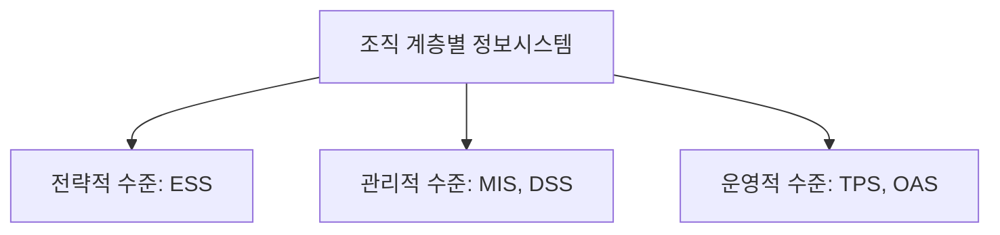
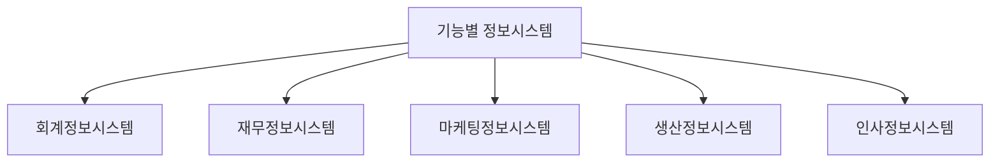

# 정보시스템의 유형

## 다양한 정보시스템 유형과 특징

### 개요
정보시스템은 조직의 다양한 계층과 기능에 따라 여러 유형으로 분류됩니다. 이 장에서는 조직 계층별 정보시스템, 기능별 정보시스템, 그리고 최신 정보시스템 유형에 대해 살펴보고, 각 유형의 특징과 보안 고려사항을 이해합니다.

### 조직 계층별 정보시스템

조직의 계층 구조에 따라 정보시스템은 다음과 같이 분류됩니다:

#### 1. 전략적 수준의 정보시스템
전략적 수준의 정보시스템은 최고 경영층이 장기적인 의사결정을 내리는 데 필요한 정보를 제공합니다.

**주요 유형:**
- **경영자정보시스템(EIS: Executive Information System)**: 최고 경영자에게 조직의 전반적인 성과와 외부 환경에 대한 요약 정보 제공
- **전략정보시스템(SIS: Strategic Information System)**: 조직의 경쟁 우위를 확보하기 위한 전략적 의사결정 지원

**특징:**
- 비구조적이고 불확실한 문제 해결
- 외부 환경 정보와 내부 정보의 통합
- 장기적 계획 수립 지원
- 요약된 정보와 그래픽 중심의 인터페이스

**보안 고려사항:**
- 고위 경영진 정보에 대한 엄격한 접근 통제
- 전략적 정보의 기밀성 보장
- 외부 데이터 소스의 신뢰성 검증

#### 2. 관리적 수준의 정보시스템
관리적 수준의 정보시스템은 중간 관리자가 전술적 의사결정을 내리는 데 필요한 정보를 제공합니다.

**주요 유형:**
- **관리정보시스템(MIS: Management Information System)**: 조직의 성과, 자원 활용, 운영 효율성에 대한 정보 제공
- **의사결정지원시스템(DSS: Decision Support System)**: 반구조적 문제 해결을 위한 분석 도구와 모델 제공
- **그룹의사결정지원시스템(GDSS: Group Decision Support System)**: 그룹 의사결정 프로세스 지원

**특징:**
- 구조적 및 반구조적 문제 해결
- 정기적인 보고서와 예외 보고서 생성
- 내부 데이터 중심의 분석
- 중기적 계획 및 통제 지원

**보안 고려사항:**
- 부서 간 정보 공유의 적절한 통제
- 의사결정 모델의 무결성 보장
- 분석 결과의 정확성 검증

#### 3. 운영적 수준의 정보시스템
운영적 수준의 정보시스템은 일상적인 업무 처리와 관련된 정보를 제공합니다.

**주요 유형:**
- **거래처리시스템(TPS: Transaction Processing System)**: 일상적인 비즈니스 거래 처리 및 기록
- **사무자동화시스템(OAS: Office Automation System)**: 문서 작성, 일정 관리, 통신 등 사무 업무 자동화
- **프로세스제어시스템(PCS: Process Control System)**: 생산 공정이나 물리적 프로세스 제어

**특징:**
- 구조화된 반복적 업무 처리
- 대량의 상세 데이터 처리
- 실시간 처리 요구
- 일상적 운영 지원

**보안 고려사항:**
- 거래 데이터의 무결성 보장
- 시스템 가용성 확보
- 사용자 인증 및 권한 관리
- 감사 추적 기록 유지

### 기능별 정보시스템

조직의 기능 영역에 따라 정보시스템은 다음과 같이 분류됩니다:

#### 1. 회계정보시스템(AIS: Accounting Information System)
회계정보시스템은 조직의 재무 거래를 기록, 처리, 보고하는 시스템입니다.

**주요 기능:**
- 일반 회계 및 원장 관리
- 매출 및 매입 관리
- 자산 관리
- 재무제표 작성

**보안 고려사항:**
- 재무 데이터의 무결성 및 정확성 보장
- 회계 감사 지원을 위한 감사 추적
- 재무 정보에 대한 접근 통제

#### 2. 재무정보시스템(FIS: Financial Information System)
재무정보시스템은 조직의 자금 흐름, 투자, 재무 계획을 관리하는 시스템입니다.

**주요 기능:**
- 현금 흐름 관리
- 투자 분석
- 재무 계획 및 예측
- 위험 관리

**보안 고려사항:**
- 금융 거래의 보안
- 민감한 재무 정보의 기밀성
- 규제 준수 지원

#### 3. 마케팅정보시스템(MKIS: Marketing Information System)
마케팅정보시스템은 시장 조사, 제품 개발, 판매, 광고 등 마케팅 활동을 지원하는 시스템입니다.

**주요 기능:**
- 시장 조사 및 분석
- 고객 관계 관리
- 판매 예측
- 마케팅 캠페인 관리

**보안 고려사항:**
- 고객 데이터 보호
- 개인정보 규제 준수
- 경쟁 정보의 기밀성 유지

#### 4. 생산정보시스템(PIS: Production Information System)
생산정보시스템은 제품 생산, 품질 관리, 재고 관리 등 생산 활동을 지원하는 시스템입니다.

**주요 기능:**
- 생산 계획 및 일정 관리
- 재고 관리
- 품질 관리
- 공급망 관리

**보안 고려사항:**
- 생산 시스템의 가용성 확보
- 산업 제어 시스템 보안
- 지적 재산 보호

#### 5. 인사정보시스템(HRIS: Human Resource Information System)
인사정보시스템은 직원 채용, 교육, 평가, 보상 등 인적 자원 관리를 지원하는 시스템입니다.

**주요 기능:**
- 직원 정보 관리
- 급여 및 복리후생 관리
- 성과 평가
- 교육 및 경력 개발

**보안 고려사항:**
- 직원 개인정보 보호
- 급여 정보의 기밀성
- 인사 기록의 무결성 유지

### 최신 정보시스템 유형

기술 발전에 따라 새로운 유형의 정보시스템이 등장하고 있습니다:

#### 1. 전사적자원관리(ERP: Enterprise Resource Planning)
ERP는 조직의 모든 기능 영역을 통합하여 관리하는 시스템입니다.

**특징:**
- 조직 전체 프로세스의 통합
- 중앙 집중식 데이터베이스
- 모듈식 구조
- 실시간 정보 제공

**보안 고려사항:**
- 통합 시스템에 대한 접근 통제
- 모듈 간 데이터 흐름의 보안
- 대규모 시스템의 취약점 관리

#### 2. 고객관계관리(CRM: Customer Relationship Management)
CRM은 고객과의 관계를 관리하고 개선하기 위한 시스템입니다.

**특징:**
- 고객 데이터 통합 관리
- 고객 상호작용 추적
- 고객 세분화 및 타겟팅
- 고객 서비스 개선

**보안 고려사항:**
- 고객 데이터 보호
- 개인정보보호법 준수
- 고객 정보의 안전한 공유

#### 3. 공급망관리(SCM: Supply Chain Management)
SCM은 원자재 조달부터 최종 제품 배송까지의 전체 공급망을 관리하는 시스템입니다.

**특징:**
- 공급업체, 제조업체, 유통업체 간 협업
- 재고 최적화
- 물류 및 배송 관리
- 수요 예측

**보안 고려사항:**
- 파트너 간 정보 공유의 보안
- 공급망 가시성과 보안의 균형
- 외부 연결의 보안 관리

#### 4. 지식관리시스템(KMS: Knowledge Management System)
KMS는 조직 내 지식의 생성, 공유, 활용을 지원하는 시스템입니다.

**특징:**
- 암묵적 지식의 명시적 지식화
- 지식 저장소 구축
- 협업 및 지식 공유 촉진
- 학습 조직 지원

**보안 고려사항:**
- 지적 재산 보호
- 지식 접근 권한 관리
- 외부 유출 방지

#### 5. 빅데이터 분석 시스템
빅데이터 분석 시스템은 대량의 구조화/비구조화 데이터를 처리하고 분석하는 시스템입니다.

**특징:**
- 대용량 데이터 처리
- 실시간 분석
- 다양한 데이터 소스 통합
- 예측 분석 및 패턴 발견

**보안 고려사항:**
- 대규모 데이터의 보안
- 데이터 프라이버시 보호
- 분석 결과의 오용 방지

#### 6. 인공지능 기반 시스템
인공지능 기반 시스템은 기계학습, 자연어 처리 등의 기술을 활용하여 지능적인 의사결정을 지원하는 시스템입니다.

**특징:**
- 자동화된 의사결정
- 패턴 인식 및 예측
- 자연어 처리 및 이해
- 지속적 학습 및 개선

**보안 고려사항:**
- 알고리즘 편향성 관리
- AI 모델의 무결성 보장
- 적대적 공격 대응

### 정보시스템 유형과 보안 관계

각 정보시스템 유형에 따라 보안 요구사항과 위협이 다르게 나타납니다. 정보시스템의 유형을 이해하는 것은 적절한 보안 통제를 설계하고 구현하는 데 중요합니다.

**보안 설계 고려사항:**
- 시스템의 중요도와 민감도 평가
- 처리되는 데이터의 유형과 가치 파악
- 사용자 그룹과 접근 요구사항 분석
- 시스템 간 연결 및 통합 지점 식별

### 5가지 키워드로 정리하는 핵심 포인트
1. **계층별 분류**: 전략적, 관리적, 운영적 수준에 따른 정보시스템 분류
2. **기능별 분류**: 회계, 재무, 마케팅, 생산, 인사 등 기능 영역별 정보시스템
3. **통합 시스템**: ERP, CRM, SCM 등 여러 기능을 통합하는 현대적 정보시스템
4. **지능형 시스템**: 빅데이터, 인공지능 등 고급 분석 기능을 제공하는 시스템
5. **맞춤형 보안**: 각 정보시스템 유형에 맞는 특화된 보안 통제 필요

### 확인 문제
1. 다음 중 전략적 수준의 정보시스템으로 가장 적절한 것은?
    - [ ] 거래처리시스템(TPS)
    - [ ] 관리정보시스템(MIS)
    - [ ] 경영자정보시스템(EIS)
    - [ ] 사무자동화시스템(OAS)

2. 조직의 모든 기능 영역을 통합하여 관리하는 시스템은?
    - [ ] 의사결정지원시스템(DSS)
    - [ ] 전사적자원관리(ERP)
    - [ ] 지식관리시스템(KMS)
    - [ ] 공급망관리(SCM)

3. 다음 중 인사정보시스템(HRIS)의 보안 고려사항으로 가장 중요한 것은?
    - [ ] 생산 시스템의 가용성 확보
    - [ ] 재무 데이터의 무결성 보장
    - [ ] 직원 개인정보 보호
    - [ ] 고객 데이터 보호

> [정답 및 해설 보기](../answers_and_explanations.md#01-1-3)
