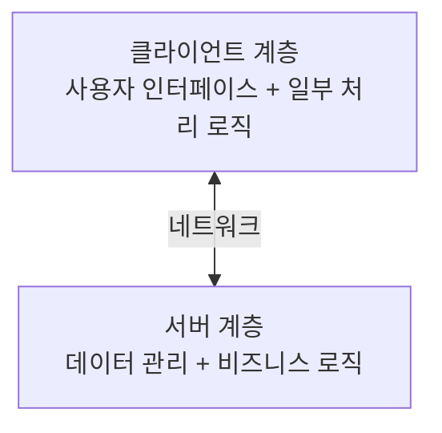
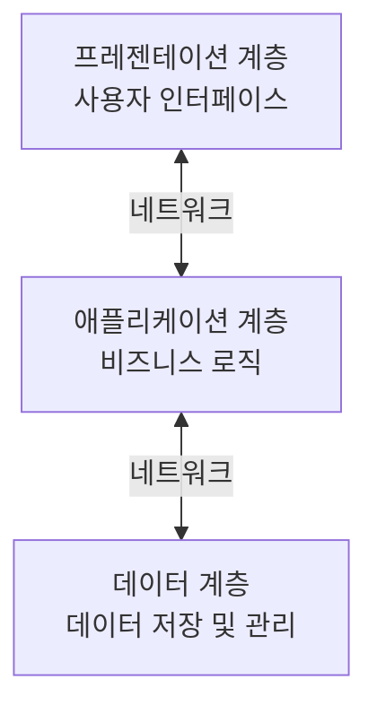

# 클라이언트-서버 아키텍처

## 정보시스템 아키텍처의 기본 구조

### 개요
클라이언트-서버 아키텍처는 네트워크 기반 정보시스템의 가장 기본적인 구조로, 서비스를 요청하는 클라이언트와 서비스를 제공하는 서버로 구성됩니다. 이 장에서는 클라이언트-서버 아키텍처의 개념, 구성요소, 특징, 그리고 보안 고려사항에 대해 살펴봅니다.

### 클라이언트-서버 아키텍처의 개념

클라이언트-서버 아키텍처는 컴퓨팅 자원과 책임을 클라이언트와 서버라는 두 가지 주요 구성요소로 분리하는 네트워크 아키텍처 모델입니다. 이 모델에서 클라이언트는 서비스를 요청하고, 서버는 해당 요청에 대한 서비스를 제공합니다.

#### 클라이언트(Client)
클라이언트는 사용자 인터페이스를 제공하고 서버에 서비스를 요청하는 애플리케이션입니다.

**클라이언트의 특징:**
- 사용자와 직접 상호작용
- 서비스 요청 생성 및 전송
- 서버로부터 받은 응답 처리 및 표시
- 일부 처리 로직 수행 (클라이언트의 역할에 따라 다름)

**클라이언트의 유형:**
- **씬 클라이언트(Thin Client)**: 최소한의 처리 기능만 수행하고 대부분의 처리를 서버에 의존
- **팻 클라이언트(Fat Client)**: 상당한 처리 기능을 자체적으로 수행
- **모바일 클라이언트**: 모바일 기기에서 실행되는 클라이언트
- **웹 클라이언트**: 웹 브라우저를 통해 서비스에 접근하는 클라이언트

#### 서버(Server)
서버는 클라이언트의 요청을 처리하고 적절한 서비스를 제공하는 시스템입니다.

**서버의 특징:**
- 다수의 클라이언트 요청 처리
- 데이터 관리 및 저장
- 비즈니스 로직 처리
- 자원 공유 및 관리

**서버의 유형:**
- **파일 서버**: 파일 저장 및 공유 서비스 제공
- **데이터베이스 서버**: 데이터베이스 관리 및 쿼리 처리
- **애플리케이션 서버**: 비즈니스 로직 처리 및 애플리케이션 실행
- **웹 서버**: HTTP 요청 처리 및 웹 페이지 제공
- **메일 서버**: 이메일 송수신 서비스 제공
- **프린트 서버**: 프린터 자원 관리 및 인쇄 작업 처리

### 클라이언트-서버 아키텍처의 계층 구조

클라이언트-서버 아키텍처는 기능적 책임에 따라 여러 계층으로 구성될 수 있습니다.

#### 2-계층 아키텍처(2-Tier Architecture)
가장 기본적인 형태로, 클라이언트와 서버 두 계층으로 구성됩니다.

**특징:**
- 구현이 간단하고 직관적
- 소규모 애플리케이션에 적합
- 클라이언트에 많은 로직이 포함될 경우 유지보수 어려움
- 확장성 제한

#### 3-계층 아키텍처(3-Tier Architecture)
기능을 세 개의 계층으로 분리한 구조입니다.

**계층별 역할:**
- **프레젠테이션 계층(Presentation Tier)**: 사용자 인터페이스 제공
- **애플리케이션 계층(Application Tier)**: 비즈니스 로직 처리
- **데이터 계층(Data Tier)**: 데이터 저장 및 관리

**특징:**
- 각 계층의 독립적 개발 및 유지보수 가능
- 확장성 향상
- 보안 강화 (계층 간 접근 제어)
- 구현 복잡성 증가

#### 다중 계층 아키텍처(N-Tier Architecture)
3-계층 이상으로 기능을 더 세분화한 구조입니다.

**추가 가능한 계층:**
- **통합 계층**: 다양한 시스템과의 연동
- **캐싱 계층**: 성능 향상을 위한 데이터 캐싱
- **보안 계층**: 인증 및 권한 부여 처리

**특징:**
- 고도의 모듈화
- 유연한 확장성
- 복잡한 시스템에 적합
- 구현 및 관리 복잡성 증가

### 클라이언트-서버 아키텍처의 장단점

#### 장점
- **자원의 중앙 집중화**: 서버에서 자원을 중앙 관리하여 효율성 향상
- **역할 분담**: 클라이언트와 서버 간 명확한 역할 분담으로 개발 및 유지보수 용이
- **확장성**: 클라이언트나 서버를 독립적으로 확장 가능
- **보안 강화**: 중요 데이터와 로직을 서버에 집중하여 보안 강화 가능

#### 단점
- **서버 의존성**: 서버 장애 시 전체 시스템 영향
- **네트워크 의존성**: 네트워크 문제 발생 시 서비스 중단
- **비용**: 서버 인프라 구축 및 유지 비용 발생
- **복잡성**: 분산 환경 관리의 복잡성

### 클라이언트-서버 아키텍처의 보안 고려사항

클라이언트-서버 아키텍처에서는 다음과 같은 보안 고려사항이 중요합니다:

#### 클라이언트 측 보안
- **입력 유효성 검증**: 사용자 입력에 대한 적절한 검증
- **클라이언트 인증**: 정당한 사용자만 접근할 수 있도록 인증
- **데이터 암호화**: 민감한 데이터의 로컬 저장 시 암호화
- **악성코드 방지**: 클라이언트 시스템의 악성코드 감염 방지

#### 서버 측 보안
- **접근 제어**: 권한에 따른 자원 접근 통제
- **인증 및 권한 부여**: 사용자 신원 확인 및 권한 관리
- **데이터 보호**: 저장 데이터 암호화 및 백업
- **취약점 관리**: 정기적인 보안 패치 및 업데이트

#### 통신 보안
- **전송 데이터 암호화**: SSL/TLS 등을 이용한 데이터 전송 암호화
- **세션 관리**: 안전한 세션 생성 및 관리
- **방화벽 구성**: 불필요한 포트 차단 및 트래픽 필터링
- **침입 탐지/방지**: 비정상 접근 시도 탐지 및 차단

### 클라이언트-서버 아키텍처의 현대적 응용

#### 웹 애플리케이션
웹 브라우저(클라이언트)와 웹 서버 간의 상호작용을 기반으로 하는 애플리케이션입니다.

**특징:**
- HTTP/HTTPS 프로토콜 사용
- 브라우저 기반 인터페이스
- REST API를 통한 통신
- 상태 비저장(Stateless) 특성

#### 모바일 애플리케이션
모바일 기기(클라이언트)와 백엔드 서버 간의 상호작용을 기반으로 하는 애플리케이션입니다.

**특징:**
- 네이티브 또는 하이브리드 클라이언트
- 오프라인 작동 지원
- 푸시 알림 활용
- 자원 제약 환경 고려

#### 클라우드 기반 서비스
클라우드 환경에서 제공되는 클라이언트-서버 서비스입니다.

**특징:**
- 탄력적 확장성
- 서버리스 아키텍처 활용
- 마이크로서비스 구조
- 컨테이너 기술 활용

### 5가지 키워드로 정리하는 핵심 포인트
1. **역할 분담**: 클라이언트는 요청과 표시, 서버는 처리와 응답을 담당하는 명확한 역할 구분
2. **계층 구조**: 2-계층, 3-계층, 다중 계층 등 기능적 책임에 따른 다양한 구조 가능
3. **확장성**: 클라이언트와 서버를 독립적으로 확장할 수 있는 유연한 구조
4. **중앙 집중화**: 데이터와 비즈니스 로직의 중앙 관리로 일관성과 보안 강화
5. **보안 고려사항**: 클라이언트, 서버, 통신 각 영역별 특화된 보안 대책 필요

### 확인 문제
1. 클라이언트-서버 아키텍처에서 최소한의 처리 기능만 수행하고 대부분의 처리를 서버에 의존하는 클라이언트 유형은?
    - [ ] 팻 클라이언트(Fat Client)
    - [ ] 씬 클라이언트(Thin Client)
    - [ ] 하이브리드 클라이언트(Hybrid Client)
    - [ ] 모바일 클라이언트(Mobile Client)

2. 다음 중 3-계층 아키텍처의 구성 요소가 아닌 것은?
    - [ ] 프레젠테이션 계층(Presentation Tier)
    - [ ] 애플리케이션 계층(Application Tier)
    - [ ] 데이터 계층(Data Tier)
    - [ ] 통합 계층(Integration Tier)

3. 클라이언트-서버 아키텍처의 보안 고려사항으로 가장 적절하지 않은 것은?
    - [ ] 전송 데이터 암호화
    - [ ] 사용자 인증 및 권한 부여
    - [ ] 물리적 보안 장치 설치
    - [ ] 입력 유효성 검증

> [정답 및 해설 보기](../answers_and_explanations.md#01-2-1)
