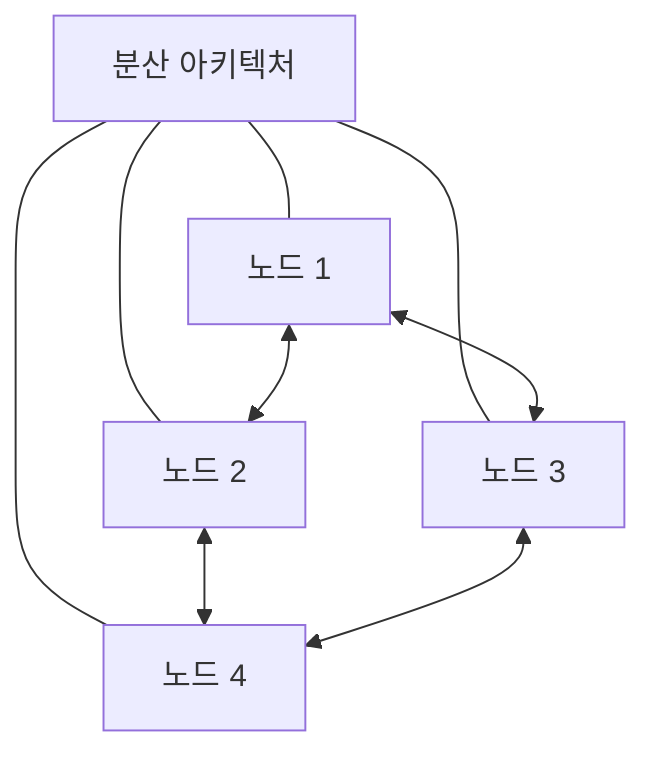
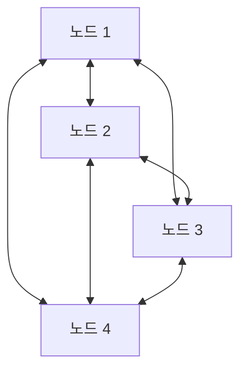
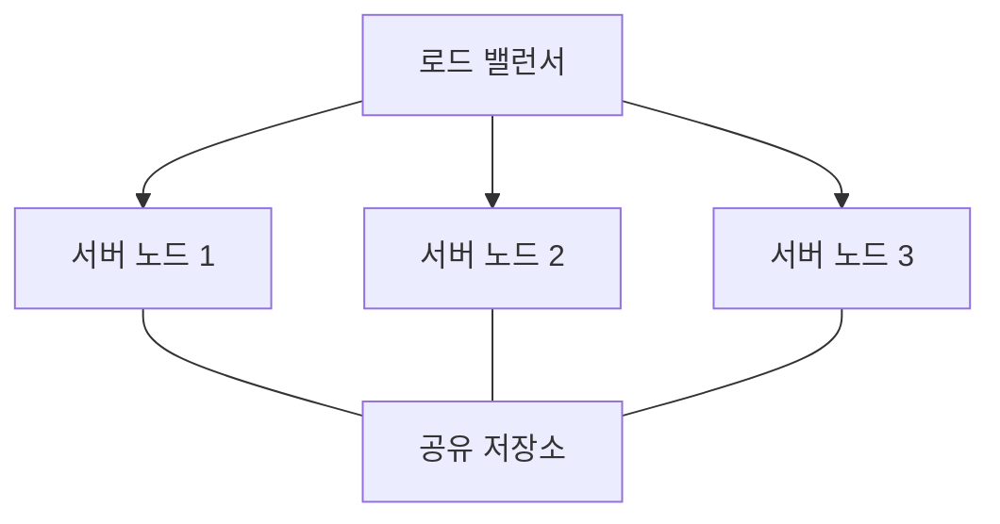
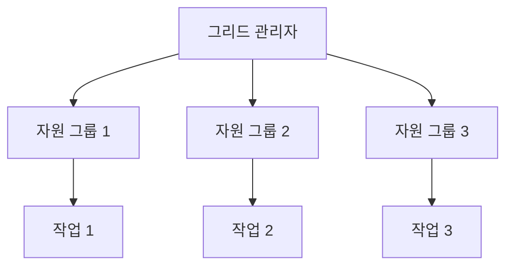
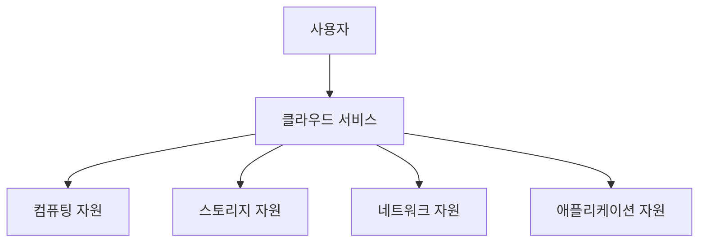
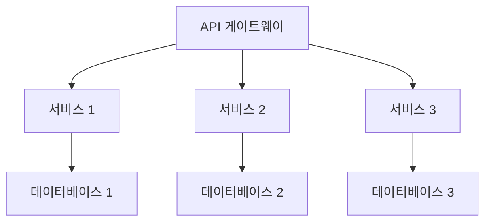

# 분산 아키텍처

## 정보시스템 아키텍처의 분산 구조

### 개요
분산 아키텍처는 여러 독립적인 컴퓨터 시스템이 네트워크를 통해 연결되어 하나의 통합된 시스템처럼 동작하는 구조입니다. 이 장에서는 분산 아키텍처의 개념, 유형, 특징, 그리고 보안 고려사항에 대해 살펴봅니다.

### 분산 아키텍처의 개념

분산 아키텍처(Distributed Architecture)는 물리적으로 분리된 여러 컴퓨팅 노드가 네트워크를 통해 연결되어 논리적으로 하나의 시스템처럼 작동하는 컴퓨팅 구조입니다. 각 노드는 독립적인 처리 능력을 가지며, 전체 시스템의 작업을 분담하여 처리합니다.

#### 분산 시스템의 특성
분산 시스템은 다음과 같은 주요 특성을 가집니다:

- **자원 공유**: 하드웨어, 소프트웨어, 데이터 등의 자원을 여러 노드가 공유
- **투명성**: 사용자에게 시스템의 분산 특성이 보이지 않음(위치 투명성, 복제 투명성 등)
- **확장성**: 필요에 따라 노드를 추가하여 시스템 용량 확장 가능
- **결함 허용**: 일부 노드의 장애가 전체 시스템 장애로 이어지지 않음
- **동시성**: 여러 프로세스가 동시에 실행 가능
- **개방성**: 다양한 하드웨어와 소프트웨어 플랫폼 간의 상호운용성

### 분산 아키텍처의 유형

분산 아키텍처는 구성 방식과 목적에 따라 다양한 유형으로 분류됩니다.

#### 1. 피어-투-피어(P2P) 아키텍처
모든 노드가 동등한 권한과 책임을 가지며, 중앙 서버 없이 직접 통신하는 구조입니다.

**특징:**
- 중앙 서버 의존성 없음
- 높은 확장성과 내결함성
- 자원 발견 및 관리의 복잡성
- 보안 및 신뢰 관리의 어려움

**응용 사례:**
- 파일 공유 시스템(BitTorrent)
- 블록체인 네트워크
- 분산 컴퓨팅 프로젝트(SETI@home)

#### 2. 클러스터 아키텍처
동일하거나 유사한 기능을 수행하는 여러 노드가 하나의 시스템처럼 작동하는 구조입니다.

**특징:**
- 고가용성 및 부하 분산
- 확장성 및 성능 향상
- 단일 시스템 이미지 제공
- 노드 간 상태 동기화 필요

**응용 사례:**
- 웹 서버 클러스터
- 데이터베이스 클러스터
- 고성능 컴퓨팅(HPC) 클러스터

#### 3. 그리드 컴퓨팅
지리적으로 분산된 이질적인 컴퓨팅 자원을 통합하여 대규모 계산 작업을 수행하는 구조입니다.

**특징:**
- 지리적으로 분산된 자원 활용
- 이질적인 시스템 통합
- 대규모 계산 작업 처리
- 자원 관리 및 스케줄링 중요

**응용 사례:**
- 과학 연구 시뮬레이션
- 기상 예측
- 금융 모델링

#### 4. 클라우드 컴퓨팅
인터넷을 통해 컴퓨팅 자원을 서비스로 제공하는 분산 아키텍처입니다.

**특징:**
- 서비스로서의 자원 제공(XaaS)
- 탄력적 확장성
- 사용량 기반 과금
- 가상화 기술 활용

**서비스 모델:**
- IaaS(Infrastructure as a Service)
- PaaS(Platform as a Service)
- SaaS(Software as a Service)

#### 5. 마이크로서비스 아키텍처
애플리케이션을 독립적으로 배포 가능한 작은 서비스들로 분해하는 구조입니다.

**특징:**
- 서비스별 독립적 개발 및 배포
- 기술 다양성 허용
- 서비스 간 느슨한 결합
- 복잡한 서비스 관리 및 모니터링

**응용 사례:**
- 대규모 웹 애플리케이션
- 전자상거래 플랫폼
- 콘텐츠 스트리밍 서비스

### 분산 아키텍처의 주요 구성요소

분산 아키텍처는 다음과 같은 주요 구성요소로 이루어집니다:

#### 1. 분산 처리 시스템
여러 프로세서가 작업을 분담하여 처리하는 시스템입니다.

**주요 기술:**
- 병렬 처리
- 분산 알고리즘
- 작업 스케줄링
- 부하 분산

#### 2. 분산 데이터 관리
데이터를 여러 노드에 분산 저장하고 관리하는 시스템입니다.

**주요 기술:**
- 데이터 분할(Sharding)
- 데이터 복제(Replication)
- 분산 트랜잭션
- 데이터 일관성 관리

#### 3. 분산 통신
노드 간 메시지 교환 및 조정을 위한 통신 시스템입니다.

**주요 기술:**
- 원격 프로시저 호출(RPC)
- 메시지 큐
- 발행-구독(Pub-Sub) 모델
- 서비스 디스커버리

#### 4. 분산 동기화
여러 노드 간의 작업 조정 및 상태 일관성을 유지하는 메커니즘입니다.

**주요 기술:**
- 분산 락(Distributed Lock)
- 합의 알고리즘(Consensus Algorithm)
- 벡터 클럭(Vector Clock)
- 분산 트랜잭션 조정

### 분산 아키텍처의 장단점

#### 장점
- **확장성**: 필요에 따라 노드를 추가하여 시스템 용량 확장 가능
- **내결함성**: 일부 노드 장애 시에도 시스템 전체 기능 유지
- **성능 향상**: 병렬 처리를 통한 처리 속도 향상
- **자원 활용 최적화**: 유휴 자원의 효율적 활용
- **지리적 분산**: 물리적으로 분산된 환경에서 서비스 제공 가능

#### 단점
- **복잡성**: 설계, 구현, 관리의 복잡성 증가
- **네트워크 의존성**: 네트워크 장애에 취약
- **일관성 유지 어려움**: 분산된 데이터의 일관성 보장 어려움
- **보안 관리 복잡**: 다수의 노드에 대한 보안 관리 어려움
- **디버깅 어려움**: 분산 환경에서의 문제 추적 및 디버깅 복잡

### 분산 아키텍처의 보안 고려사항

분산 아키텍처에서는 다음과 같은 보안 고려사항이 중요합니다:

#### 1. 인증 및 권한 부여
분산 환경에서의 사용자 및 서비스 인증과 권한 관리입니다.

**주요 기술:**
- 중앙집중식 인증(SSO)
- 토큰 기반 인증(JWT, OAuth)
- 분산 ID 관리
- 세분화된 접근 제어

#### 2. 데이터 보안
분산 저장된 데이터의 보안을 보장하는 메커니즘입니다.

**주요 기술:**
- 저장 데이터 암호화
- 전송 데이터 암호화(TLS/SSL)
- 데이터 마스킹
- 안전한 키 관리

#### 3. 네트워크 보안
분산 노드 간 통신의 보안을 보장하는 메커니즘입니다.

**주요 기술:**
- 네트워크 분리(세그먼테이션)
- 방화벽 및 침입 탐지/방지
- VPN 및 보안 터널링
- API 보안

#### 4. 감사 및 모니터링
분산 환경에서의 보안 이벤트 추적 및 모니터링입니다.

**주요 기술:**
- 중앙집중식 로깅
- 실시간 모니터링
- 이상 탐지
- 포렌식 분석

#### 5. 내결함성 보안
장애 상황에서도 보안을 유지하는 메커니즘입니다.

**주요 기술:**
- 보안 장애 복구
- 안전한 상태 전환
- 보안 정책 일관성 유지
- 장애 시 최소 권한 원칙 적용

### 분산 아키텍처의 현대적 응용

#### 1. 엣지 컴퓨팅
데이터 처리를 중앙 데이터 센터가 아닌 데이터 소스 근처에서 수행하는 분산 아키텍처입니다.

**특징:**
- 지연 시간 감소
- 대역폭 사용 최적화
- 로컬 데이터 처리
- IoT 장치와의 통합

#### 2. 서버리스 컴퓨팅
인프라 관리 없이 코드 실행에만 집중할 수 있는 클라우드 기반 분산 아키텍처입니다.

**특징:**
- 이벤트 기반 실행
- 자동 확장
- 사용량 기반 과금
- 인프라 추상화

#### 3. 컨테이너 오케스트레이션
컨테이너화된 애플리케이션의 배포, 관리, 확장을 자동화하는 분산 아키텍처입니다.

**특징:**
- 선언적 구성
- 자동 확장 및 복구
- 서비스 디스커버리
- 부하 분산

### 5가지 키워드로 정리하는 핵심 포인트
1. **분산 처리**: 여러 노드가 작업을 분담하여 처리하는 구조
2. **확장성**: 필요에 따라 노드를 추가하여 시스템 용량 확장 가능
3. **내결함성**: 일부 노드 장애 시에도 시스템 전체 기능 유지
4. **다양한 유형**: P2P, 클러스터, 그리드, 클라우드, 마이크로서비스 등 다양한 구현 방식
5. **보안 복잡성**: 분산 환경에서의 인증, 데이터 보안, 네트워크 보안 등 복잡한 보안 요구사항

### 확인 문제
1. 다음 중 분산 아키텍처의 특성이 아닌 것은?
    - [ ] 자원 공유
    - [ ] 확장성
    - [ ] 중앙 집중식 제어
    - [ ] 내결함성

2. 모든 노드가 동등한 권한과 책임을 가지며, 중앙 서버 없이 직접 통신하는 분산 아키텍처는?
    - [ ] 클러스터 아키텍처
    - [ ] 피어-투-피어(P2P) 아키텍처
    - [ ] 그리드 컴퓨팅
    - [ ] 마이크로서비스 아키텍처

3. 분산 아키텍처에서 데이터 관리와 관련된 기술이 아닌 것은?
    - [ ] 데이터 분할(Sharding)
    - [ ] 데이터 복제(Replication)
    - [ ] 분산 트랜잭션
    - [ ] 원격 프로시저 호출(RPC)

> [정답 및 해설 보기](../answers_and_explanations.md#01-2-2)
