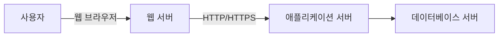
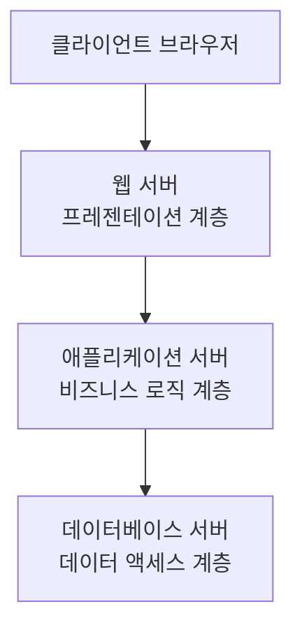
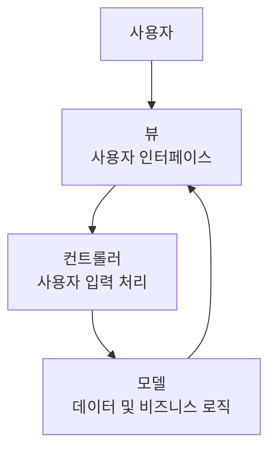
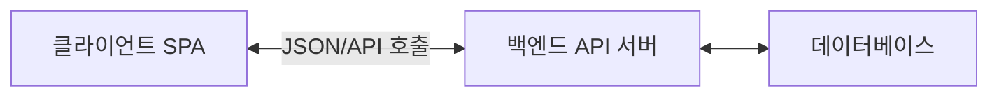
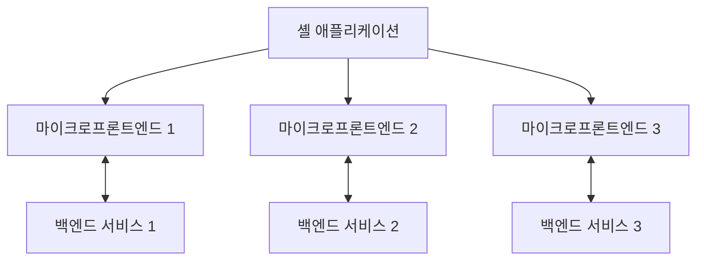
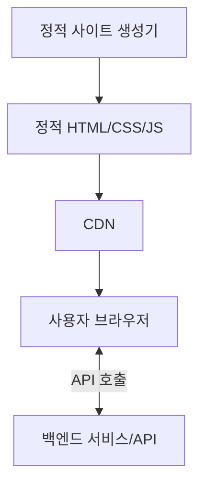

# 웹 기반 아키텍처

## 정보시스템 아키텍처의 웹 기반 구조

### 개요
웹 기반 아키텍처는 인터넷 기술과 웹 표준을 활용하여 구축된 정보시스템 구조로, 현대 정보시스템의 가장 보편적인 형태 중 하나입니다. 이 장에서는 웹 기반 아키텍처의 개념, 구성요소, 발전 과정, 그리고 보안 고려사항에 대해 살펴봅니다.

### 웹 기반 아키텍처의 개념

웹 기반 아키텍처(Web-based Architecture)는 HTTP(Hypertext Transfer Protocol)와 같은 웹 프로토콜과 HTML, CSS, JavaScript 등의 웹 기술을 기반으로 구축된 시스템 구조입니다. 이 아키텍처는 웹 브라우저를 통해 접근 가능한 애플리케이션을 구현하며, 인터넷이나 인트라넷을 통해 서비스를 제공합니다.

#### 웹 기반 아키텍처의 특징
웹 기반 아키텍처는 다음과 같은 주요 특징을 가집니다:

- **플랫폼 독립성**: 다양한 운영체제와 기기에서 접근 가능
- **중앙 집중식 관리**: 서버 측에서 애플리케이션 관리 및 업데이트 용이
- **확장성**: 사용자 증가에 따른 확장 용이
- **유비쿼터스 접근성**: 인터넷 연결만 있으면 어디서든 접근 가능
- **표준 기반**: 웹 표준 기술을 활용한 개발
- **상호운용성**: 다양한 시스템과의 통합 용이

### 웹 기반 아키텍처의 구성요소

웹 기반 아키텍처는 다음과 같은 주요 구성요소로 이루어집니다:

#### 1. 클라이언트 측 구성요소
사용자가 직접 상호작용하는 웹 브라우저와 관련 기술입니다.

**주요 기술:**
- **HTML(Hypertext Markup Language)**: 웹 페이지의 구조와 콘텐츠 정의
- **CSS(Cascading Style Sheets)**: 웹 페이지의 시각적 표현 정의
- **JavaScript**: 클라이언트 측 동적 기능 구현
- **웹 브라우저**: 웹 콘텐츠 렌더링 및 사용자 인터페이스 제공
- **프론트엔드 프레임워크**: React, Angular, Vue.js 등 UI 개발 프레임워크

#### 2. 서버 측 구성요소
웹 서비스를 제공하고 비즈니스 로직을 처리하는 서버 측 기술입니다.

**주요 기술:**
- **웹 서버**: Apache, Nginx, IIS 등 HTTP 요청 처리
- **애플리케이션 서버**: Tomcat, JBoss, Node.js 등 비즈니스 로직 처리
- **서버 측 스크립트 언어**: PHP, Python, Java, Ruby, C# 등
- **백엔드 프레임워크**: Spring, Django, Express.js, ASP.NET 등
- **웹 서비스 API**: REST, GraphQL, SOAP 등

#### 3. 데이터 관리 구성요소
데이터를 저장하고 관리하는 기술입니다.

**주요 기술:**
- **관계형 데이터베이스**: MySQL, PostgreSQL, Oracle, SQL Server 등
- **NoSQL 데이터베이스**: MongoDB, Cassandra, Redis 등
- **ORM(Object-Relational Mapping)**: Hibernate, Entity Framework 등
- **데이터 캐싱**: Memcached, Redis 등
- **데이터 접근 계층**: JDBC, ADO.NET 등

#### 4. 통신 구성요소
클라이언트와 서버 간의 통신을 담당하는 기술입니다.

**주요 기술:**
- **HTTP/HTTPS 프로토콜**: 웹 통신의 기본 프로토콜
- **WebSocket**: 양방향 실시간 통신
- **AJAX(Asynchronous JavaScript and XML)**: 비동기 데이터 교환
- **JSON/XML**: 데이터 교환 형식
- **API 게이트웨이**: API 요청 관리 및 라우팅

### 웹 기반 아키텍처의 발전 과정

웹 기반 아키텍처는 웹 기술의 발전과 함께 진화해왔습니다.

#### 1. 정적 웹 페이지 시대(1990년대 초)
초기 웹은 단순한 정적 HTML 페이지로 구성되었습니다.

**특징:**
- 단방향 정보 제공
- 서버에서 완성된 HTML 페이지 전송
- 제한된 사용자 상호작용
- 단순한 하이퍼링크 기반 탐색

#### 2. 동적 웹 페이지 시대(1990년대 중반~2000년대 초)
CGI, PHP 등의 서버 측 스크립트 기술이 등장하면서 동적 웹 페이지가 가능해졌습니다.

**특징:**
- 서버 측에서 동적으로 HTML 생성
- 폼 기반 사용자 입력 처리
- 데이터베이스 연동
- 세션 관리 기능

#### 3. 웹 애플리케이션 시대(2000년대 초~중반)
AJAX의 등장과 함께 더 풍부한 사용자 경험을 제공하는 웹 애플리케이션이 발전했습니다.

**특징:**
- 비동기 데이터 교환
- 부분적 페이지 업데이트
- 데스크톱 애플리케이션과 유사한 사용자 경험
- 웹 2.0 개념 등장

#### 4. SPA와 프론트엔드 프레임워크 시대(2010년대)
단일 페이지 애플리케이션(SPA)과 다양한 프론트엔드 프레임워크가 등장했습니다.

**특징:**
- 클라이언트 측 렌더링
- JavaScript 기반 UI 조작
- React, Angular, Vue.js 등의 프레임워크
- RESTful API를 통한 데이터 통신

#### 5. 현대 웹 아키텍처(2010년대 후반~현재)
마이크로서비스, 서버리스, PWA 등 다양한 기술이 통합된 현대적 웹 아키텍처가 발전했습니다.

**특징:**
- 마이크로서비스 기반 백엔드
- 서버리스 아키텍처
- 프로그레시브 웹 앱(PWA)
- GraphQL, WebSocket 등 고급 통신 기술
- 컨테이너화 및 클라우드 네이티브 배포

### 웹 기반 아키텍처의 유형

웹 기반 아키텍처는 구현 방식에 따라 다양한 유형으로 분류됩니다.

#### 1. 전통적인 다계층 웹 아키텍처
가장 기본적인 형태로, 프레젠테이션, 비즈니스 로직, 데이터 액세스 계층으로 구성됩니다.

**특징:**
- 명확한 관심사 분리
- 계층별 독립적 확장 가능
- 전통적인 서버 측 렌더링
- 세션 기반 상태 관리

#### 2. MVC/MVP/MVVM 아키텍처
모델-뷰-컨트롤러(MVC) 및 그 변형 패턴을 적용한 웹 아키텍처입니다.

**특징:**
- 코드 구조화 및 관심사 분리
- 재사용성 향상
- 테스트 용이성
- 다양한 프레임워크 지원(Spring MVC, ASP.NET MVC 등)

#### 3. 단일 페이지 애플리케이션(SPA) 아키텍처
하나의 HTML 페이지를 로드한 후 JavaScript를 통해 동적으로 콘텐츠를 변경하는 아키텍처입니다.

**특징:**
- 빠른 사용자 경험
- 서버 부하 감소
- 프론트엔드와 백엔드의 명확한 분리
- RESTful API 또는 GraphQL 기반 통신

#### 4. 마이크로프론트엔드 아키텍처
프론트엔드 애플리케이션을 독립적으로 개발, 테스트, 배포할 수 있는 작은 단위로 분할하는 아키텍처입니다.

**특징:**
- 독립적인 팀별 개발 가능
- 점진적 업그레이드 용이
- 기술 스택 다양성 허용
- 복잡한 통합 및 테스트

#### 5. JAMstack 아키텍처
JavaScript, API, Markup의 조합으로 구성된 현대적 웹 아키텍처입니다.

**특징:**
- 사전 렌더링된 정적 파일
- CDN을 통한 빠른 전송
- 서버리스 함수와 API 활용
- 높은 보안성과 확장성

### 웹 기반 아키텍처의 장단점

#### 장점
- **접근성**: 웹 브라우저만 있으면 접근 가능
- **플랫폼 독립성**: 다양한 기기와 운영체제 지원
- **배포 용이성**: 중앙 서버 업데이트로 모든 사용자에게 적용
- **확장성**: 사용자 증가에 따른 수평적 확장 용이
- **통합 용이성**: 표준 기반 인터페이스로 다른 시스템과 통합 용이

#### 단점
- **네트워크 의존성**: 인터넷 연결 필요
- **성능 제약**: 네트워크 지연 및 브라우저 제약
- **보안 위험**: 웹 취약점에 노출 가능성
- **제한된 기능**: 네이티브 애플리케이션 대비 제한된 기능
- **복잡성 증가**: 현대 웹 기술의 빠른 변화와 복잡성

### 웹 기반 아키텍처의 보안 고려사항

웹 기반 아키텍처에서는 다음과 같은 보안 고려사항이 중요합니다:

#### 1. 웹 애플리케이션 보안
웹 애플리케이션 자체의 보안 취약점을 방지하는 방안입니다.

**주요 위협 및 대응:**
- **인젝션 공격(SQL, XSS, CSRF 등)**: 입력 검증 및 이스케이핑
- **인증 및 세션 관리 취약점**: 안전한 인증 메커니즘 구현
- **안전하지 않은 직접 객체 참조**: 접근 제어 검증
- **보안 설정 오류**: 보안 강화 설정 및 최신 패치 적용
- **민감한 데이터 노출**: 암호화 및 안전한 통신

#### 2. 전송 계층 보안
클라이언트와 서버 간 통신의 보안을 보장하는 메커니즘입니다.

**주요 기술:**
- **HTTPS/TLS**: 암호화된 통신 채널
- **HTTP 보안 헤더**: Content-Security-Policy, X-XSS-Protection 등
- **인증서 관리**: 유효한 SSL/TLS 인증서 유지
- **안전한 쿠키 설정**: Secure, HttpOnly, SameSite 속성

#### 3. API 보안
웹 서비스 API의 보안을 보장하는 메커니즘입니다.

**주요 기술:**
- **API 인증**: OAuth, JWT, API 키 등
- **API 접근 제어**: 역할 기반 접근 제어
- **API 요청 제한**: 속도 제한 및 할당량
- **API 게이트웨이**: 중앙집중식 보안 정책 적용

#### 4. 클라이언트 측 보안
브라우저 환경에서의 보안을 강화하는 방안입니다.

**주요 기술:**
- **콘텐츠 보안 정책(CSP)**: 스크립트 실행 제한
- **서브리소스 무결성(SRI)**: 외부 리소스 검증
- **CORS(Cross-Origin Resource Sharing)**: 교차 출처 요청 제한
- **프론트엔드 암호화**: 민감한 클라이언트 데이터 보호

#### 5. 인프라 보안
웹 애플리케이션을 호스팅하는 인프라의 보안입니다.

**주요 기술:**
- **웹 애플리케이션 방화벽(WAF)**: 악의적인 트래픽 필터링
- **DDoS 방어**: 분산 서비스 거부 공격 대응
- **취약점 스캐닝**: 정기적인 보안 취약점 검사
- **보안 모니터링**: 실시간 보안 이벤트 모니터링

### 웹 기반 아키텍처의 현대적 동향

#### 1. 서버리스 웹 아키텍처
서버 관리 없이 기능을 구현할 수 있는 클라우드 기반 아키텍처입니다.

**특징:**
- 함수형 서비스(FaaS) 활용
- 자동 확장 및 관리
- 이벤트 기반 처리
- 사용량 기반 과금

#### 2. 프로그레시브 웹 앱(PWA)
웹 기술로 네이티브 앱과 유사한 경험을 제공하는 웹 애플리케이션입니다.

**특징:**
- 오프라인 작동
- 푸시 알림
- 홈 화면 설치
- 빠른 로딩 및 응답성

#### 3. WebAssembly
브라우저에서 네이티브에 가까운 성능으로 코드를 실행할 수 있는 기술입니다.

**특징:**
- 고성능 웹 애플리케이션
- 다양한 언어 지원(C, C++, Rust 등)
- 브라우저 호환성
- 보안 샌드박스 실행

#### 4. API 우선 아키텍처
API를 중심으로 설계된 웹 아키텍처입니다.

**특징:**
- API 설계 우선 접근법
- 다양한 클라이언트 지원
- 마이크로서비스와의 통합
- GraphQL 및 REST 기반 인터페이스

### 5가지 키워드로 정리하는 핵심 포인트
1. **웹 표준**: HTML, CSS, JavaScript 등 표준 웹 기술 기반 아키텍처
2. **다계층 구조**: 프레젠테이션, 비즈니스 로직, 데이터 액세스 계층으로 구성
3. **진화**: 정적 웹 페이지에서 현대적 SPA, PWA까지 지속적 발전
4. **보안 취약점**: XSS, CSRF, SQL 인젝션 등 다양한 웹 특화 보안 위협 존재
5. **현대화**: 서버리스, 마이크로프론트엔드, JAMstack 등 현대적 아키텍처 패턴 적용

### 확인 문제
1. 다음 중 웹 기반 아키텍처의 특징이 아닌 것은?
    - [ ] 플랫폼 독립성
    - [ ] 중앙 집중식 관리
    - [ ] 네트워크 연결 없이 항상 작동 가능
    - [ ] 웹 표준 기술 활용

2. 단일 페이지 애플리케이션(SPA)의 특징으로 가장 적절한 것은?
    - [ ] 각 페이지 전환마다 서버에서 새로운 HTML 페이지를 로드
    - [ ] JavaScript를 사용하지 않고 순수 HTML만으로 구현
    - [ ] 하나의 HTML 페이지를 로드한 후 JavaScript로 동적 콘텐츠 변경
    - [ ] 서버 측 렌더링만 사용하여 페이지 생성

3. 웹 기반 아키텍처의 보안 위협으로 가장 일반적인 것은?
    - [ ] 물리적 서버 접근
    - [ ] 크로스 사이트 스크립팅(XSS)
    - [ ] 하드웨어 오작동
    - [ ] 전원 공급 중단

> [정답 및 해설 보기](../answers_and_explanations.md#01-2-3)
