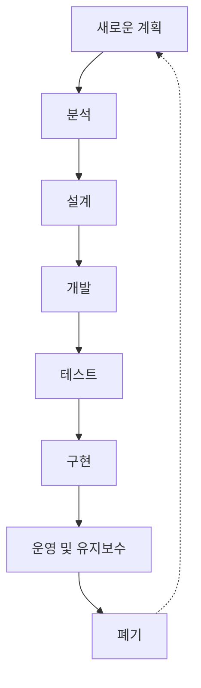

# 정보시스템 생명주기

## 정보시스템의 계획부터 폐기까지

### 개요
정보시스템 생명주기(Information System Life Cycle)는 정보시스템의 계획, 개발, 구현, 운영, 유지보수, 폐기에 이르는 전체 과정을 체계적으로 관리하는 프레임워크입니다. 이 장에서는 정보시스템 생명주기의 각 단계와 각 단계에서의 보안 고려사항에 대해 살펴봅니다.

### 정보시스템 생명주기의 개념

정보시스템 생명주기는 정보시스템이 조직에 도입되어 사용되고 최종적으로 폐기되기까지의 전체 과정을 의미합니다. 이는 시스템 개발 생명주기(SDLC: System Development Life Cycle)를 포함하는 더 넓은 개념으로, 시스템의 전체 수명 동안의 관리 활동을 포괄합니다.

### 정보시스템 생명주기의 단계

#### 1. 계획 단계(Planning Phase)
조직의 요구사항과 목표를 파악하고 정보시스템 도입의 타당성을 검토하는 단계입니다.

**주요 활동:**
- 조직의 전략적 목표 분석
- 현행 시스템 평가
- 새로운 시스템의 필요성 및 타당성 검토
- 프로젝트 범위, 일정, 예산 계획 수립
- 초기 위험 평가

**보안 고려사항:**
- 보안 요구사항 초기 식별
- 규제 및 컴플라이언스 요구사항 파악
- 보안 예산 및 자원 계획

#### 2. 분석 단계(Analysis Phase)
사용자 요구사항을 상세히 분석하고 시스템 요구사항을 정의하는 단계입니다.

**주요 활동:**
- 사용자 요구사항 수집 및 분석
- 기능적/비기능적 요구사항 정의
- 시스템 경계 및 인터페이스 정의
- 데이터 요구사항 분석

**보안 고려사항:**
- 보안 요구사항 상세화
- 위협 모델링 및 위험 분석
- 데이터 분류 및 보호 요구사항 정의
- 접근 제어 요구사항 정의

#### 3. 설계 단계(Design Phase)
시스템의 구조, 구성요소, 인터페이스 등을 설계하는 단계입니다.

**주요 활동:**
- 시스템 아키텍처 설계
- 데이터베이스 설계
- 사용자 인터페이스 설계
- 프로세스 및 워크플로우 설계

**보안 고려사항:**
- 보안 아키텍처 설계
- 인증 및 권한 부여 메커니즘 설계
- 암호화 전략 수립
- 보안 통제 설계

#### 4. 개발 단계(Development Phase)
설계를 바탕으로 실제 시스템을 구현하는 단계입니다.

**주요 활동:**
- 코딩 및 프로그래밍
- 데이터베이스 구현
- 사용자 인터페이스 개발
- 단위 테스트

**보안 고려사항:**
- 시큐어 코딩 실천
- 코드 리뷰 및 보안 검토
- 취약점 스캐닝
- 보안 기능 구현 및 테스트

#### 5. 테스트 단계(Testing Phase)
개발된 시스템이 요구사항을 충족하는지 검증하는 단계입니다.

**주요 활동:**
- 기능 테스트
- 통합 테스트
- 시스템 테스트
- 사용자 수용 테스트

**보안 고려사항:**
- 보안 테스트 (침투 테스트, 취약점 평가)
- 인증 및 권한 부여 테스트
- 부하 테스트 및 스트레스 테스트
- 보안 결함 수정 및 재테스트

#### 6. 구현 단계(Implementation Phase)
개발 및 테스트가 완료된 시스템을 실제 운영 환경에 배포하는 단계입니다.

**주요 활동:**
- 시스템 설치 및 구성
- 데이터 마이그레이션
- 사용자 교육 및 훈련
- 전환 계획 실행

**보안 고려사항:**
- 보안 구성 및 강화
- 접근 권한 설정
- 보안 모니터링 도구 구현
- 사용자 보안 인식 교육

#### 7. 운영 및 유지보수 단계(Operation and Maintenance Phase)
시스템을 운영하고 필요에 따라 유지보수하는 단계입니다.

**주요 활동:**
- 시스템 모니터링 및 관리
- 문제 해결 및 지원
- 성능 최적화
- 변경 관리 및 업그레이드

**보안 고려사항:**
- 지속적인 보안 모니터링
- 보안 패치 및 업데이트 관리
- 정기적인 보안 평가 및 감사
- 보안 사고 대응

#### 8. 폐기 단계(Retirement Phase)
시스템의 수명이 다하여 운영을 중단하고 대체 시스템으로 전환하는 단계입니다.

**주요 활동:**
- 폐기 계획 수립
- 데이터 아카이빙 또는 마이그레이션
- 하드웨어 및 소프트웨어 처분
- 시스템 문서화 보관

**보안 고려사항:**
- 안전한 데이터 삭제 및 파기
- 미디어 및 장비의 안전한 처분
- 접근 권한 제거
- 기밀 정보 보호

### 정보시스템 생명주기 모델

정보시스템 생명주기를 관리하기 위한 다양한 모델이 존재합니다:

#### 1. 폭포수 모델(Waterfall Model)
각 단계가 순차적으로 진행되며, 이전 단계가 완료되어야 다음 단계로 진행하는 전통적인 모델입니다.

**특징:**
- 명확한 단계 구분
- 문서 중심적 접근
- 요구사항이 안정적일 때 효과적
- 변경 관리가 어려움

#### 2. 반복적 모델(Iterative Model)
시스템을 점진적으로 개발하며, 각 반복에서 시스템의 일부를 개발하고 개선하는 모델입니다.

**특징:**
- 점진적 개발 및 개선
- 위험 조기 식별 가능
- 사용자 피드백 반영 용이
- 변경 수용성 높음

#### 3. 애자일 모델(Agile Model)
빠른 개발과 지속적인 사용자 피드백을 강조하는 유연한 접근 방식입니다.

**특징:**
- 짧은 개발 주기(스프린트)
- 고객 협업 중시
- 변화에 대한 유연한 대응
- 지속적인 개선 및 통합

#### 4. DevOps 모델
개발(Development)과 운영(Operations)을 통합하여 지속적인 통합, 배포, 모니터링을 강조하는 모델입니다.

**특징:**
- 개발과 운영의 통합
- 자동화 강조
- 지속적 통합 및 배포
- 빠른 피드백 루프

### 정보시스템 생명주기와 보안

정보시스템 생명주기의 각 단계에서 보안을 고려하는 것은 매우 중요합니다. 이를 위한 접근 방식으로 보안 개발 생명주기(SDL: Security Development Lifecycle)가 있습니다.

#### 보안 개발 생명주기(SDL)
정보시스템 개발 과정에 보안을 통합하는 프로세스 프레임워크입니다.

**주요 활동:**
- 보안 교육 및 인식
- 보안 요구사항 정의
- 위협 모델링
- 시큐어 코딩 및 코드 리뷰
- 보안 테스트
- 보안 검증 및 릴리스 검토
- 사고 대응 계획

#### 생명주기 전반의 보안 고려사항
정보시스템 생명주기 전반에 걸쳐 고려해야 할 보안 사항들입니다:

- **보안 거버넌스**: 보안 정책, 표준, 지침 수립 및 준수
- **위험 관리**: 지속적인 위험 평가 및 관리
- **규제 준수**: 관련 법규 및 규제 요구사항 준수
- **보안 아키텍처**: 심층 방어 전략 및 최소 권한 원칙 적용
- **보안 인식 교육**: 개발자 및 사용자 대상 보안 교육
- **보안 모니터링**: 지속적인 보안 상태 모니터링 및 평가

### 5가지 키워드로 정리하는 핵심 포인트
1. **생명주기 단계**: 계획, 분석, 설계, 개발, 테스트, 구현, 운영 및 유지보수, 폐기의 체계적 과정
2. **생명주기 모델**: 폭포수, 반복적, 애자일, DevOps 등 다양한 접근 방식 존재
3. **보안 통합**: 모든 생명주기 단계에 보안 고려사항 통합 필요
4. **위험 관리**: 생명주기 전반에 걸친 지속적인 위험 식별 및 관리
5. **변화 관리**: 요구사항 변화와 기술 발전에 대응하는 유연한 생명주기 관리

### 확인 문제
1. 정보시스템 생명주기의 올바른 순서는?
    - [ ] 계획 → 개발 → 분석 → 설계 → 테스트 → 구현 → 운영 → 폐기
    - [ ] 계획 → 분석 → 설계 → 개발 → 테스트 → 구현 → 운영 → 폐기
    - [ ] 분석 → 계획 → 설계 → 개발 → 구현 → 테스트 → 운영 → 폐기
    - [ ] 계획 → 설계 → 분석 → 개발 → 테스트 → 구현 → 운영 → 폐기

2. 다음 중 폭포수 모델의 특징이 아닌 것은?
    - [ ] 각 단계가 순차적으로 진행된다
    - [ ] 이전 단계가 완료되어야 다음 단계로 진행한다
    - [ ] 변경에 유연하게 대응할 수 있다
    - [ ] 문서 중심적 접근 방식이다

3. 정보시스템 생명주기에서 보안을 고려해야 하는 단계는?
    - [ ] 개발 단계와 테스트 단계에서만
    - [ ] 계획 단계와 구현 단계에서만
    - [ ] 모든 생명주기 단계에서
    - [ ] 운영 및 유지보수 단계에서만

> [정답 및 해설 보기](../answers_and_explanations.md#01-3-1)
