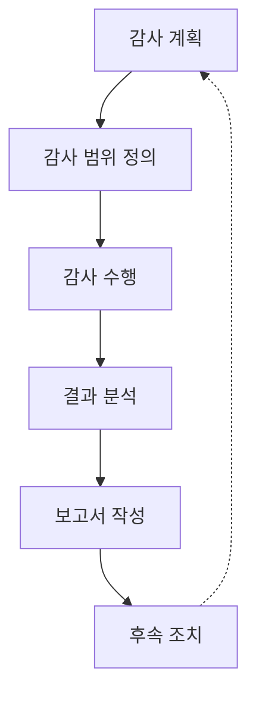

# 정보시스템 감사

## 정보시스템의 통제와 평가

### 개요
정보시스템 감사(Information System Audit)는 조직의 정보시스템이 적절하게 통제되고, 효율적으로 운영되며, 보안 요구사항을 충족하는지 체계적으로 평가하는 과정입니다. 이 장에서는 정보시스템 감사의 개념, 유형, 방법론, 그리고 정보보안 관점에서의 중요성에 대해 살펴봅니다.

### 정보시스템 감사의 개념

정보시스템 감사는 정보시스템의 통제, 보안, 효율성을 독립적으로 검토하고 평가하는 체계적인 프로세스입니다. 이는 조직의 정보자산을 보호하고, 시스템의 신뢰성과 무결성을 보장하며, 관련 법규 및 정책 준수를 확인하는 데 중요한 역할을 합니다.

#### 정보시스템 감사의 목적
정보시스템 감사는 다음과 같은 목적을 가지고 수행됩니다:

- **통제 평가**: 정보시스템의 내부 통제가 적절하게 설계되고 효과적으로 운영되는지 평가
- **위험 관리**: 정보시스템 관련 위험이 적절히 식별되고 관리되는지 확인
- **규정 준수**: 관련 법규, 규제, 정책, 표준 준수 여부 검증
- **보안 강화**: 정보시스템의 보안 취약점 식별 및 개선 권고
- **효율성 향상**: 정보시스템 운영의 효율성 및 효과성 평가
- **신뢰성 보장**: 정보시스템에서 생성되는 정보의 신뢰성과 무결성 확인

### 정보시스템 감사의 유형

정보시스템 감사는 목적, 범위, 시기에 따라 다양한 유형으로 분류됩니다:

#### 1. 목적에 따른 분류

**운영 감사(Operational Audit)**
- 정보시스템 운영의 효율성과 효과성 평가
- 운영 절차 및 프로세스의 적절성 검토
- 자원 활용의 최적화 여부 확인

**기술 감사(Technical Audit)**
- 하드웨어, 소프트웨어, 네트워크 등 기술적 요소 평가
- 시스템 구성 및 설정의 적절성 검토
- 기술적 취약점 식별

**보안 감사(Security Audit)**
- 정보시스템의 보안 통제 평가
- 보안 정책 및 절차 준수 여부 확인
- 보안 취약점 및 위협 식별

**컴플라이언스 감사(Compliance Audit)**
- 법규, 규제, 표준 준수 여부 검증
- 내부 정책 및 지침 준수 여부 확인
- 계약상 의무 이행 여부 평가

**재무 감사(Financial Audit)**
- 재무 정보 처리 시스템의 통제 평가
- 재무 데이터의 정확성 및 신뢰성 검증
- 재무 보고 관련 시스템 통제 검토

#### 2. 수행 시기에 따른 분류

**정기 감사(Regular Audit)**
- 계획된 일정에 따라 정기적으로 수행
- 연간, 분기별, 월별 등 정해진 주기로 실시
- 지속적인 통제 상태 모니터링

**특별 감사(Special Audit)**
- 특정 사건이나 상황에 대응하여 수행
- 보안 사고, 시스템 변경, 규제 변화 등에 따라 실시
- 특정 문제나 우려사항에 초점

**지속적 감사(Continuous Audit)**
- 자동화된 도구를 활용한 실시간 또는 준실시간 감사
- 지속적인 모니터링 및 분석
- 이상 징후 조기 발견 및 대응

#### 3. 수행 주체에 따른 분류

**내부 감사(Internal Audit)**
- 조직 내부의 감사 부서나 인력이 수행
- 조직의 정책 및 절차에 따라 진행
- 경영진에게 직접 보고

**외부 감사(External Audit)**
- 독립적인 외부 감사 기관이나 전문가가 수행
- 객관적이고 독립적인 관점 제공
- 법적 요구사항이나 인증을 위해 실시

**제3자 감사(Third-party Audit)**
- 계약 관계에 있는 제3자(벤더, 서비스 제공자 등)에 대한 감사
- 서비스 수준 계약(SLA) 준수 여부 확인
- 외부 의존성에 대한 위험 관리

### 정보시스템 감사 프로세스

정보시스템 감사는 일반적으로 다음과 같은 단계로 진행됩니다:

#### 1. 감사 계획 수립
감사의 목적, 범위, 일정, 자원 등을 정의하는 단계입니다.

**주요 활동:**
- 감사 목표 및 범위 정의
- 감사 대상 시스템 및 프로세스 식별
- 감사 일정 및 자원 계획
- 감사 팀 구성 및 역할 할당
- 감사 방법론 및 도구 선정

#### 2. 예비 조사
감사 대상에 대한 기본 정보를 수집하고 이해하는 단계입니다.

**주요 활동:**
- 관련 문서 및 정책 검토
- 이전 감사 결과 및 후속 조치 확인
- 조직 구조 및 책임 파악
- 시스템 아키텍처 및 구성 이해
- 주요 위험 및 통제 영역 식별

#### 3. 감사 프로그램 개발
감사 수행을 위한 상세 계획과 절차를 개발하는 단계입니다.

**주요 활동:**
- 감사 목표별 세부 절차 정의
- 감사 증거 수집 방법 결정
- 감사 체크리스트 및 질문지 개발
- 샘플링 방법 및 규모 결정
- 감사 일정 상세화

#### 4. 감사 수행
실제 감사 활동을 수행하고 증거를 수집하는 단계입니다.

**주요 활동:**
- 인터뷰 및 관찰 수행
- 문서 검토 및 분석
- 시스템 설정 및 로그 검사
- 통제 테스트 및 평가
- 취약점 스캐닝 및 침투 테스트
- 증거 수집 및 문서화

#### 5. 결과 분석 및 보고
수집된 증거를 분석하고 결과를 보고하는 단계입니다.

**주요 활동:**
- 감사 증거 분석 및 평가
- 발견사항 및 문제점 식별
- 위험 수준 평가
- 개선 권고사항 개발
- 감사 보고서 작성
- 결과 보고 및 논의

#### 6. 후속 조치
감사 결과에 따른 개선 활동을 모니터링하는 단계입니다.

**주요 활동:**
- 개선 계획 수립 지원
- 개선 활동 모니터링
- 개선 결과 검증
- 미해결 이슈 추적
- 후속 감사 계획

### 정보시스템 감사 방법론 및 기법

정보시스템 감사를 수행하기 위한 다양한 방법론과 기법이 있습니다:

#### 1. 통제 기반 감사
정보시스템의 통제가 적절하게 설계되고 효과적으로 운영되는지 평가하는 접근 방식입니다.

**주요 통제 유형:**
- **예방 통제(Preventive Controls)**: 문제 발생을 사전에 방지하는 통제
- **탐지 통제(Detective Controls)**: 문제 발생을 감지하는 통제
- **교정 통제(Corrective Controls)**: 발생한 문제를 해결하는 통제
- **관리적 통제(Administrative Controls)**: 정책, 절차, 지침 등
- **기술적 통제(Technical Controls)**: 하드웨어, 소프트웨어 기반 통제
- **물리적 통제(Physical Controls)**: 물리적 접근 및 환경 통제

#### 2. 위험 기반 감사
조직의 주요 위험 영역에 감사 자원을 집중하는 접근 방식입니다.

**주요 단계:**
- 위험 평가 및 우선순위 설정
- 고위험 영역 식별
- 위험 대응 통제 평가
- 잔여 위험 분석

#### 3. 프로세스 기반 감사
업무 프로세스의 흐름에 따라 감사를 수행하는 접근 방식입니다.

**주요 단계:**
- 프로세스 매핑 및 이해
- 프로세스 단계별 통제 식별
- 프로세스 효율성 및 효과성 평가
- 프로세스 개선 권고

#### 4. 데이터 분석 기법
대량의 데이터를 분석하여 이상 징후나 패턴을 식별하는 기법입니다.

**주요 기법:**
- 통계적 분석
- 패턴 인식
- 이상치 탐지
- 추세 분석
- 회귀 분석
- 데이터 마이닝

#### 5. 컴퓨터 지원 감사 기법(CAATs)
자동화된 도구를 활용하여 감사 효율성을 높이는 기법입니다.

**주요 도구:**
- 감사 소프트웨어
- 로그 분석 도구
- 취약점 스캐너
- 네트워크 모니터링 도구
- 데이터 추출 및 분석 도구

### 정보시스템 감사 표준 및 프레임워크

정보시스템 감사를 수행하기 위한 다양한 표준과 프레임워크가 있습니다:

#### 1. COBIT (Control Objectives for Information and Related Technologies)
ISACA에서 개발한 IT 거버넌스 및 관리를 위한 프레임워크입니다.

**주요 특징:**
- IT 프로세스, 통제 목표, 성숙도 모델 제공
- 비즈니스 요구사항과 IT 목표 연계
- 5개 도메인, 40개 프로세스로 구성
- 성과 측정을 위한 지표 제공

#### 2. ITIL (Information Technology Infrastructure Library)
IT 서비스 관리를 위한 베스트 프랙티스 프레임워크입니다.

**주요 특징:**
- 서비스 수명주기 중심 접근
- 서비스 전략, 설계, 전환, 운영, 개선의 5단계
- 프로세스 및 기능 정의
- 서비스 품질 향상 중점

#### 3. ISO/IEC 27001
정보보안 관리시스템(ISMS)을 위한 국제 표준입니다.

**주요 특징:**
- 정보보안 관리를 위한 요구사항 정의
- 위험 평가 및 처리 중심
- PDCA(Plan-Do-Check-Act) 사이클 적용
- 114개의 통제 항목 제공

#### 4. NIST 사이버보안 프레임워크
미국 국립표준기술연구소(NIST)에서 개발한 사이버보안 프레임워크입니다.

**주요 특징:**
- 식별, 보호, 탐지, 대응, 복구의 5가지 핵심 기능
- 유연하고 위험 기반 접근
- 다양한 산업 분야에 적용 가능
- 기존 표준 및 프레임워크와 통합 가능

#### 5. ISACA 감사 지침
ISACA에서 제공하는 정보시스템 감사를 위한 지침입니다.

**주요 특징:**
- 감사 계획, 수행, 보고에 대한 지침 제공
- 감사 증거 수집 및 평가 방법 제시
- 감사 문서화 요구사항 정의
- 감사 품질 보장을 위한 기준 제공

### 정보시스템 감사와 정보보안

정보시스템 감사는 조직의 정보보안 체계를 강화하는 데 중요한 역할을 합니다:

#### 1. 보안 통제 평가
정보보안 통제의 설계 및 운영 효과성을 독립적으로 평가합니다.

**주요 평가 영역:**
- 접근 통제 및 권한 관리
- 암호화 및 키 관리
- 네트워크 보안
- 물리적 보안
- 인적 보안
- 사고 대응 및 복구

#### 2. 취약점 식별
정보시스템의 보안 취약점을 식별하고 개선 방안을 제시합니다.

**주요 기법:**
- 취약점 스캐닝
- 침투 테스트
- 구성 검토
- 코드 리뷰
- 아키텍처 분석

#### 3. 규정 준수 확인
정보보안 관련 법규, 규제, 표준 준수 여부를 검증합니다.

**주요 규제:**
- 개인정보보호법
- 정보통신망법
- 전자금융거래법
- GDPR(일반 개인정보보호법)
- PCI DSS(결제카드산업 데이터보안표준)

#### 4. 보안 인식 제고
감사 과정을 통해 조직 내 보안 인식을 높이고 보안 문화를 강화합니다.

**주요 활동:**
- 보안 정책 및 절차 검토
- 보안 교육 및 인식 프로그램 평가
- 보안 사고 대응 훈련 검토
- 보안 모범 사례 공유

#### 5. 지속적 개선
정기적인 감사를 통해 정보보안 체계의 지속적 개선을 지원합니다.

**주요 활동:**
- 이전 감사 결과 후속 조치 확인
- 보안 성숙도 평가
- 개선 권고사항 제시
- 보안 로드맵 수립 지원

### 정보시스템 감사의 도전과제와 대응

정보시스템 감사를 수행하면서 직면할 수 있는 도전과제와 대응 방안입니다:

#### 1. 기술 복잡성 증가
클라우드, 빅데이터, IoT 등 새로운 기술의 등장으로 감사 환경이 복잡해지고 있습니다.

**대응 방안:**
- 지속적인 기술 교육 및 역량 개발
- 전문가 협업 및 자문
- 특화된 감사 도구 활용
- 위험 기반 접근으로 핵심 영역 집중

#### 2. 사이버 위협의 진화
사이버 위협이 지속적으로 진화하고 복잡해지고 있습니다.

**대응 방안:**
- 최신 위협 동향 모니터링
- 위협 인텔리전스 활용
- 보안 통제의 효과성 지속 평가
- 침해 대응 능력 검증

#### 3. 규제 환경 변화
정보보안 및 개인정보보호 관련 규제가 강화되고 있습니다.

**대응 방안:**
- 규제 변화 지속 모니터링
- 규제 요구사항 매핑 및 통합
- 컴플라이언스 프레임워크 개발
- 규제 전문가 참여

#### 4. 자원 제약
감사 자원(인력, 시간, 예산)의 제약으로 효과적인 감사 수행이 어려울 수 있습니다.

**대응 방안:**
- 위험 기반 감사 계획 수립
- 자동화 도구 활용
- 지속적 모니터링 체계 구축
- 내부 역량 강화

#### 5. 원격 업무 환경
원격 및 하이브리드 업무 환경으로 인한 새로운 위험과 통제 과제가 등장하고 있습니다.

**대응 방안:**
- 원격 감사 기법 개발
- 원격 접근 통제 평가 강화
- 엔드포인트 보안 중점 검토
- 클라우드 서비스 보안 평가

### 5가지 키워드로 정리하는 핵심 포인트
1. **독립적 평가**: 정보시스템의 통제, 보안, 효율성에 대한 객관적이고 독립적인 검토
2. **위험 기반 접근**: 조직의 주요 위험 영역에 감사 자원을 집중하는 전략적 접근
3. **표준 및 프레임워크**: COBIT, ITIL, ISO 27001 등 감사 수행을 위한 체계적인 기준
4. **통제 평가**: 예방, 탐지, 교정 통제의 설계 및 운영 효과성 검증
5. **지속적 개선**: 정기적인 감사를 통한 정보시스템 보안 및 효율성의 지속적 향상

### 확인 문제
1. 정보시스템 감사의 주요 목적이 아닌 것은?
    - [ ] 정보시스템 통제의 효과성 평가
    - [ ] 정보시스템 관련 위험 관리 확인
    - [ ] 정보시스템의 성능 최적화
    - [ ] 법규 및 규제 준수 여부 검증

2. 다음 중 위험 기반 감사 접근법의 특징으로 가장 적절한 것은?
    - [ ] 모든 시스템을 동일한 수준으로 감사한다
    - [ ] 조직의 주요 위험 영역에 감사 자원을 집중한다
    - [ ] 기술적 통제만 중점적으로 평가한다
    - [ ] 외부 규제 요구사항만 검토한다

3. 정보시스템 감사 프로세스의 올바른 순서는?
    - [ ] 감사 수행 → 감사 계획 → 결과 분석 → 후속 조치
    - [ ] 감사 계획 → 감사 수행 → 결과 분석 → 후속 조치
    - [ ] 결과 분석 → 감사 계획 → 감사 수행 → 후속 조치
    - [ ] 감사 계획 → 결과 분석 → 감사 수행 → 후속 조치

> [정답 및 해설 보기](../answers_and_explanations.md#01-3-2)
