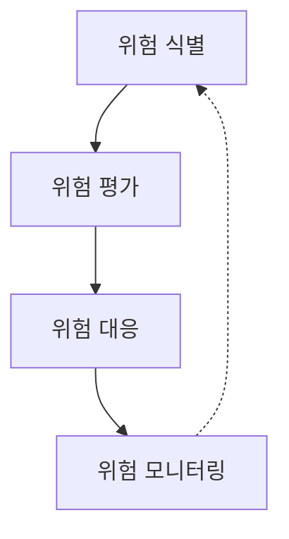
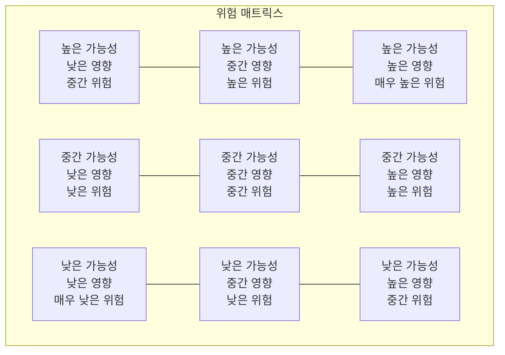

# 정보시스템 위험관리

## 정보시스템 위험의 식별, 평가, 대응

### 개요
정보시스템 위험관리(Information System Risk Management)는 정보시스템과 관련된 위험을 체계적으로 식별, 평가, 대응하는 프로세스입니다. 이 장에서는 정보시스템 위험관리의 개념, 프로세스, 방법론, 그리고 정보보안 관점에서의 중요성에 대해 살펴봅니다.

### 정보시스템 위험관리의 개념

정보시스템 위험관리는 정보시스템과 관련된 위험을 효과적으로 관리하여 조직의 목표 달성을 지원하는 체계적인 접근 방식입니다. 이는 위험을 완전히 제거하는 것이 아니라, 조직이 수용 가능한 수준으로 위험을 관리하는 것을 목표로 합니다.

#### 정보시스템 위험의 정의
정보시스템 위험은 정보시스템의 기밀성, 무결성, 가용성에 부정적인 영향을 미칠 수 있는 잠재적 사건이나 상황을 의미합니다.

**위험의 구성 요소:**
- **위협(Threat)**: 시스템이나 조직에 해를 끼칠 수 있는 잠재적 원인이나 행위자
- **취약점(Vulnerability)**: 위협에 의해 악용될 수 있는 시스템의 약점이나 결함
- **자산(Asset)**: 보호해야 할 가치 있는 정보나 자원
- **영향(Impact)**: 위험이 실현될 경우 발생하는 부정적 결과
- **가능성(Likelihood)**: 위험이 실현될 확률

**위험 수식:**
위험 = 위협 × 취약점 × 자산 가치 × 영향 × 가능성

#### 정보시스템 위험관리의 목적
정보시스템 위험관리는 다음과 같은 목적을 가지고 수행됩니다:

- **비즈니스 연속성 보장**: 정보시스템 장애나 보안 사고로 인한 업무 중단 최소화
- **자산 보호**: 중요 정보자산의 기밀성, 무결성, 가용성 보호
- **의사결정 지원**: 위험 기반 의사결정을 위한 정보 제공
- **규제 준수**: 관련 법규 및 규제 요구사항 충족
- **비용 최적화**: 위험 대응에 필요한 자원의 효율적 배분
- **신뢰성 향상**: 이해관계자의 신뢰 확보 및 조직 평판 보호

### 정보시스템 위험관리 프로세스

정보시스템 위험관리는 일반적으로 다음과 같은 단계로 진행됩니다:

#### 1. 위험 식별(Risk Identification)
정보시스템과 관련된 위험을 포괄적으로 식별하는 단계입니다.

**주요 활동:**
- 자산 식별 및 분류
- 위협 식별
- 취약점 식별
- 기존 통제 식별
- 위험 시나리오 개발

**위험 식별 기법:**
- 체크리스트 및 설문지
- 브레인스토밍
- 델파이 기법
- 인터뷰 및 워크숍
- 과거 사고 분석
- 취약점 스캐닝 및 침투 테스트

#### 2. 위험 평가(Risk Assessment)
식별된 위험의 심각도와 우선순위를 평가하는 단계입니다.

**주요 활동:**
- 위험 발생 가능성 평가
- 위험 영향 평가
- 위험 수준 결정
- 위험 우선순위 설정

**위험 평가 방법:**
- **정성적 평가**: 주관적 판단에 기반한 평가 (예: 높음, 중간, 낮음)
- **정량적 평가**: 수치적 데이터에 기반한 평가 (예: 금전적 손실 추정)
- **준정량적 평가**: 정성적 평가에 수치적 값을 할당하는 혼합 방식

**위험 매트릭스:**
위험의 가능성과 영향을 시각적으로 표현하는 도구입니다.

#### 3. 위험 대응(Risk Response)
평가된 위험에 대한 적절한 대응 전략을 선택하고 구현하는 단계입니다.

**주요 활동:**
- 위험 대응 전략 선택
- 통제 방안 설계
- 비용-효과 분석
- 위험 대응 계획 수립
- 잔여 위험 평가

**위험 대응 전략:**
- **위험 회피(Risk Avoidance)**: 위험을 발생시키는 활동이나 상황을 피함
- **위험 감소(Risk Reduction)**: 통제를 구현하여 위험의 가능성이나 영향을 줄임
- **위험 전가(Risk Transfer)**: 보험, 아웃소싱 등을 통해 위험을 제3자에게 이전
- **위험 수용(Risk Acceptance)**: 위험을 그대로 받아들이고 결과에 대비
- **위험 공유(Risk Sharing)**: 다른 당사자와 위험을 분담

#### 4. 위험 모니터링 및 검토(Risk Monitoring and Review)
구현된 통제의 효과성을 지속적으로 모니터링하고 위험 상황의 변화를 검토하는 단계입니다.

**주요 활동:**
- 통제 효과성 모니터링
- 새로운 위험 식별
- 위험 상태 변화 추적
- 위험 대응 계획 업데이트
- 정기적인 위험 재평가

**모니터링 방법:**
- 주요 위험 지표(KRI) 모니터링
- 통제 테스트 및 평가
- 보안 사고 및 이벤트 분석
- 정기적인 보안 평가 및 감사
- 지속적인 취약점 스캐닝

### 정보시스템 위험관리 프레임워크

정보시스템 위험관리를 위한 다양한 표준과 프레임워크가 있습니다:

#### 1. ISO/IEC 27005
ISO/IEC 27001 정보보안 관리시스템을 지원하는 위험관리 표준입니다.

**주요 특징:**
- 정보보안 위험관리 프로세스 정의
- 위험 평가, 처리, 수용, 커뮤니케이션, 모니터링 단계 제공
- 정성적 및 정량적 평가 방법 지원
- 다양한 조직 환경에 적용 가능

#### 2. NIST SP 800-30
미국 국립표준기술연구소(NIST)에서 개발한 위험 평가 가이드입니다.

**주요 특징:**
- 위험 평가 프로세스 상세 정의
- 위험 평가 준비, 수행, 결과 활용 단계 제공
- 위험 요소 식별 및 분석 방법 제시
- 연방 정보 시스템에 초점

#### 3. FAIR (Factor Analysis of Information Risk)
정보 위험을 정량적으로 분석하기 위한 프레임워크입니다.

**주요 특징:**
- 위험의 재무적 영향 분석에 중점
- 위험 요소의 분해 및 모델링
- 확률론적 접근 방식
- 시나리오 기반 분석

#### 4. OCTAVE (Operationally Critical Threat, Asset, and Vulnerability Evaluation)
카네기 멜론 대학의 CERT에서 개발한 위험 평가 방법론입니다.

**주요 특징:**
- 자체 주도적 위험 평가 접근법
- 자산 중심, 위협 중심 평가
- 워크숍 기반 협업 프로세스
- 중소기업용 간소화 버전(OCTAVE Allegro) 제공

#### 5. COBIT 5 for Risk
ISACA의 COBIT 프레임워크 내 위험 관리 부분입니다.

**주요 특징:**
- IT 거버넌스 및 관리 맥락에서의 위험 관리
- 위험 거버넌스 및 관리 프로세스 정의
- 위험 시나리오 개발 지침
- 위험 관리 활동의 성숙도 평가

### 정보시스템 위험 유형

정보시스템과 관련된 다양한 유형의 위험이 있습니다:

#### 1. 기술적 위험
정보시스템의 기술적 측면과 관련된 위험입니다.

**주요 위험:**
- 하드웨어 장애
- 소프트웨어 결함
- 네트워크 장애
- 시스템 호환성 문제
- 기술 노후화
- 보안 취약점

#### 2. 운영적 위험
정보시스템 운영 및 관리와 관련된 위험입니다.

**주요 위험:**
- 프로세스 실패
- 인적 오류
- 변경 관리 문제
- 서비스 중단
- 백업 및 복구 실패
- 용량 부족

#### 3. 보안 위험
정보시스템의 보안과 관련된 위험입니다.

**주요 위험:**
- 악성코드 감염
- 해킹 및 침입
- 데이터 유출
- 내부자 위협
- 서비스 거부 공격
- 사회공학적 공격

#### 4. 규제 및 컴플라이언스 위험
법규 및 규제 준수와 관련된 위험입니다.

**주요 위험:**
- 규제 위반
- 라이선스 위반
- 개인정보 보호 위반
- 지적재산권 침해
- 감사 실패
- 법적 제재

#### 5. 전략적 위험
정보시스템의 전략적 활용과 관련된 위험입니다.

**주요 위험:**
- IT 투자 실패
- 기술 방향 오류
- 벤더 의존성
- 기술 변화 대응 실패
- 비즈니스 요구사항 불일치
- 혁신 부족

### 정보시스템 위험관리와 보안

정보시스템 위험관리는 정보보안 관리의 핵심 요소입니다:

#### 1. 보안 통제 선택
위험 평가 결과를 바탕으로 적절한 보안 통제를 선택합니다.

**통제 유형:**
- **관리적 통제**: 정책, 절차, 지침, 교육 등
- **기술적 통제**: 방화벽, 암호화, 접근 제어, 침입 탐지 등
- **물리적 통제**: 물리적 접근 통제, 환경 통제 등

#### 2. 보안 아키텍처 설계
위험 기반 접근 방식으로 보안 아키텍처를 설계합니다.

**주요 원칙:**
- 심층 방어(Defense in Depth)
- 최소 권한 원칙
- 기본 보안(Secure by Default)
- 단일 장애점 제거
- 보안과 사용성 균형

#### 3. 보안 투자 최적화
위험 우선순위에 따라 보안 투자를 최적화합니다.

**주요 고려사항:**
- 위험 감소 효과
- 구현 및 운영 비용
- 규제 요구사항
- 비즈니스 영향
- 기술적 실현 가능성

#### 4. 보안 사고 대응
위험 관리 프로세스의 일환으로 보안 사고 대응 계획을 수립합니다.

**주요 요소:**
- 사고 탐지 및 보고
- 사고 분류 및 우선순위 설정
- 사고 대응 및 복구
- 사고 분석 및 학습
- 사고 커뮤니케이션

#### 5. 보안 성과 측정
위험 관리 활동의 효과성을 측정하고 개선합니다.

**주요 지표:**
- 위험 감소율
- 보안 사고 발생 건수 및 영향
- 통제 효과성 지표
- 규제 준수율
- 보안 성숙도 지표

### 정보시스템 위험관리의 도전과제와 대응

정보시스템 위험관리를 수행하면서 직면할 수 있는 도전과제와 대응 방안입니다:

#### 1. 불확실성 관리
위험은 본질적으로 불확실성을 내포하고 있어 정확한 예측이 어렵습니다.

**대응 방안:**
- 다양한 시나리오 분석
- 확률론적 모델링 활용
- 전문가 판단 활용
- 보수적 접근 채택
- 지속적인 모니터링 및 조정

#### 2. 복잡성 증가
정보시스템 환경의 복잡성 증가로 위험 식별 및 평가가 어려워지고 있습니다.

**대응 방안:**
- 체계적인 위험 분해
- 모듈화된 접근 방식
- 자동화 도구 활용
- 전문 영역별 평가
- 통합 위험 뷰 구축

#### 3. 자원 제약
위험관리에 필요한 자원(인력, 시간, 예산)의 제약으로 효과적인 위험관리가 어려울 수 있습니다.

**대응 방안:**
- 위험 우선순위에 따른 자원 배분
- 자동화 및 도구 활용
- 기존 프로세스와의 통합
- 점진적 접근 방식
- 비용 효율적인 통제 선택

#### 4. 조직 문화
위험관리의 중요성에 대한 인식 부족과 저항이 있을 수 있습니다.

**대응 방안:**
- 경영진의 지원 확보
- 위험 인식 교육 및 훈련
- 성공 사례 공유
- 인센티브 제도 도입
- 위험 커뮤니케이션 강화

#### 5. 신기술 위험
클라우드, AI, IoT 등 신기술 도입에 따른 새로운 위험이 등장하고 있습니다.

**대응 방안:**
- 신기술 위험 연구
- 파일럿 프로젝트 통한 검증
- 업계 모범 사례 참조
- 전문가 네트워크 활용
- 점진적 도입 및 모니터링

### 정보시스템 위험관리의 미래 동향

정보시스템 위험관리 분야의 주요 미래 동향입니다:

#### 1. 인공지능 및 자동화
AI와 자동화 기술을 활용한 위험관리 고도화가 진행되고 있습니다.

**주요 적용 분야:**
- 위험 패턴 자동 식별
- 이상 징후 탐지
- 위험 예측 모델링
- 자동화된 위험 평가
- 지능형 의사결정 지원

#### 2. 통합 위험관리
사일로화된 위험관리에서 통합 위험관리로 전환되고 있습니다.

**주요 특징:**
- 전사적 위험 뷰 제공
- 위험 간 상호 연관성 분석
- 비즈니스 위험과 IT 위험 통합
- 위험 데이터 통합 및 공유
- 거버넌스, 위험, 컴플라이언스(GRC) 통합

#### 3. 실시간 위험관리
정적인 위험 평가에서 동적이고 실시간 위험관리로 발전하고 있습니다.

**주요 특징:**
- 지속적인 위험 모니터링
- 실시간 위험 지표 추적
- 적응형 위험 대응
- 위험 상황 변화 즉시 반영
- 사전 예방적 위험 관리

#### 4. 공급망 위험관리
조직 경계를 넘어 공급망 전체의 위험을 관리하는 접근이 강화되고 있습니다.

**주요 특징:**
- 제3자 위험 평가
- 공급망 보안 요구사항
- 공급망 위험 모니터링
- 공급망 복원력 강화
- 공급망 보안 인증

#### 5. 사이버 복원력 중심
위험 예방 중심에서 사이버 복원력(Cyber Resilience) 중심으로 패러다임이 변화하고 있습니다.

**주요 특징:**
- 위험 예방과 대응 균형
- 비즈니스 연속성 통합
- 신속한 복구 능력 강화
- 적응형 보안 아키텍처
- 지속적인 학습 및 개선

### 5가지 키워드로 정리하는 핵심 포인트
1. **체계적 프로세스**: 위험 식별, 평가, 대응, 모니터링의 체계적인 순환 과정
2. **위험 기반 접근**: 위험 우선순위에 따른 자원 배분 및 의사결정
3. **다양한 대응 전략**: 회피, 감소, 전가, 수용 등 상황에 맞는 위험 대응 전략 선택
4. **지속적 모니터링**: 위험 환경 변화에 대응하기 위한 지속적인 모니터링 및 재평가
5. **보안 통합**: 정보보안 관리의 핵심 요소로서 보안 통제 선택 및 구현 지원

### 확인 문제
1. 정보시스템 위험관리 프로세스의 올바른 순서는?
    - [ ] 위험 대응 → 위험 식별 → 위험 평가 → 위험 모니터링
    - [ ] 위험 식별 → 위험 평가 → 위험 대응 → 위험 모니터링
    - [ ] 위험 모니터링 → 위험 식별 → 위험 평가 → 위험 대응
    - [ ] 위험 평가 → 위험 식별 → 위험 대응 → 위험 모니터링

2. 다음 중 위험 대응 전략이 아닌 것은?
    - [ ] 위험 회피(Risk Avoidance)
    - [ ] 위험 감소(Risk Reduction)
    - [ ] 위험 전가(Risk Transfer)
    - [ ] 위험 무시(Risk Ignorance)

3. 정보시스템 위험 평가 방법 중 주관적 판단에 기반하여 위험을 '높음', '중간', '낮음' 등으로 분류하는 방법은?
    - [ ] 정량적 평가
    - [ ] 정성적 평가
    - [ ] 준정량적 평가
    - [ ] 통계적 평가

> [정답 및 해설 보기](../answers_and_explanations.md#01-3-3)
