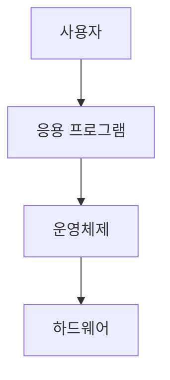

# 운영체제의 정의

## 운영체제 개요

### 개요
운영체제(Operating System, OS)는 컴퓨터 하드웨어와 소프트웨어 자원을 관리하고, 사용자와 응용 프로그램에게 서비스를 제공하는 시스템 소프트웨어입니다. 이 장에서는 운영체제의 기본 개념, 역사적 발전, 그리고 정보보안에서의 중요성에 대해 살펴봅니다.

### 운영체제란?
운영체제는 컴퓨터 시스템의 하드웨어와 소프트웨어 자원을 효율적으로 관리하고, 사용자와 응용 프로그램에게 편리한 인터페이스를 제공하는 시스템 소프트웨어입니다. 운영체제는 컴퓨터 시스템의 '매니저'이자 '중재자' 역할을 수행하며, 하드웨어와 소프트웨어 사이의 중간 계층으로 작동합니다.

#### 운영체제의 위치와 역할
운영체제는 컴퓨터 시스템에서 다음과 같은 위치에 있습니다:

- **하드웨어와 소프트웨어 사이의 중간 계층**: 하드웨어 자원을 추상화하여 응용 프로그램에게 제공
- **자원 관리자**: CPU, 메모리, 입출력 장치, 파일 시스템 등의 자원을 효율적으로 관리
- **서비스 제공자**: 사용자와 응용 프로그램에게 다양한 서비스와 인터페이스 제공

### 운영체제의 역사적 발전
운영체제는 컴퓨터 기술의 발전과 함께 진화해왔습니다.

1. **1940-1950년대**: 초기 컴퓨터에는 운영체제가 없었으며, 프로그래머가 직접 하드웨어를 제어
2. **1950-1960년대**: 일괄 처리 시스템(Batch Processing) - 작업을 모아서 순차적으로 처리
3. **1960-1970년대**: 다중 프로그래밍(Multiprogramming)과 시분할 시스템(Time-Sharing) 등장
4. **1970-1980년대**: 개인용 컴퓨터(PC)의 등장과 함께 MS-DOS, 초기 Mac OS 등 개발
5. **1980-1990년대**: 그래픽 사용자 인터페이스(GUI) 기반 운영체제 보편화 (Windows, Mac OS)
6. **1990년대 이후**: 네트워크 기반 운영체제, 모바일 운영체제, 클라우드 운영체제 등장

### 운영체제의 주요 특성
운영체제는 다음과 같은 주요 특성을 가집니다:

1. **동시성(Concurrency)**: 여러 프로세스가 동시에 실행될 수 있도록 지원
2. **자원 공유(Resource Sharing)**: 하드웨어 자원을 여러 사용자나 프로그램이 공유할 수 있도록 관리
3. **가상화(Virtualization)**: 물리적 자원을 논리적으로 추상화하여 제공
4. **비동기적 동작(Asynchronous Operation)**: 입출력 작업 등이 비동기적으로 처리될 수 있도록 지원
5. **보안(Security)**: 시스템과 데이터를 보호하기 위한 다양한 보안 메커니즘 제공

### 운영체제와 정보보안
운영체제는 정보보안의 핵심 요소로, 다음과 같은 보안 기능을 제공합니다:

- **인증(Authentication)**: 사용자 신원 확인
- **접근 제어(Access Control)**: 자원에 대한 접근 권한 관리
- **암호화(Encryption)**: 데이터 보호를 위한 암호화 지원
- **감사(Auditing)**: 시스템 활동 기록 및 모니터링
- **격리(Isolation)**: 프로세스 간 격리를 통한 보안 강화

운영체제 수준의 보안은 정보시스템 전체의 보안 기반이 되므로, 운영체제 자체의 취약점은 전체 시스템의 보안을 위협할 수 있습니다.

### 5가지 키워드로 정리하는 핵심 포인트
1. **시스템 소프트웨어**: 운영체제는 하드웨어와 응용 프로그램 사이의 중간 계층으로 작동하는 시스템 소프트웨어
2. **자원 관리**: CPU, 메모리, 입출력 장치, 파일 시스템 등의 컴퓨터 자원을 효율적으로 관리
3. **인터페이스 제공**: 사용자와 응용 프로그램에게 하드웨어를 쉽게 사용할 수 있는 인터페이스 제공
4. **발전 과정**: 일괄 처리 시스템에서 다중 프로그래밍, 시분할 시스템을 거쳐 현대적 운영체제로 발전
5. **보안 기능**: 인증, 접근 제어, 암호화 등 시스템 보안을 위한 기본 메커니즘 제공

### 확인 문제
1. 다음 중 운영체제의 정의로 가장 적절한 것은?
    - [ ] 컴퓨터의 물리적 구성 요소
    - [ ] 사용자가 직접 사용하는 응용 프로그램
    - [ ] 컴퓨터 하드웨어와 소프트웨어 자원을 관리하고, 사용자와 응용 프로그램에게 서비스를 제공하는 시스템 소프트웨어
    - [ ] 네트워크를 통해 다른 컴퓨터와 통신하는 소프트웨어

2. 운영체제의 주요 특성이 아닌 것은?
    - [ ] 동시성(Concurrency)
    - [ ] 자원 공유(Resource Sharing)
    - [ ] 하드웨어 설계(Hardware Design)
    - [ ] 가상화(Virtualization)

3. 운영체제가 제공하는 보안 기능으로 올바른 것을 모두 고르시오.
    - [ ] 인증(Authentication)
    - [ ] 접근 제어(Access Control)
    - [ ] 암호화(Encryption)
    - [ ] 하드웨어 수리(Hardware Repair)
    - [ ] 감사(Auditing)

> [정답 및 해설 보기](../answers_and_explanations.md#02-1-1)
