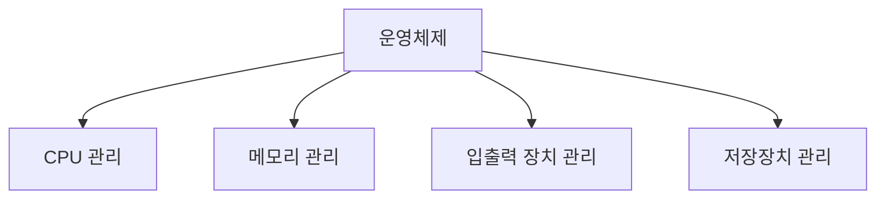

# 운영체제의 역할

## 운영체제 개요

### 개요
운영체제는 컴퓨터 시스템에서 다양한 핵심적인 역할을 수행합니다. 이 장에서는 운영체제가 수행하는 주요 역할과 기능, 그리고 이러한 역할이 정보보안에 미치는 영향에 대해 살펴봅니다.

### 운영체제의 주요 역할

운영체제는 컴퓨터 시스템에서 다음과 같은 핵심적인 역할을 수행합니다:

#### 하드웨어 관리
운영체제는 컴퓨터의 물리적 자원을 효율적으로 관리하고 제어합니다.

- **CPU 관리**: 프로세스에 CPU 시간을 할당하고, 스케줄링을 통해 효율적인 처리를 보장
- **메모리 관리**: 주기억장치(RAM)의 할당, 해제, 보호 및 가상 메모리 관리
- **입출력 장치 관리**: 키보드, 마우스, 디스플레이, 프린터 등의 입출력 장치 제어
- **저장장치 관리**: 하드 디스크, SSD 등의 보조기억장치 관리 및 파일 시스템 제공

#### 소프트웨어 인터페이스 제공
운영체제는 응용 프로그램과 하드웨어 사이의 중간 계층으로서 인터페이스를 제공합니다.

- **API(Application Programming Interface)**: 응용 프로그램이 하드웨어 자원을 사용할 수 있도록 표준화된 인터페이스 제공
- **시스템 호출(System Call)**: 응용 프로그램이 운영체제의 서비스를 요청하는 메커니즘
- **드라이버 관리**: 하드웨어 장치와의 통신을 위한 드라이버 관리

#### 사용자 인터페이스 제공
운영체제는 사용자가 컴퓨터와 상호작용할 수 있는 인터페이스를 제공합니다.

- **CLI(Command Line Interface)**: 텍스트 기반의 명령어 인터페이스 (예: Unix/Linux의 Shell, Windows의 CMD)
- **GUI(Graphical User Interface)**: 그래픽 기반의 사용자 인터페이스 (예: Windows, macOS, 다양한 Linux 데스크톱 환경)
- **NUI(Natural User Interface)**: 터치, 음성, 제스처 등을 활용한 자연스러운 인터페이스

#### 프로세스 관리
운영체제는 프로세스의 생성, 실행, 종료 및 프로세스 간 통신을 관리합니다.

- **프로세스 생성 및 종료**: 프로그램을 실행하여 프로세스를 생성하고, 작업 완료 후 종료
- **프로세스 스케줄링**: 여러 프로세스가 CPU를 효율적으로 사용할 수 있도록 스케줄링
- **프로세스 간 통신(IPC)**: 프로세스 간 데이터 교환 및 동기화 메커니즘 제공
- **교착 상태(Deadlock) 관리**: 프로세스 간 자원 경쟁으로 인한 교착 상태 예방 및 해결

#### 파일 시스템 관리
운영체제는 데이터를 구조화하여 저장하고 관리하는 파일 시스템을 제공합니다.

- **파일 생성, 읽기, 쓰기, 삭제**: 기본적인 파일 조작 기능 제공
- **디렉토리 관리**: 파일을 계층적으로 구조화하여 관리
- **접근 권한 관리**: 파일 및 디렉토리에 대한 사용자별 접근 권한 설정
- **저장 공간 할당**: 디스크 공간을 효율적으로 할당하고 관리

#### 네트워크 관리
현대 운영체제는 네트워크 연결 및 통신을 관리합니다.

- **네트워크 프로토콜 지원**: TCP/IP 등 다양한 네트워크 프로토콜 구현
- **네트워크 인터페이스 관리**: 네트워크 카드 등의 하드웨어 인터페이스 제어
- **네트워크 보안**: 방화벽, 암호화 등 기본적인 네트워크 보안 기능 제공

### 운영체제의 역할과 정보보안
운영체제의 다양한 역할은 정보보안과 밀접한 관련이 있습니다:

1. **접근 제어**: 운영체제는 사용자 인증과 권한 관리를 통해 시스템 자원에 대한 접근을 제어
2. **메모리 보호**: 프로세스 간 메모리 영역을 분리하여 한 프로세스가 다른 프로세스의 메모리에 접근하지 못하도록 보호
3. **파일 시스템 보안**: 파일 및 디렉토리에 대한 접근 권한 관리를 통해 데이터 보호
4. **네트워크 보안**: 기본적인 방화벽 기능과 네트워크 트래픽 모니터링을 통한 보안 강화
5. **감사 및 로깅**: 시스템 활동을 기록하고 모니터링하여 보안 사고 탐지 및 대응

운영체제의 보안 기능이 제대로 작동하지 않으면 전체 시스템의 보안이 위협받을 수 있으므로, 운영체제 수준의 보안은 정보보안의 기본 토대가 됩니다.

### 5가지 키워드로 정리하는 핵심 포인트
1. **자원 관리자**: 운영체제는 CPU, 메모리, 입출력 장치 등의 하드웨어 자원을 효율적으로 관리
2. **인터페이스 제공**: 사용자와 응용 프로그램에게 하드웨어를 쉽게 사용할 수 있는 인터페이스 제공
3. **프로세스 관리**: 프로세스의 생성, 실행, 종료 및 프로세스 간 통신을 관리
4. **파일 시스템**: 데이터를 구조화하여 저장하고 관리하는 파일 시스템 제공
5. **보안 기능**: 접근 제어, 메모리 보호, 파일 시스템 보안 등 기본적인 보안 메커니즘 제공

### 확인 문제
1. 다음 중 운영체제의 주요 역할이 아닌 것은?
    - [ ] CPU와 메모리 등의 하드웨어 자원 관리
    - [ ] 사용자와 하드웨어 간의 인터페이스 제공
    - [ ] 응용 프로그램 개발 및 컴파일
    - [ ] 파일 시스템 관리 및 데이터 저장

2. 운영체제의 프로세스 관리 기능에 포함되는 것은?
    - [ ] 하드웨어 드라이버 설치
    - [ ] 프로세스 스케줄링
    - [ ] 웹 브라우저 실행
    - [ ] 네트워크 케이블 연결

3. 운영체제가 정보보안에 기여하는 방식으로 올바른 것을 모두 고르시오.
    - [ ] 사용자 인증 및 접근 제어
    - [ ] 프로세스 간 메모리 보호
    - [ ] 파일 시스템 접근 권한 관리
    - [ ] 물리적 보안 장비 설치
    - [ ] 시스템 활동 로깅 및 감사

> [정답 및 해설 보기](../answers_and_explanations.md#02-1-2)
