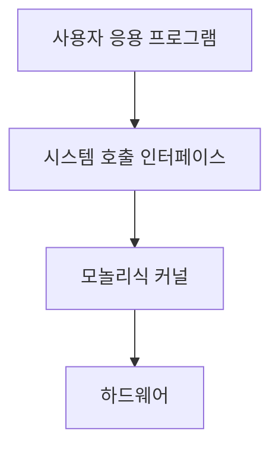
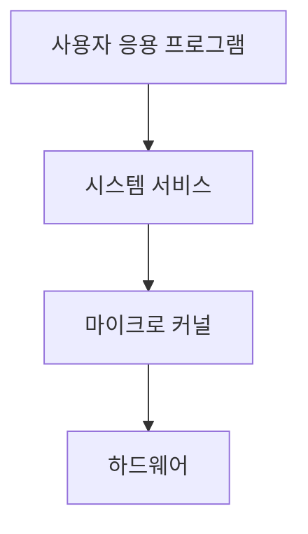

# 운영체제의 종류

## 운영체제 개요

### 개요
운영체제는 사용 목적, 구조, 기능에 따라 다양한 종류로 분류됩니다. 이 장에서는 주요 운영체제의 종류와 특징, 그리고 각 운영체제의 보안 특성에 대해 살펴봅니다.

### 사용 목적에 따른 분류

운영체제는 사용 목적에 따라 다음과 같이 분류할 수 있습니다:

#### 데스크톱 운영체제
개인용 컴퓨터에서 사용되는 운영체제로, 사용자 친화적인 인터페이스와 다양한 응용 프로그램 지원에 중점을 둡니다.

- **Windows**: Microsoft에서 개발한 가장 널리 사용되는 데스크톱 운영체제
  - Windows 10, Windows 11 등
  - 사용자 친화적인 GUI와 다양한 소프트웨어 호환성이 특징
  - 폐쇄적인 소스 코드(독점 소프트웨어)

- **macOS**: Apple에서 개발한 Mac 컴퓨터용 운영체제
  - macOS Monterey, macOS Ventura 등
  - 세련된 디자인과 안정성, Apple 하드웨어와의 최적화가 특징
  - 폐쇄적인 소스 코드와 제한된 하드웨어 지원

- **Linux 데스크톱 배포판**: 오픈 소스 기반의 데스크톱 운영체제
  - Ubuntu, Fedora, Linux Mint 등
  - 오픈 소스, 높은 사용자 정의 가능성, 다양한 배포판이 특징
  - 상대적으로 낮은 시장 점유율이지만 높은 보안성과 안정성

#### 서버 운영체제
다중 사용자 환경에서 네트워크 서비스, 데이터베이스, 웹 서버 등을 운영하기 위한 운영체제입니다.

- **Windows Server**: Microsoft의 서버용 운영체제
  - Windows Server 2019, Windows Server 2022 등
  - Active Directory, IIS 웹 서버 등 엔터프라이즈 기능 제공
  - 기업 환경에서 널리 사용됨

- **Linux 서버**: 서버 환경에서 가장 널리 사용되는 운영체제
  - Red Hat Enterprise Linux, Ubuntu Server, CentOS 등
  - 높은 안정성, 보안성, 확장성이 특징
  - 웹 서버, 클라우드 인프라에서 지배적인 점유율

- **Unix 계열**: 전통적인 서버 운영체제
  - Solaris, AIX, HP-UX 등
  - 높은 안정성과 성능, 엔터프라이즈급 기능 제공
  - 특수 목적의 서버 환경에서 사용

#### 모바일 운영체제
스마트폰, 태블릿 등 모바일 기기에 최적화된 운영체제입니다.

- **Android**: Google에서 개발한 오픈 소스 모바일 운영체제
  - Linux 커널 기반, 다양한 제조사의 기기에서 사용
  - 높은 시장 점유율과 다양한 앱 생태계
  - 기기별 파편화와 보안 업데이트 지연 문제 존재

- **iOS**: Apple에서 개발한 iPhone, iPad용 운영체제
  - 폐쇄적인 생태계와 하드웨어-소프트웨어 통합이 특징
  - 엄격한 앱 심사와 보안 정책으로 상대적으로 높은 보안성
  - 제한된 사용자 정의 가능성

#### 임베디드 운영체제
특수 목적의 임베디드 시스템에 사용되는 경량화된 운영체제입니다.

- **RTOS(Real-Time Operating System)**: 실시간 처리가 필요한 시스템용 운영체제
  - VxWorks, FreeRTOS, QNX 등
  - 정확한 시간 제약 내에서 작업 처리 보장
  - 의료 장비, 자동차 제어 시스템, 산업 자동화 등에 사용

- **IoT 운영체제**: 사물인터넷 기기를 위한 경량 운영체제
  - Contiki, RIOT, Zephyr 등
  - 제한된 자원에서 효율적으로 동작하도록 최적화
  - 저전력, 네트워크 연결성에 중점

### 구조에 따른 분류

운영체제는 내부 구조에 따라 다음과 같이 분류할 수 있습니다:

#### 모놀리식 커널(Monolithic Kernel)
모든 운영체제 서비스가 하나의 커널 공간에서 실행되는 구조입니다.

- **특징**:
  - 모든 시스템 서비스가 커널 모드에서 실행
  - 시스템 호출을 통해 서비스 접근
  - 높은 성능과 효율성
  - 하나의 모듈 오류가 전체 시스템에 영향을 줄 수 있음

- **예시**: Linux, Unix 전통적 구현

#### 마이크로 커널(Microkernel)
최소한의 기능만 커널에 포함하고, 나머지 서비스는 사용자 공간에서 실행하는 구조입니다.

- **특징**:
  - 메모리 관리, 프로세스 간 통신 등 핵심 기능만 커널에 포함
  - 파일 시스템, 네트워크 스택 등은 사용자 모드에서 실행
  - 높은 안정성과 모듈성
  - 상대적으로 낮은 성능(잦은 컨텍스트 스위칭)

- **예시**: QNX, MINIX

#### 하이브리드 커널(Hybrid Kernel)
모놀리식 커널과 마이크로 커널의 장점을 결합한 구조입니다.

- **특징**:
  - 성능이 중요한 서비스는 커널 모드에서 실행
  - 안정성이 중요한 서비스는 사용자 모드에서 실행
  - 모듈식 설계로 유연성 제공

- **예시**: Windows NT 커널(Windows 10/11), macOS(XNU 커널)

### 운영체제 종류별 보안 특성

각 운영체제는 고유한 보안 특성과 메커니즘을 가지고 있습니다:

#### Windows 보안 특성
- **사용자 계정 제어(UAC)**: 관리자 권한 사용을 제한하여 악성 소프트웨어의 영향 최소화
- **Windows Defender**: 내장된 안티바이러스 및 악성코드 방지 솔루션
- **BitLocker**: 디스크 암호화 기능
- **Windows Hello**: 생체 인식 기반 인증
- **보안 업데이트**: 정기적인 보안 패치 제공(Patch Tuesday)

#### Linux 보안 특성
- **권한 모델**: 사용자, 그룹, 기타 사용자에 대한 읽기/쓰기/실행 권한 체계
- **SELinux/AppArmor**: 강제적 접근 제어(MAC) 시스템
- **패키지 서명 확인**: 소프트웨어 패키지의 무결성 검증
- **오픈 소스**: 코드 검토를 통한 취약점 발견 용이
- **방화벽**: iptables/nftables 기반 네트워크 필터링

#### macOS 보안 특성
- **Gatekeeper**: 신뢰할 수 있는 소프트웨어만 실행 허용
- **SIP(System Integrity Protection)**: 시스템 파일 보호
- **FileVault**: 디스크 암호화
- **샌드박스**: 앱 격리를 통한 보안 강화
- **XProtect**: 내장된 악성코드 탐지 기능

#### 모바일 운영체제 보안 특성
- **앱 샌드박싱**: 앱 간 격리를 통한 보안 강화
- **앱 권한 관리**: 앱의 시스템 자원 접근 제한
- **원격 잠금 및 초기화**: 분실 시 데이터 보호
- **생체 인식**: 지문, 얼굴 인식 등을 통한 인증
- **암호화**: 저장 데이터 암호화

### 5가지 키워드로 정리하는 핵심 포인트
1. **데스크톱 OS**: Windows, macOS, Linux 등 개인용 컴퓨터를 위한 사용자 친화적 운영체제
2. **서버 OS**: Windows Server, Linux 서버 배포판 등 다중 사용자 및 서비스를 위한 운영체제
3. **모바일 OS**: Android, iOS 등 모바일 기기에 최적화된 운영체제
4. **커널 구조**: 모놀리식, 마이크로, 하이브리드 등 운영체제의 내부 설계 방식
5. **보안 메커니즘**: 각 운영체제별 고유한 보안 기능과 접근 방식

### 확인 문제
1. 다음 중 모놀리식 커널 구조의 특징으로 올바른 것은?
    - [ ] 모든 시스템 서비스가 사용자 모드에서 실행된다
    - [ ] 최소한의 기능만 커널에 포함한다
    - [ ] 모든 운영체제 서비스가 하나의 커널 공간에서 실행된다
    - [ ] 하드웨어와 직접 통신하지 않는다

2. 다음 중 Linux 운영체제의 보안 특성이 아닌 것은?
    - [ ] SELinux를 통한 강제적 접근 제어
    - [ ] 사용자 계정 제어(UAC)
    - [ ] 패키지 서명 확인을 통한 무결성 검증
    - [ ] iptables 기반 방화벽

3. 운영체제의 종류와 그 특징이 올바르게 연결된 것을 모두 고르시오.
    - [ ] Windows - 오픈 소스 기반 운영체제
    - [ ] macOS - Apple 하드웨어와의 최적화
    - [ ] Android - Linux 커널 기반 모바일 운영체제
    - [ ] RTOS - 정확한 시간 제약 내에서 작업 처리 보장
    - [ ] iOS - 다양한 제조사의 기기에서 사용

> [정답 및 해설 보기](../answers_and_explanations.md#02-1-3)
