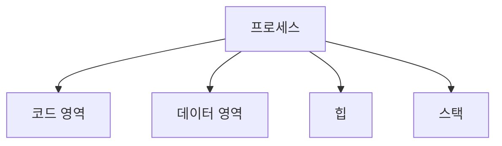
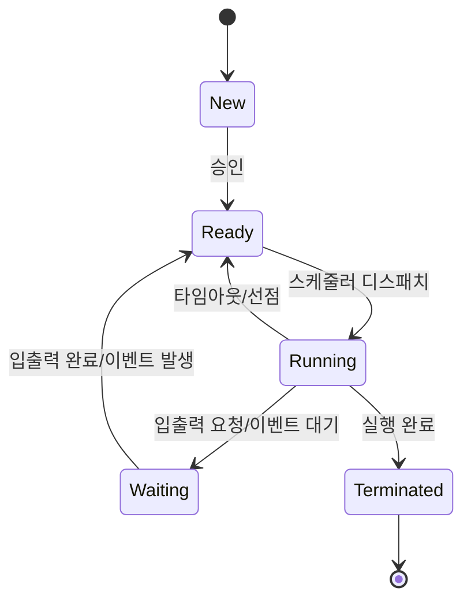

# 프로세스 관리

## 운영체제 구성요소

### 개요
프로세스 관리는 운영체제의 핵심 기능 중 하나로, 컴퓨터 시스템에서 실행되는 프로그램의 생성, 실행, 종료 및 상호작용을 관리합니다. 이 장에서는 프로세스의 개념, 상태, 스케줄링, 그리고 프로세스 관리와 관련된 보안 이슈에 대해 살펴봅니다.

### 프로세스의 개념

#### 프로세스와 프로그램의 차이
- **프로그램(Program)**: 디스크에 저장된 실행 가능한 파일로, 정적인 개체
- **프로세스(Process)**: 실행 중인 프로그램의 인스턴스로, 동적인 개체

프로세스는 다음과 같은 요소로 구성됩니다:
- **코드 영역(Code Section)**: 실행 가능한 프로그램 코드
- **데이터 영역(Data Section)**: 전역 변수
- **힙(Heap)**: 동적으로 할당되는 메모리 영역
- **스택(Stack)**: 함수 호출, 지역 변수 등을 위한 임시 메모리 영역

#### 프로세스 제어 블록(PCB)
프로세스 제어 블록(Process Control Block, PCB)은 운영체제가 프로세스를 관리하기 위해 유지하는 데이터 구조로, 다음과 같은 정보를 포함합니다:

- **프로세스 식별자(Process ID)**: 각 프로세스의 고유 식별자
- **프로세스 상태(Process State)**: 실행, 준비, 대기 등의 상태
- **프로그램 카운터(Program Counter)**: 다음에 실행할 명령어의 주소
- **CPU 레지스터**: 프로세스가 CPU를 양보할 때 저장되는 레지스터 값
- **CPU 스케줄링 정보**: 우선순위, 스케줄링 큐 포인터 등
- **메모리 관리 정보**: 메모리 할당 정보, 페이지 테이블 등
- **입출력 상태 정보**: 할당된 입출력 장치, 열린 파일 목록 등
- **계정 정보**: CPU 사용 시간, 계정 번호 등

### 프로세스 상태

프로세스는 생성부터 종료까지 다양한 상태를 거치게 됩니다:

1. **생성(New)**: 프로세스가 생성되는 상태
2. **준비(Ready)**: CPU를 할당받기 위해 대기하는 상태
3. **실행(Running)**: CPU를 할당받아 명령어를 실행하는 상태
4. **대기(Waiting/Blocked)**: 입출력 완료, 이벤트 발생 등을 기다리는 상태
5. **종료(Terminated)**: 프로세스 실행이 완료된 상태

### 프로세스 스케줄링

프로세스 스케줄링은 여러 프로세스가 CPU를 효율적으로 사용할 수 있도록 관리하는 기법입니다.

#### 스케줄링 목적
- **CPU 이용률 최대화**: CPU의 유휴 시간 최소화
- **처리량 최대화**: 단위 시간당 완료되는 프로세스 수 최대화
- **반환 시간 최소화**: 프로세스 제출부터 완료까지의 시간 최소화
- **대기 시간 최소화**: 프로세스가 준비 큐에서 대기하는 시간 최소화
- **응답 시간 최소화**: 요청 후 첫 응답까지의 시간 최소화

#### 주요 스케줄링 알고리즘
1. **선입선출(FCFS, First-Come, First-Served)**: 도착 순서대로 CPU 할당
2. **최단 작업 우선(SJF, Shortest Job First)**: 실행 시간이 가장 짧은 프로세스에 CPU 할당
3. **우선순위 스케줄링(Priority Scheduling)**: 우선순위가 높은 프로세스에 CPU 할당
4. **라운드 로빈(Round Robin)**: 각 프로세스에 동일한 시간 할당 후 순환
5. **다단계 큐(Multilevel Queue)**: 프로세스를 여러 큐로 분류하여 각 큐마다 다른 스케줄링 알고리즘 적용
6. **다단계 피드백 큐(Multilevel Feedback Queue)**: 프로세스가 큐 사이를 이동할 수 있는 다단계 큐

### 프로세스 간 통신(IPC)

프로세스 간 통신(Inter-Process Communication, IPC)은 프로세스들이 서로 데이터를 교환하고 동기화하는 메커니즘입니다.

#### 주요 IPC 메커니즘
1. **파이프(Pipe)**: 단방향 통신을 위한 채널
   - 익명 파이프: 부모-자식 프로세스 간 통신
   - 명명된 파이프(FIFO): 관련 없는 프로세스 간 통신

2. **메시지 큐(Message Queue)**: 구조화된 메시지를 교환하는 방식

3. **공유 메모리(Shared Memory)**: 여러 프로세스가 동일한 메모리 영역에 접근
   - 가장 빠른 IPC 방식이지만 동기화 문제 발생 가능

4. **세마포어(Semaphore)**: 공유 자원에 대한 접근을 제어하는 신호 메커니즘

5. **소켓(Socket)**: 네트워크를 통한 프로세스 간 통신
   - 로컬 및 원격 시스템의 프로세스 간 통신 가능

### 스레드(Thread)

스레드는 프로세스 내에서 실행되는 작업의 단위로, 하나의 프로세스는 여러 스레드를 가질 수 있습니다.

#### 스레드의 특징
- **경량 프로세스**: 프로세스보다 생성 및 컨텍스트 스위칭 비용이 적음
- **자원 공유**: 같은 프로세스 내의 스레드들은 코드, 데이터, 파일 등의 자원을 공유
- **독립적 실행**: 각 스레드는 독립적인 실행 경로를 가짐
- **병렬 처리**: 멀티코어 시스템에서 실제 병렬 실행 가능

#### 스레드 유형
1. **사용자 수준 스레드**: 사용자 라이브러리에 의해 관리되는 스레드
   - 장점: 운영체제 지원 없이 구현 가능, 효율적인 컨텍스트 스위칭
   - 단점: 한 스레드가 블록되면 전체 프로세스가 블록될 수 있음

2. **커널 수준 스레드**: 운영체제 커널에 의해 관리되는 스레드
   - 장점: 한 스레드가 블록되어도 다른 스레드는 실행 가능, 멀티코어 활용 가능
   - 단점: 생성 및 컨텍스트 스위칭 비용이 상대적으로 높음

### 프로세스 관리와 보안

프로세스 관리는 시스템 보안에 중요한 영향을 미칩니다:

#### 프로세스 격리
- **메모리 보호**: 각 프로세스는 독립된 메모리 공간을 가짐
- **권한 분리**: 프로세스는 할당된 권한 내에서만 동작
- **자원 제한**: CPU 시간, 메모리 사용량 등 자원 사용 제한

#### 프로세스 관련 보안 위협
1. **권한 상승 공격**: 프로세스가 더 높은 권한을 획득하려는 시도
2. **버퍼 오버플로우**: 프로세스 메모리 영역을 침범하여 코드 실행
3. **레이스 컨디션**: 프로세스 간 타이밍 취약점을 이용한 공격
4. **서비스 거부(DoS)**: 시스템 자원을 고갈시켜 서비스 불능 상태 유발
5. **좀비 프로세스**: 종료되었지만 시스템 자원을 계속 점유하는 프로세스

#### 보안 강화 방안
- **최소 권한 원칙**: 프로세스에 필요한 최소한의 권한만 부여
- **샌드박싱**: 프로세스를 격리된 환경에서 실행
- **자원 할당 제한**: CPU, 메모리 등 자원 사용량 제한
- **프로세스 모니터링**: 비정상적인 프로세스 활동 감시
- **보안 패치 적용**: 알려진 취약점에 대한 패치 적용

### 5가지 키워드로 정리하는 핵심 포인트
1. **프로세스**: 실행 중인 프로그램의 인스턴스로, 코드, 데이터, 스택, 힙으로 구성
2. **PCB**: 프로세스 제어 블록으로, 프로세스 관리를 위한 정보를 저장하는 데이터 구조
3. **스케줄링**: 여러 프로세스가 CPU를 효율적으로 사용할 수 있도록 관리하는 기법
4. **IPC**: 프로세스 간 통신 메커니즘으로, 파이프, 메시지 큐, 공유 메모리 등이 있음
5. **스레드**: 프로세스 내에서 실행되는 작업의 단위로, 자원을 공유하며 병렬 처리 가능

### 확인 문제
1. 다음 중 프로세스의 상태가 아닌 것은?
    - [ ] 생성(New)
    - [ ] 실행(Running)
    - [ ] 컴파일(Compiling)
    - [ ] 대기(Waiting)

2. 프로세스 제어 블록(PCB)에 포함되는 정보로 올바른 것은?
    - [ ] 사용자 계정 비밀번호
    - [ ] 프로세스 식별자(PID)
    - [ ] 하드웨어 드라이버 정보
    - [ ] 운영체제 버전 정보

3. 프로세스 간 통신(IPC) 메커니즘으로 올바른 것을 모두 고르시오.
    - [ ] 파이프(Pipe)
    - [ ] 공유 메모리(Shared Memory)
    - [ ] 세마포어(Semaphore)
    - [ ] 하드 디스크(Hard Disk)
    - [ ] 소켓(Socket)

> [정답 및 해설 보기](../answers_and_explanations.md#02-2-1)
