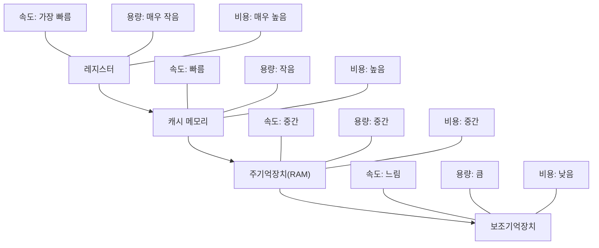

# 메모리 관리

## 운영체제 구성요소

### 개요
메모리 관리는 운영체제의 핵심 기능 중 하나로, 컴퓨터 시스템의 주기억장치(RAM)를 효율적으로 관리하고 프로세스에게 필요한 메모리를 할당하는 역할을 담당합니다. 이 장에서는 메모리 관리의 기본 개념, 주요 기법, 그리고 메모리 관리와 관련된 보안 이슈에 대해 살펴봅니다.

### 메모리 관리의 기본 개념

#### 메모리 계층 구조
컴퓨터 시스템의 메모리는 속도, 용량, 비용에 따라 계층적으로 구성됩니다:

1. **레지스터**: CPU 내부에 위치한 가장 빠른 메모리
2. **캐시 메모리**: CPU와 주기억장치 사이의 고속 버퍼 메모리
3. **주기억장치(RAM)**: 프로그램과 데이터가 실행 중에 저장되는 공간
4. **보조기억장치**: 하드 디스크, SSD 등 영구적인 저장 공간

#### 주소 바인딩
프로그램의 논리적 주소를 물리적 메모리 주소로 변환하는 과정입니다:

1. **컴파일 타임 바인딩**: 컴파일 시점에 물리적 메모리 주소 결정
2. **로드 타임 바인딩**: 프로그램 로딩 시점에 물리적 메모리 주소 결정
3. **실행 타임 바인딩**: 프로그램 실행 중에 물리적 메모리 주소 결정 (동적 주소 변환)

#### 메모리 관리 용어
- **논리적 주소(Logical Address)**: 프로세스가 생성하는 주소, 가상 주소라고도 함
- **물리적 주소(Physical Address)**: 실제 메모리 위치를 나타내는 주소
- **MMU(Memory Management Unit)**: 논리적 주소를 물리적 주소로 변환하는 하드웨어 장치

### 메모리 할당 기법

#### 연속 메모리 할당
프로세스에게 연속된 메모리 공간을 할당하는 방식입니다:

1. **단일 분할 할당(Single Partition Allocation)**
   - 메모리를 운영체제 영역과 사용자 프로세스 영역으로만 구분
   - 한 번에 하나의 프로세스만 메모리에 로드 가능

2. **고정 분할 할당(Fixed Partition Allocation)**
   - 메모리를 고정된 크기의 여러 분할로 나눔
   - 각 분할에 하나의 프로세스 할당
   - 내부 단편화(Internal Fragmentation) 발생 가능

3. **가변 분할 할당(Variable Partition Allocation)**
   - 프로세스 크기에 맞게 메모리를 동적으로 분할
   - 외부 단편화(External Fragmentation) 발생 가능
   - 할당 알고리즘: 최초 적합(First-Fit), 최적 적합(Best-Fit), 최악 적합(Worst-Fit)

#### 단편화(Fragmentation)
메모리 공간이 효율적으로 사용되지 못하는 현상입니다:

1. **내부 단편화(Internal Fragmentation)**
   - 프로세스에 할당된 메모리가 실제 필요한 양보다 클 때 발생
   - 고정 분할 할당에서 주로 발생

2. **외부 단편화(External Fragmentation)**
   - 총 가용 메모리는 충분하지만 연속된 공간이 부족하여 할당할 수 없는 상태
   - 가변 분할 할당에서 주로 발생
   - 해결책: 메모리 압축(Compaction), 페이징, 세그먼테이션

### 가상 메모리 관리

가상 메모리는 물리적 메모리의 크기 제약을 극복하기 위한 기법으로, 프로세스의 일부만 메모리에 로드하여 실행할 수 있게 합니다.

#### 페이징(Paging)
프로세스의 주소 공간을 고정 크기의 페이지로 나누고, 물리적 메모리를 같은 크기의 프레임으로 나누어 관리하는 기법입니다:

- **페이지(Page)**: 가상 메모리의 고정 크기 블록
- **프레임(Frame)**: 물리적 메모리의 고정 크기 블록
- **페이지 테이블(Page Table)**: 페이지와 프레임 간의 매핑 정보를 저장하는 자료구조

#### 세그먼테이션(Segmentation)
프로세스의 주소 공간을 논리적 단위(세그먼트)로 나누어 관리하는 기법입니다:

- **세그먼트(Segment)**: 코드, 데이터, 스택 등 논리적 단위
- **세그먼트 테이블(Segment Table)**: 세그먼트의 시작 주소와 길이 정보를 저장

#### 페이지 교체 알고리즘
메모리가 부족할 때 어떤 페이지를 디스크로 내보낼지 결정하는 알고리즘입니다:

1. **FIFO(First-In-First-Out)**: 가장 먼저 들어온 페이지를 교체
2. **LRU(Least Recently Used)**: 가장 오랫동안 사용되지 않은 페이지를 교체
3. **LFU(Least Frequently Used)**: 사용 빈도가 가장 낮은 페이지를 교체
4. **OPT(Optimal)**: 가장 오랫동안 사용되지 않을 페이지를 교체 (이론적인 알고리즘)
5. **Clock 알고리즘**: LRU의 근사 알고리즘으로, 참조 비트를 활용

#### 스레싱(Thrashing)
과도한 페이지 교체로 인해 시스템 성능이 급격히 저하되는 현상입니다:

- **원인**: 프로세스에 필요한 페이지 프레임 수가 부족할 때 발생
- **해결책**: 작업 세트(Working Set) 모델, 페이지 부재 빈도(PFF) 기법

### 메모리 보호와 보안

메모리 관리는 시스템 보안에 중요한 영향을 미칩니다:

#### 메모리 보호 기법
1. **경계 레지스터(Boundary Register)**
   - 기준 레지스터(Base Register)와 한계 레지스터(Limit Register)를 사용
   - 프로세스의 주소 범위를 벗어나는 접근 차단

2. **페이지 보호**
   - 페이지 테이블 항목에 보호 비트(Protection Bit) 설정
   - 읽기 전용, 읽기/쓰기, 실행 권한 등 지정

3. **세그먼트 보호**
   - 세그먼트 테이블 항목에 보호 비트 설정
   - 코드 세그먼트는 읽기/실행만 허용, 데이터 세그먼트는 읽기/쓰기 허용 등

#### 메모리 관련 보안 위협
1. **버퍼 오버플로우(Buffer Overflow)**
   - 할당된 버퍼 크기보다 많은 데이터를 쓰는 공격
   - 스택, 힙 등의 메모리 영역 침범 가능

2. **힙 스프레이(Heap Spray)**
   - 힙 메모리에 악성 코드를 대량으로 삽입하는 공격
   - 취약점 공격 성공률 높이기 위한 기법

3. **메모리 누수(Memory Leak)**
   - 할당된 메모리를 해제하지 않아 시스템 자원 고갈
   - 서비스 거부(DoS) 상태 유발 가능

4. **페이지 테이블 조작**
   - 페이지 테이블 항목을 조작하여 권한 없는 메모리 접근
   - 커널 메모리 영역 접근 시도

#### 보안 강화 방안
1. **ASLR(Address Space Layout Randomization)**
   - 프로세스의 메모리 레이아웃을 무작위화하여 공격 어렵게 함
   - 버퍼 오버플로우, ROP 공격 등 방어에 효과적

2. **DEP(Data Execution Prevention)/NX(No-Execute)**
   - 데이터 영역에서 코드 실행을 방지
   - 스택이나 힙에 삽입된 악성 코드 실행 차단

3. **스택 카나리(Stack Canary)**
   - 함수의 반환 주소 앞에 무작위 값(카나리) 삽입
   - 버퍼 오버플로우 탐지에 활용

4. **메모리 샌드박싱**
   - 프로세스의 메모리 접근을 제한된 영역으로 격리
   - 악성 코드의 영향 범위 최소화

### 5가지 키워드로 정리하는 핵심 포인트
1. **주소 변환**: 논리적 주소를 물리적 주소로 변환하는 메모리 관리의 핵심 기능
2. **메모리 할당**: 연속 할당, 페이징, 세그먼테이션 등 프로세스에 메모리를 할당하는 다양한 기법
3. **가상 메모리**: 물리적 메모리 크기 제약을 극복하기 위한 기법으로, 디스크를 메모리 확장으로 활용
4. **페이지 교체**: 메모리 부족 시 어떤 페이지를 디스크로 내보낼지 결정하는 알고리즘
5. **메모리 보호**: 경계 레지스터, 보호 비트, ASLR, DEP 등을 통한 메모리 보안 강화 기법

### 확인 문제
1. 다음 중 메모리 관리의 주요 목적이 아닌 것은?
    - [ ] 프로세스 간 메모리 보호
    - [ ] 메모리 사용 효율성 향상
    - [ ] 물리적 메모리 크기 제약 극복
    - [ ] 하드웨어 드라이버 개발 지원

2. 페이징 기법에서 발생할 수 있는 단편화는?
    - [ ] 외부 단편화
    - [ ] 내부 단편화
    - [ ] 둘 다 발생 가능
    - [ ] 둘 다 발생하지 않음

3. 메모리 보안을 강화하기 위한 기술로 올바른 것을 모두 고르시오.
    - [ ] ASLR(Address Space Layout Randomization)
    - [ ] DEP(Data Execution Prevention)
    - [ ] 스택 카나리(Stack Canary)
    - [ ] 디스크 조각 모음(Disk Defragmentation)
    - [ ] 페이지 테이블 암호화

> [정답 및 해설 보기](../answers_and_explanations.md#02-2-2)
