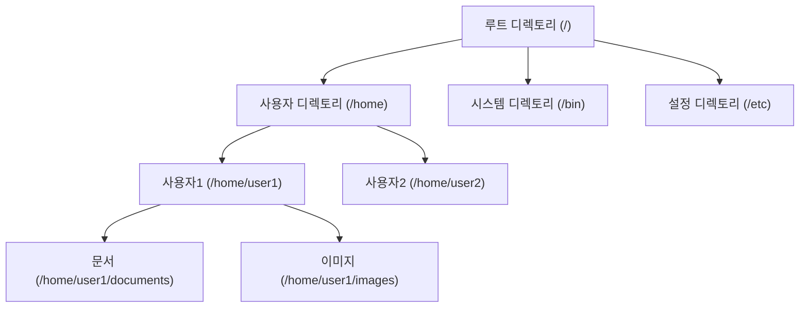
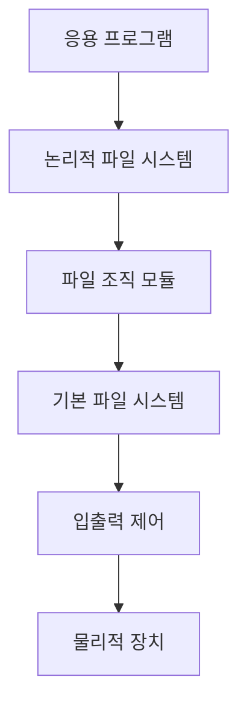

# 파일 시스템

## 운영체제 구성요소

### 개요
파일 시스템은 운영체제의 핵심 구성요소로, 컴퓨터 시스템에서 데이터를 저장, 조직, 검색하는 방법을 제공합니다. 이 장에서는 파일 시스템의 기본 개념, 구조, 주요 유형, 그리고 파일 시스템과 관련된 보안 이슈에 대해 살펴봅니다.

### 파일 시스템의 기본 개념

#### 파일(File)
파일은 관련 정보의 집합으로, 보조기억장치에 저장되는 논리적 단위입니다:

- **파일 속성**:
  - 이름(Name): 사용자가 파일을 식별하는 데 사용
  - 유형(Type): 파일의 종류(텍스트, 실행 파일, 이미지 등)
  - 크기(Size): 파일이 차지하는 공간
  - 위치(Location): 파일이 저장된 장치와 위치
  - 보호(Protection): 파일 접근 권한
  - 시간 정보(Timestamps): 생성, 수정, 접근 시간

- **파일 연산**:
  - 생성(Create): 새 파일 생성
  - 읽기(Read): 파일 내용 읽기
  - 쓰기(Write): 파일 내용 수정
  - 삭제(Delete): 파일 제거
  - 이름 변경(Rename): 파일 이름 변경
  - 복사(Copy): 파일 복제

#### 디렉토리(Directory)
디렉토리는 파일과 하위 디렉토리를 포함하는 특수한 유형의 파일로, 파일 시스템의 구조를 형성합니다:

- **디렉토리 구조**:
  - 단일 레벨 디렉토리: 모든 파일이 하나의 디렉토리에 위치
  - 계층적 디렉토리: 트리 구조로 디렉토리가 조직됨
  - 그래프 디렉토리: 하나의 파일이 여러 디렉토리에 속할 수 있음(링크)



#### 파일 접근 방식
파일에 접근하는 방법은 다음과 같습니다:

1. **순차 접근(Sequential Access)**:
   - 파일의 처음부터 순서대로 읽거나 쓰는 방식
   - 테이프 저장 장치에 적합

2. **직접 접근(Direct Access)**:
   - 파일의 특정 위치에 직접 접근하는 방식
   - 디스크 저장 장치에 적합

3. **색인 접근(Indexed Access)**:
   - 색인을 통해 파일의 특정 레코드에 접근하는 방식
   - 데이터베이스에 적합

### 파일 시스템 구조

#### 파일 시스템 계층
파일 시스템은 여러 계층으로 구성됩니다:

1. **응용 프로그램**: 파일 시스템 API를 사용하여 파일 조작
2. **논리적 파일 시스템**: 파일 메타데이터 관리, 디렉토리 구조 유지
3. **파일 조직 모듈**: 논리적 블록과 물리적 블록 간의 매핑
4. **기본 파일 시스템**: 디스크 블록 관리, 버퍼 캐싱
5. **입출력 제어**: 장치 드라이버와 인터럽트 핸들러
6. **장치**: 물리적 저장 장치(하드 디스크, SSD 등)



#### 파일 할당 방식
파일에 디스크 공간을 할당하는 방식은 다음과 같습니다:

1. **연속 할당(Contiguous Allocation)**:
   - 파일에 연속된 블록을 할당
   - 장점: 순차 접근이 빠름, 구현이 간단
   - 단점: 외부 단편화 발생, 파일 크기 변경이 어려움

2. **연결 할당(Linked Allocation)**:
   - 각 블록이 다음 블록의 포인터를 포함
   - 장점: 외부 단편화 없음, 파일 크기 변경이 쉬움
   - 단점: 직접 접근이 느림, 포인터 공간 낭비

3. **색인 할당(Indexed Allocation)**:
   - 색인 블록에 모든 포인터를 저장
   - 장점: 직접 접근 지원, 외부 단편화 없음
   - 단점: 작은 파일에 대한 공간 낭비, 큰 파일에 대한 다중 레벨 색인 필요

### 주요 파일 시스템 유형

#### Windows 파일 시스템
- **FAT(File Allocation Table)**:
  - FAT12, FAT16, FAT32 등의 변형
  - 간단한 구조, 호환성이 좋음
  - 제한된 보안 기능

- **NTFS(New Technology File System)**:
  - 고급 메타데이터, 트랜잭션 로깅
  - 접근 제어 목록(ACL)을 통한 보안
  - 파일 암호화, 압축 지원

#### Unix/Linux 파일 시스템
- **ext(Extended File System)**:
  - ext2, ext3, ext4 등의 변형
  - 리눅스의 표준 파일 시스템
  - 저널링(ext3, ext4), 대용량 파일 지원

- **XFS, JFS, Btrfs**:
  - 고성능, 확장성이 뛰어난 파일 시스템
  - 대용량 서버 환경에 적합

#### macOS 파일 시스템
- **HFS+(Hierarchical File System Plus)**:
  - 전통적인 macOS 파일 시스템
  - 유니코드 파일명, 메타데이터 지원

- **APFS(Apple File System)**:
  - 최신 macOS, iOS 파일 시스템
  - 암호화, 스냅샷, 공간 공유 기능

#### 네트워크 파일 시스템
- **NFS(Network File System)**:
  - Unix/Linux 환경의 네트워크 파일 공유
  - 원격 파일을 로컬처럼 접근

- **SMB/CIFS(Server Message Block/Common Internet File System)**:
  - Windows 환경의 네트워크 파일 공유
  - 크로스 플랫폼 지원

### 파일 시스템 보안

#### 파일 접근 제어
파일 시스템은 다양한 접근 제어 메커니즘을 제공합니다:

1. **사용자 기반 접근 제어**:
   - Unix/Linux의 권한 비트(읽기, 쓰기, 실행)
   - 소유자, 그룹, 기타 사용자에 대한 권한 설정

   ```
   -rwxr-xr--  1 user group  4096 Aug 24 15:30 example.txt
   ```
   - 소유자(user): 읽기, 쓰기, 실행 권한
   - 그룹(group): 읽기, 실행 권한
   - 기타 사용자: 읽기 권한만

2. **접근 제어 목록(ACL)**:
   - 더 세분화된 접근 제어
   - 특정 사용자나 그룹에 대한 권한 설정
   - NTFS, ext4 등에서 지원

3. **강제적 접근 제어(MAC)**:
   - SELinux, AppArmor 등
   - 시스템 정책에 따라 접근 제어
   - 사용자 권한보다 우선

#### 파일 시스템 취약점과 공격
파일 시스템과 관련된 주요 보안 위협은 다음과 같습니다:

1. **권한 설정 오류**:
   - 과도한 권한 부여로 인한 무단 접근
   - 중요 파일에 대한 부적절한 권한 설정

2. **심볼릭 링크 공격**:
   - 특수 권한을 가진 프로그램이 악의적인 링크를 따라가도록 유도
   - 권한 상승에 활용될 수 있음

3. **경로 순회 공격(Path Traversal)**:
   - `../` 등을 사용하여 의도하지 않은 디렉토리 접근
   - 웹 애플리케이션에서 자주 발생

4. **파일 인젝션**:
   - 악성 코드가 포함된 파일 업로드
   - 실행 권한을 얻어 시스템 침해

5. **파일 시스템 메타데이터 조작**:
   - 파일 시스템 구조 손상
   - 데이터 복구 방해

#### 파일 시스템 보안 강화 방안
파일 시스템 보안을 강화하기 위한 방법은 다음과 같습니다:

1. **최소 권한 원칙 적용**:
   - 필요한 최소한의 권한만 부여
   - 정기적인 권한 검토 및 조정

2. **파일 시스템 암호화**:
   - BitLocker, FileVault, LUKS 등을 통한 전체 디스크 암호화
   - 개별 파일 또는 디렉토리 암호화

3. **파일 무결성 모니터링**:
   - 중요 시스템 파일의 변경 감지
   - 해시 값 비교를 통한 무결성 검증

4. **보안 로깅 및 감사**:
   - 파일 접근 및 변경 이벤트 기록
   - 비정상적인 활동 모니터링

5. **안전한 파일 삭제**:
   - 단순 삭제가 아닌 데이터 완전 삭제(Wiping)
   - 민감한 정보의 복구 방지

### 5가지 키워드로 정리하는 핵심 포인트
1. **파일과 디렉토리**: 데이터를 저장하고 조직하는 논리적 단위와 구조
2. **파일 할당**: 연속, 연결, 색인 할당 등 디스크 공간을 파일에 할당하는 방식
3. **파일 시스템 유형**: FAT, NTFS, ext4, APFS 등 다양한 파일 시스템의 특징과 용도
4. **접근 제어**: 권한 비트, ACL, MAC 등을 통한 파일 접근 제어 메커니즘
5. **보안 위협과 대응**: 파일 시스템 관련 취약점과 이에 대한 보안 강화 방안

### 확인 문제
1. 다음 중 파일 할당 방식에 대한 설명으로 올바르지 않은 것은?
    - [ ] 연속 할당은 파일에 연속된 블록을 할당하여 순차 접근이 빠르다
    - [ ] 연결 할당은 각 블록이 다음 블록의 포인터를 포함하여 외부 단편화가 발생하지 않는다
    - [ ] 색인 할당은 모든 포인터를 색인 블록에 저장하여 직접 접근을 지원한다
    - [ ] 모든 파일 할당 방식은 파일 크기 변경에 동일한 효율성을 제공한다

2. Unix/Linux 시스템에서 파일 권한 'rwxr-x---'의 의미로 올바른 것은?
    - [ ] 모든 사용자가 읽기, 쓰기, 실행 권한을 가진다
    - [ ] 소유자는 모든 권한, 그룹은 읽기와 실행 권한, 기타 사용자는 권한이 없다
    - [ ] 소유자와 그룹만 읽기 권한을 가진다
    - [ ] 소유자만 쓰기 권한을 가지고, 모든 사용자가 실행 권한을 가진다

3. 파일 시스템 보안을 강화하기 위한 방법으로 올바른 것을 모두 고르시오.
    - [ ] 모든 파일에 최대 권한 부여
    - [ ] 파일 시스템 암호화 적용
    - [ ] 파일 무결성 모니터링
    - [ ] 중요 파일의 백업 비활성화
    - [ ] 최소 권한 원칙 적용

> [정답 및 해설 보기](../answers_and_explanations.md#02-2-3)
