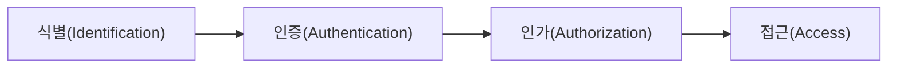
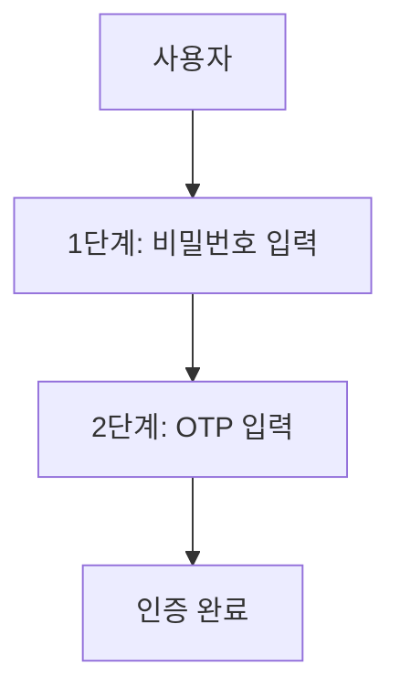

# 사용자 인증

## 운영체제 보안 기능

### 개요
사용자 인증은 운영체제의 핵심 보안 기능 중 하나로, 시스템에 접근하려는 사용자의 신원을 확인하는 과정입니다. 이 장에서는 사용자 인증의 기본 개념, 주요 인증 방식, 인증 관련 취약점 및 대응 방안에 대해 살펴봅니다.

### 사용자 인증의 기본 개념

#### 인증의 정의와 목적
인증(Authentication)은 사용자가 주장하는 신원이 실제로 맞는지 확인하는 과정입니다:

- **인증의 목적**:
  - 시스템 자원에 대한 무단 접근 방지
  - 사용자 행위에 대한 책임 추적성 확보
  - 시스템 보안 정책의 기반 제공

#### 인증 관련 용어
- **식별(Identification)**: 사용자가 자신의 신원을 주장하는 과정 (예: 사용자 ID 입력)
- **인증(Authentication)**: 주장된 신원이 맞는지 확인하는 과정 (예: 비밀번호 확인)
- **인가(Authorization)**: 인증된 사용자에게 특정 자원에 대한 접근 권한을 부여하는 과정
- **계정 관리(Account Management)**: 사용자 계정의 생성, 수정, 삭제, 감사 등을 관리하는 과정

#### 인증 요소
인증은 다음과 같은 요소를 기반으로 할 수 있습니다:

1. **지식 기반(Something You Know)**:
   - 사용자가 알고 있는 정보
   - 예: 비밀번호, PIN, 패턴, 보안 질문

2. **소유 기반(Something You Have)**:
   - 사용자가 소유한 물리적 장치
   - 예: 스마트카드, OTP 토큰, 휴대폰

3. **생체 기반(Something You Are)**:
   - 사용자의 생체적 특징
   - 예: 지문, 홍채, 얼굴, 음성

4. **행위 기반(Something You Do)**:
   - 사용자의 행동 패턴
   - 예: 키보드 타이핑 패턴, 서명 패턴

5. **위치 기반(Somewhere You Are)**:
   - 사용자의 물리적 또는 네트워크 위치
   - 예: GPS 위치, 특정 네트워크 접속

### 주요 인증 방식

#### 비밀번호 기반 인증
가장 일반적인 인증 방식으로, 사용자 ID와 비밀번호를 사용합니다:

- **장점**: 구현이 간단하고 사용자에게 친숙함
- **단점**: 추측 가능한 비밀번호 사용, 재사용, 피싱 등에 취약

**안전한 비밀번호 정책**:
- 최소 길이 요구 (일반적으로 8자 이상)
- 복잡성 요구 (대소문자, 숫자, 특수문자 조합)
- 주기적인 변경 요구
- 이전 비밀번호 재사용 금지
- 일반적인 단어나 개인 정보 사용 금지

#### 다중 요소 인증(MFA)
두 가지 이상의 인증 요소를 조합하여 사용하는 방식입니다:

- **2단계 인증(2FA)**: 두 가지 요소를 사용 (예: 비밀번호 + OTP)
- **장점**: 단일 요소 인증보다 훨씬 높은 보안성 제공
- **단점**: 추가적인 인증 단계로 인한 사용자 불편

#### 생체 인증
사용자의 생체적 특징을 이용한 인증 방식입니다:

1. **지문 인식**:
   - 지문의 고유한 패턴을 이용
   - 빠르고 편리하지만 위조 가능성 존재

2. **홍채/망막 인식**:
   - 눈의 고유한 패턴을 이용
   - 높은 정확도와 보안성

3. **얼굴 인식**:
   - 얼굴의 특징점을 이용
   - 편리하지만 조명, 각도 등에 영향 받음

4. **음성 인식**:
   - 목소리의 고유한 특성을 이용
   - 주변 소음에 영향 받을 수 있음

- **장점**: 편리함, 분실 위험 없음, 높은 보안성
- **단점**: 오인식 가능성, 생체 정보 변경 불가, 프라이버시 문제

#### 토큰 기반 인증
물리적 또는 소프트웨어 토큰을 이용한 인증 방식입니다:

1. **하드웨어 토큰**:
   - 물리적 장치로 OTP(일회용 비밀번호) 생성
   - 예: RSA SecurID, YubiKey

2. **소프트웨어 토큰**:
   - 스마트폰 앱 등을 통한 OTP 생성
   - 예: Google Authenticator, Microsoft Authenticator

3. **스마트카드**:
   - IC칩이 내장된 카드로 인증 정보 저장
   - 공인인증서 등에 활용

- **장점**: 높은 보안성, 피싱 공격에 강함
- **단점**: 토큰 분실 가능성, 추가 비용

#### 싱글 사인온(SSO)
하나의 인증으로 여러 시스템에 접근할 수 있는 방식입니다:

- **작동 방식**: 중앙 인증 서버에서 인증 후 티켓/토큰 발급
- **장점**: 사용자 편의성 향상, 비밀번호 관리 부담 감소
- **단점**: 단일 인증 정보 유출 시 여러 시스템 위험

**주요 SSO 프로토콜**:
- Kerberos: 티켓 기반 인증 프로토콜
- SAML(Security Assertion Markup Language)
- OAuth, OpenID Connect

### 운영체제별 인증 메커니즘

#### Windows 인증 메커니즘
Windows 운영체제에서 제공하는 인증 메커니즘입니다:

1. **로컬 인증**:
   - SAM(Security Accounts Manager) 데이터베이스 사용
   - NTLM 해시로 비밀번호 저장

2. **도메인 인증**:
   - Active Directory를 통한 중앙화된 인증
   - Kerberos 프로토콜 사용

3. **Windows Hello**:
   - 생체 인식(지문, 얼굴), PIN 등을 활용한 인증
   - TPM(Trusted Platform Module) 칩 활용

#### Unix/Linux 인증 메커니즘
Unix/Linux 시스템에서 제공하는 인증 메커니즘입니다:

1. **/etc/passwd, /etc/shadow**:
   - 전통적인 파일 기반 인증
   - 암호화된 비밀번호 저장

2. **PAM(Pluggable Authentication Modules)**:
   - 모듈식 인증 프레임워크
   - 다양한 인증 방식 통합 지원

3. **LDAP(Lightweight Directory Access Protocol)**:
   - 디렉토리 서비스를 통한 중앙화된 인증
   - OpenLDAP, 389 Directory Server 등

#### macOS 인증 메커니즘
macOS에서 제공하는 인증 메커니즘입니다:

1. **로컬 인증**:
   - 로컬 계정 데이터베이스 사용
   - Keychain을 통한 자격 증명 관리

2. **Touch ID/Face ID**:
   - 생체 인식을 통한 인증
   - Secure Enclave에서 생체 정보 처리

3. **디렉토리 서비스**:
   - Active Directory, OpenLDAP 등과 통합
   - Single Sign-On 지원

### 인증 관련 취약점과 공격

#### 주요 인증 취약점
인증 시스템에 존재할 수 있는 취약점입니다:

1. **약한 비밀번호 정책**:
   - 짧거나 단순한 비밀번호 허용
   - 일반적인 비밀번호 사용 가능

2. **기본 계정 및 비밀번호**:
   - 시스템 기본 계정(admin, root 등) 사용
   - 기본 비밀번호 변경하지 않음

3. **부적절한 세션 관리**:
   - 세션 타임아웃 미설정
   - 안전하지 않은 세션 ID 관리

4. **안전하지 않은 비밀번호 저장**:
   - 평문 저장 또는 약한 해시 알고리즘 사용
   - 솔트(salt) 미사용

#### 주요 인증 공격 기법
인증 시스템을 대상으로 하는 공격 기법입니다:

1. **무차별 대입 공격(Brute Force Attack)**:
   - 가능한 모든 비밀번호 조합 시도
   - 대응: 계정 잠금, 로그인 시도 제한

2. **사전 공격(Dictionary Attack)**:
   - 일반적인 단어나 구문을 이용한 공격
   - 대응: 복잡한 비밀번호 정책

3. **피싱(Phishing)**:
   - 가짜 로그인 페이지로 인증 정보 탈취
   - 대응: 사용자 교육, 다중 요소 인증

4. **키로깅(Keylogging)**:
   - 키보드 입력을 기록하여 비밀번호 탈취
   - 대응: 가상 키보드, 다중 요소 인증

5. **세션 하이재킹(Session Hijacking)**:
   - 인증 후 세션 정보를 탈취하여 접근
   - 대응: HTTPS 사용, 세션 타임아웃 설정

6. **패스워드 스프레이(Password Spray)**:
   - 여러 계정에 대해 소수의 일반적인 비밀번호 시도
   - 대응: 계정 잠금 정책, 강력한 비밀번호 요구

### 인증 보안 강화 방안

#### 기술적 대응 방안
인증 시스템의 보안을 강화하기 위한 기술적 방안입니다:

1. **다중 요소 인증(MFA) 적용**:
   - 최소 두 가지 이상의 인증 요소 요구
   - 비밀번호 + OTP, 생체 인증 등 조합

2. **강력한 비밀번호 정책 적용**:
   - 최소 길이, 복잡성 요구
   - 주기적인 변경, 이전 비밀번호 재사용 금지

3. **계정 잠금 정책 구현**:
   - 일정 횟수 이상 로그인 실패 시 계정 잠금
   - 점진적 지연 메커니즘 적용

4. **안전한 비밀번호 저장**:
   - 강력한 해시 알고리즘 사용 (bcrypt, Argon2 등)
   - 솔트(salt)와 페퍼(pepper) 적용

5. **보안 로깅 및 모니터링**:
   - 인증 시도 성공/실패 로깅
   - 비정상적인 로그인 패턴 모니터링

#### 관리적 대응 방안
인증 보안을 위한 관리적 방안입니다:

1. **사용자 교육**:
   - 안전한 비밀번호 생성 및 관리 교육
   - 피싱 등 사회공학적 공격 인식 교육

2. **계정 관리 정책**:
   - 미사용 계정 비활성화 및 삭제
   - 권한 있는 계정에 대한 특별 관리

3. **인증 정책 정기 검토**:
   - 인증 정책의 적절성 정기 평가
   - 새로운 위협에 대응한 정책 업데이트

4. **인증 실패 대응 절차**:
   - 인증 실패 시 대응 절차 수립
   - 계정 복구 프로세스 보안 강화

### 5가지 키워드로 정리하는 핵심 포인트
1. **인증 요소**: 지식, 소유, 생체, 행위, 위치 기반 등 다양한 인증 요소 활용
2. **다중 요소 인증**: 두 가지 이상의 인증 요소를 조합하여 보안성 강화
3. **생체 인증**: 지문, 홍채, 얼굴 등 생체적 특징을 활용한 편리하고 안전한 인증 방식
4. **인증 공격**: 무차별 대입, 사전 공격, 피싱 등 다양한 인증 시스템 공격 기법
5. **보안 강화 방안**: 강력한 비밀번호 정책, 계정 잠금, 안전한 저장 등 인증 보안 강화 기법

### 확인 문제
1. 다음 중 인증 요소에 해당하지 않는 것은?
    - [ ] 비밀번호(지식 기반)
    - [ ] OTP 토큰(소유 기반)
    - [ ] 지문 인식(생체 기반)
    - [ ] 네트워크 방화벽(기술 기반)

2. 다중 요소 인증(MFA)에 대한 설명으로 올바른 것은?
    - [ ] 하나의 인증 요소를 여러 번 확인하는 방식이다
    - [ ] 서로 다른 종류의 인증 요소를 두 개 이상 조합하여 사용하는 방식이다
    - [ ] 여러 사용자가 동시에 인증하는 방식이다
    - [ ] 하나의 인증으로 여러 시스템에 접근할 수 있는 방식이다

3. 인증 시스템의 보안을 강화하기 위한 방법으로 올바른 것을 모두 고르시오.
    - [ ] 모든 사용자에게 관리자 권한 부여
    - [ ] 다중 요소 인증(MFA) 적용
    - [ ] 강력한 비밀번호 정책 구현
    - [ ] 비밀번호를 평문으로 저장하여 관리 용이성 확보
    - [ ] 계정 잠금 정책 적용

> [정답 및 해설 보기](../answers_and_explanations.md#02-3-1)
