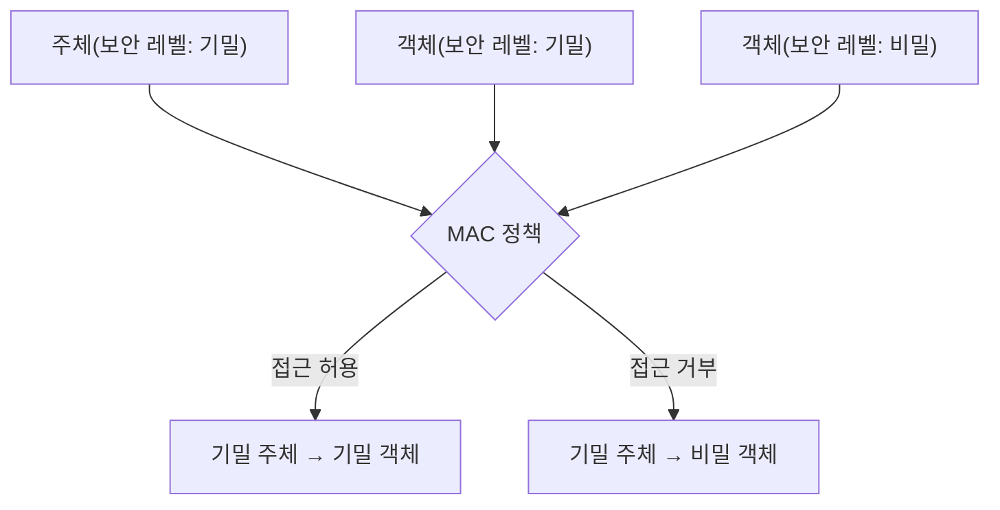
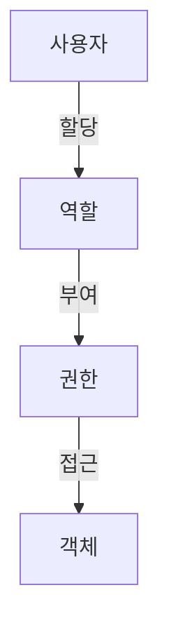

# 접근 제어

## 운영체제 보안 기능

### 개요
접근 제어(Access Control)는 운영체제의 핵심 보안 기능 중 하나로, 인증된 사용자가 시스템 자원에 접근할 수 있는 권한을 관리하는 메커니즘입니다. 이 장에서는 접근 제어의 기본 개념, 주요 모델, 구현 방식, 그리고 접근 제어와 관련된 보안 이슈에 대해 살펴봅니다.

### 접근 제어의 기본 개념

#### 접근 제어의 정의와 목적
접근 제어는 시스템 자원에 대한 접근을 제한하고 모니터링하는 보안 기술입니다:

- **접근 제어의 목적**:
  - 기밀성(Confidentiality): 권한 없는 접근으로부터 정보 보호
  - 무결성(Integrity): 권한 없는 수정으로부터 정보 보호
  - 가용성(Availability): 권한 있는 사용자의 접근 보장
  - 책임 추적성(Accountability): 자원 접근 및 사용에 대한 책임 부여

#### 접근 제어 프로세스
접근 제어는 다음과 같은 단계로 이루어집니다:

1. **식별(Identification)**: 사용자가 자신의 신원을 주장
2. **인증(Authentication)**: 주장된 신원이 맞는지 확인
3. **인가(Authorization)**: 인증된 사용자에게 접근 권한 부여
4. **접근(Access)**: 인가된 자원에 대한 접근 허용
5. **감사(Auditing)**: 접근 활동 기록 및 검토


#### 접근 제어 용어
- **주체(Subject)**: 자원에 접근하려는 엔티티(사용자, 프로세스 등)
- **객체(Object)**: 접근의 대상이 되는 자원(파일, 디렉토리, 장치 등)
- **접근 권한(Access Right)**: 객체에 대해 주체가 수행할 수 있는 작업(읽기, 쓰기, 실행 등)
- **접근 제어 정책(Access Control Policy)**: 접근 권한 부여에 관한 규칙
- **접근 제어 메커니즘(Access Control Mechanism)**: 정책을 구현하는 기술적 수단

### 접근 제어 모델

접근 제어 모델은 접근 권한을 관리하는 방식에 따라 다양한 유형으로 분류됩니다:

#### 임의 접근 제어(DAC, Discretionary Access Control)
객체의 소유자가 다른 주체에 대한 접근 권한을 자유롭게 설정할 수 있는 모델입니다:

- **특징**:
  - 객체 소유자의 재량에 따라 접근 권한 부여
  - 유연하고 사용자 친화적
  - 소유자가 실수로 과도한 권한을 부여할 위험 존재

- **예시**:
  - Unix/Linux의 파일 권한(rwx)
  - Windows의 NTFS 권한
  - 데이터베이스의 GRANT/REVOKE 명령

#### 강제 접근 제어(MAC, Mandatory Access Control)
중앙에서 정의된 보안 정책에 따라 접근 권한이 결정되는 모델입니다:

- **특징**:
  - 시스템 관리자가 정의한 보안 정책에 따라 접근 제어
  - 주체와 객체에 보안 레이블(Security Label) 할당
  - 사용자가 접근 권한을 변경할 수 없음
  - 높은 보안성, 낮은 유연성

- **예시**:
  - SELinux, AppArmor
  - 군사 및 정부 시스템
  - 다중 레벨 보안(MLS) 시스템



#### 역할 기반 접근 제어(RBAC, Role-Based Access Control)
사용자의 역할에 따라 접근 권한을 부여하는 모델입니다:

- **특징**:
  - 사용자는 하나 이상의 역할에 할당됨
  - 역할에 따라 접근 권한이 결정됨
  - 사용자 관리와 권한 관리 분리
  - 대규모 조직에 적합

- **구성 요소**:
  - 사용자(Users): 시스템을 사용하는 개체
  - 역할(Roles): 직무나 책임에 따른 그룹
  - 권한(Permissions): 객체에 대한 작업 수행 권한
  - 세션(Sessions): 사용자가 활성화한 역할 집합



#### 속성 기반 접근 제어(ABAC, Attribute-Based Access Control)
주체, 객체, 환경의 속성에 기반하여 접근 권한을 결정하는 모델입니다:

- **특징**:
  - 다양한 속성(사용자 속성, 자원 속성, 환경 속성 등)을 고려
  - 복잡하고 세밀한 접근 제어 정책 구현 가능
  - 동적인 환경에 적합
  - 구현 및 관리가 복잡

- **속성 유형**:
  - 주체 속성: 직위, 부서, 보안 인가 등
  - 객체 속성: 분류, 소유자, 데이터 유형 등
  - 환경 속성: 시간, 위치, 네트워크 상태 등

#### 기타 접근 제어 모델
- **규칙 기반 접근 제어(Rule-Based Access Control)**:
  - 사전 정의된 규칙에 따라 접근 권한 결정
  - 방화벽 규칙, 라우터 ACL 등에 활용

- **컨텍스트 기반 접근 제어(Context-Based Access Control)**:
  - 접근 요청의 컨텍스트(시간, 위치 등)를 고려
  - 제로 트러스트(Zero Trust) 모델의 기반

### 운영체제별 접근 제어 구현

#### Windows 접근 제어
Windows 운영체제에서 구현된 접근 제어 메커니즘입니다:

1. **NTFS 권한**:
   - 파일 및 디렉토리에 대한 접근 제어
   - 기본 권한: 읽기, 쓰기, 실행, 수정, 모든 권한 등
   - 상속 가능한 권한 구조

2. **접근 제어 목록(ACL)**:
   - 객체에 대한 접근 제어 항목(ACE) 목록
   - 사용자 또는 그룹별 권한 지정
   - 허용 및 거부 ACE 지원

3. **User Account Control(UAC)**:
   - 관리자 권한 사용을 제한하는 메커니즘
   - 권한 상승이 필요한 작업 시 명시적 승인 요구

4. **AppLocker**:
   - 응용 프로그램 실행 제어
   - 실행 가능한 프로그램 제한

#### Unix/Linux 접근 제어
Unix/Linux 시스템에서 구현된 접근 제어 메커니즘입니다:

1. **파일 권한 비트**:
   - 소유자(u), 그룹(g), 기타(o)에 대한 읽기(r), 쓰기(w), 실행(x) 권한
   - 특수 권한: SetUID, SetGID, Sticky Bit

   ```
   -rwxr-xr--  1 user group  4096 Aug 24 15:30 example.txt
   ```

2. **접근 제어 목록(ACL)**:
   - 기본 권한 비트를 넘어선 세밀한 접근 제어
   - `getfacl`, `setfacl` 명령으로 관리

3. **SELinux(Security-Enhanced Linux)**:
   - NSA에서 개발한 MAC 구현
   - 프로세스, 파일, 디렉토리 등에 보안 컨텍스트 할당
   - 정책에 따른 접근 제어

4. **AppArmor**:
   - 프로그램별 접근 제어 프로필 정의
   - 프로그램이 접근할 수 있는 파일 및 기능 제한

#### macOS 접근 제어
macOS에서 구현된 접근 제어 메커니즘입니다:

1. **파일 권한**:
   - Unix 스타일의 권한 비트
   - ACL 지원

2. **샌드박스(Sandbox)**:
   - 응용 프로그램의 시스템 자원 접근 제한
   - App Store 애플리케이션에 필수 적용

3. **Gatekeeper**:
   - 신뢰할 수 있는 소스의 앱만 실행 허용
   - 개발자 인증 확인

4. **TCC(Transparency, Consent, and Control)**:
   - 개인 데이터(위치, 연락처 등)에 대한 접근 제어
   - 사용자 명시적 동의 요구

### 접근 제어 관련 취약점과 공격

#### 주요 접근 제어 취약점
접근 제어 시스템에 존재할 수 있는 취약점입니다:

1. **과도한 권한 부여**:
   - 필요 이상의 권한 부여
   - 최소 권한 원칙 위반

2. **권한 상승 취약점**:
   - 낮은 권한에서 높은 권한으로 상승 가능한 취약점
   - 버퍼 오버플로우, 레이스 컨디션 등 활용

3. **접근 제어 우회**:
   - 접근 제어 메커니즘을 우회하는 방법 발견
   - 대체 경로, 직접 메모리 접근 등

4. **기본 설정 취약점**:
   - 안전하지 않은 기본 권한 설정
   - 기본 계정의 과도한 권한

5. **세션 관리 취약점**:
   - 세션 하이재킹, 세션 고정 등
   - 인증 후 접근 제어 실패

#### 주요 접근 제어 공격 기법
접근 제어 시스템을 대상으로 하는 공격 기법입니다:

1. **권한 상승 공격(Privilege Escalation)**:
   - 수직적 권한 상승: 낮은 권한에서 높은 권한으로 상승
   - 수평적 권한 상승: 동일 권한 레벨의 다른 사용자 권한 획득

2. **접근 제어 목록 조작**:
   - ACL 설정 변경을 통한 무단 접근
   - 파일 권한 변경 공격

3. **경로 순회 공격(Path Traversal)**:
   - `../` 등을 사용하여 접근 제한된 디렉토리 접근
   - 웹 애플리케이션에서 자주 발생

4. **사회공학적 공격**:
   - 권한 있는 사용자를 속여 접근 권한 획득
   - 피싱, 스피어 피싱 등

5. **측면 채널 공격(Side-Channel Attack)**:
   - 시스템 구현의 물리적 특성을 이용한 공격
   - 타이밍 공격, 전력 분석 등

### 접근 제어 보안 강화 방안

#### 기술적 대응 방안
접근 제어 시스템의 보안을 강화하기 위한 기술적 방안입니다:

1. **최소 권한 원칙(Principle of Least Privilege) 적용**:
   - 필요한 최소한의 권한만 부여
   - 특권 계정 사용 최소화

2. **직무 분리(Separation of Duties) 구현**:
   - 중요 작업을 여러 사용자로 분리
   - 단일 사용자의 권한 남용 방지

3. **다중 요소 인증(MFA) 적용**:
   - 중요 자원 접근 시 추가 인증 요구
   - 인증 강화를 통한 접근 제어 보완

4. **접근 제어 정책 강화**:
   - 명시적 거부(Explicit Deny) 우선 적용
   - 기본적으로 모든 접근 거부(Default Deny)

5. **보안 로깅 및 모니터링**:
   - 접근 시도 및 권한 변경 로깅
   - 비정상적인 접근 패턴 모니터링

#### 관리적 대응 방안
접근 제어 보안을 위한 관리적 방안입니다:

1. **접근 제어 정책 수립 및 문서화**:
   - 명확한 접근 제어 정책 정의
   - 정기적인 정책 검토 및 업데이트

2. **정기적인 접근 권한 검토**:
   - 사용자 권한의 적절성 정기 검토
   - 불필요한 권한 제거

3. **권한 있는 계정 관리**:
   - 관리자 계정 등 특별 관리
   - 권한 있는 계정의 사용 감사

4. **사용자 교육**:
   - 접근 제어 정책 및 절차 교육
   - 보안 인식 향상 교육

5. **계정 수명 주기 관리**:
   - 입사, 부서 이동, 퇴사 등에 따른 권한 조정
   - 미사용 계정 비활성화 및 삭제

### 5가지 키워드로 정리하는 핵심 포인트
1. **접근 제어 모델**: DAC, MAC, RBAC, ABAC 등 다양한 접근 제어 방식과 특징
2. **최소 권한 원칙**: 필요한 최소한의 권한만 부여하여 보안 위험 최소화
3. **운영체제별 구현**: Windows ACL, Linux 파일 권한, SELinux 등 OS별 접근 제어 메커니즘
4. **권한 상승 공격**: 접근 제어를 우회하여 높은 권한을 획득하는 공격 기법
5. **보안 강화 방안**: 직무 분리, 다중 요소 인증, 정기적 권한 검토 등 접근 제어 보안 강화 기법

### 확인 문제
1. 다음 중 접근 제어 모델에 대한 설명으로 올바르지 않은 것은?
    - [ ] DAC(임의 접근 제어)는 객체의 소유자가 접근 권한을 설정할 수 있다
    - [ ] MAC(강제 접근 제어)는 중앙에서 정의된 보안 정책에 따라 접근 권한이 결정된다
    - [ ] RBAC(역할 기반 접근 제어)는 사용자의 역할에 따라 접근 권한을 부여한다
    - [ ] 모든 접근 제어 모델은 동일한 수준의 보안성을 제공한다

2. Unix/Linux 시스템에서 파일 권한 'rwxr-x---'의 의미로 올바른 것은?
    - [ ] 모든 사용자가 읽기, 쓰기, 실행 권한을 가진다
    - [ ] 소유자는 모든 권한, 그룹은 읽기와 실행 권한, 기타 사용자는 권한이 없다
    - [ ] 소유자와 그룹만 읽기 권한을 가진다
    - [ ] 소유자만 쓰기 권한을 가지고, 모든 사용자가 실행 권한을 가진다

3. 접근 제어 보안을 강화하기 위한 방법으로 올바른 것을 모두 고르시오.
    - [ ] 모든 사용자에게 관리자 권한 부여
    - [ ] 최소 권한 원칙 적용
    - [ ] 직무 분리 구현
    - [ ] 기본 계정 및 비밀번호 유지
    - [ ] 정기적인 접근 권한 검토

> [정답 및 해설 보기](../answers_and_explanations.md#02-3-2)
