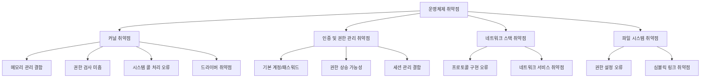
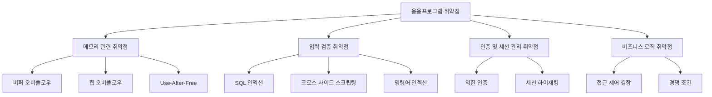
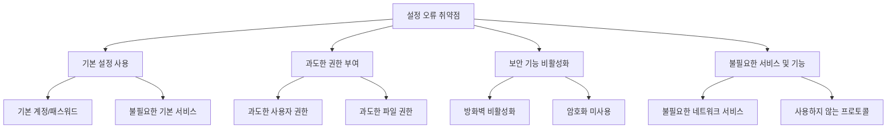

# 운영체제 취약점

## 시스템 취약점

### 개요
운영체제 취약점은 시스템 보안의 핵심 요소로, 컴퓨터 시스템의 기반이 되는 운영체제의 결함이나 약점을 의미합니다. 이 장에서는 운영체제 취약점의 유형, 주요 공격 벡터, 그리고 이에 대한 대응 방안에 대해 살펴봅니다.

### 운영체제 취약점의 이해

#### 운영체제 취약점의 정의
운영체제 취약점은 운영체제 소프트웨어의 설계, 구현, 또는 구성상의 결함으로, 공격자가 시스템의 기밀성, 무결성, 가용성을 침해할 수 있는 보안 약점을 말합니다:

- **취약점의 특성**:
  - 시스템 전체에 영향을 미침
  - 높은 권한(관리자/루트)으로 실행되는 경우가 많음
  - 패치가 적용되기 전까지 지속적인 위험 요소
  - 제로데이(Zero-day) 취약점의 경우 특히 위험

#### 운영체제 취약점의 유형
운영체제 취약점은 다양한 형태로 나타날 수 있습니다:

1. **커널 취약점**:
   - 메모리 관리 결함
   - 권한 검사 미흡
   - 시스템 콜 처리 오류
   - 드라이버 취약점

2. **인증 및 권한 관리 취약점**:
   - 기본 계정 및 패스워드 사용
   - 권한 상승 가능성
   - 세션 관리 결함
   - 접근 제어 미흡

3. **네트워크 스택 취약점**:
   - 프로토콜 구현 오류
   - 네트워크 서비스 취약점
   - 방화벽 구성 오류

4. **파일 시스템 취약점**:
   - 권한 설정 오류
   - 심볼릭 링크 취약점
   - 경로 순회(Path Traversal) 취약점

### 주요 운영체제별 취약점 특성

#### Windows 운영체제 취약점
Windows 운영체제는 시장 점유율이 높아 공격자들의 주요 타겟이 됩니다:

- **Windows 특유의 취약점**:
  - ActiveX 및 COM 객체 관련 취약점
  - Windows 레지스트리 취약점
  - SMB/CIFS 프로토콜 취약점(예: EternalBlue)
  - Windows 서비스 취약점

- **주요 공격 사례**:
  - WannaCry 랜섬웨어(MS17-010 취약점 이용)
  - BlueKeep 취약점(CVE-2019-0708)
  - PrintNightmare 취약점(CVE-2021-34527)

#### Unix/Linux 운영체제 취약점
Unix 및 Linux 시스템은 서버 환경에서 널리 사용되어 중요한 타겟이 됩니다:

- **Unix/Linux 특유의 취약점**:
  - SetUID/SetGID 프로그램 취약점
  - 쉘 관련 취약점
  - 시스템 유틸리티 취약점
  - 공유 라이브러리 취약점

- **주요 공격 사례**:
  - Shellshock 취약점(CVE-2014-6271)
  - Dirty COW 취약점(CVE-2016-5195)
  - Sudo 취약점(CVE-2021-3156)

#### macOS 운영체제 취약점
macOS는 Unix 기반이지만 고유한 취약점도 존재합니다:

- **macOS 특유의 취약점**:
  - XNU 커널 취약점
  - Objective-C/Swift 런타임 취약점
  - Gatekeeper 우회 취약점
  - Keychain 관련 취약점

### 운영체제 취약점 대응 방안

#### 패치 관리
운영체제 취약점에 대한 가장 기본적인 대응은 정기적인 패치 적용입니다:

- **효과적인 패치 관리 전략**:
  - 보안 업데이트 자동화
  - 패치 우선순위 설정
  - 패치 적용 전 테스트
  - 패치 적용 후 모니터링
  - 패치 불가능한 시스템에 대한 대체 통제

#### 시스템 강화(Hardening)
시스템 강화는 운영체제의 보안 설정을 최적화하는 과정입니다:

- **주요 강화 방법**:
  - 불필요한 서비스 및 포트 비활성화
  - 최소 권한 원칙 적용
  - 보안 기준(Baseline) 설정
  - 보안 템플릿 적용
  - 파일 시스템 권한 최적화

#### 모니터링 및 감사
지속적인 모니터링은 취약점 악용 시도를 탐지하는 데 중요합니다:

- **효과적인 모니터링 방법**:
  - 시스템 로그 분석
  - 이상 행동 탐지
  - 무결성 검사
  - 취약점 스캐닝
  - 침입 탐지/방지 시스템(IDS/IPS) 활용

### 응용프로그램 취약점

#### 응용프로그램 취약점의 정의
응용프로그램 취약점은 운영체제 위에서 실행되는 소프트웨어의 결함으로, 공격자가 악용하여 시스템에 접근하거나 데이터를 탈취할 수 있는 보안 약점을 말합니다:

- **응용프로그램 취약점의 특성**:
  - 특정 소프트웨어에 국한됨
  - 사용자 권한으로 실행되는 경우가 많음
  - 다양한 공격 벡터 제공
  - 패치 적용이 지연되는 경우가 많음

#### 주요 응용프로그램 취약점 유형

1. **메모리 관련 취약점**:
   - 버퍼 오버플로우
   - 힙 오버플로우
   - 정수 오버플로우
   - 포맷 스트링 취약점
   - Use-After-Free 취약점

2. **입력 검증 취약점**:
   - SQL 인젝션
   - 크로스 사이트 스크립팅(XSS)
   - 명령어 인젝션
   - XML 외부 엔티티(XXE) 인젝션

3. **인증 및 세션 관리 취약점**:
   - 약한 인증 메커니즘
   - 세션 하이재킹 취약점
   - 자격 증명 관리 결함
   - 다중 인증 부재

4. **비즈니스 로직 취약점**:
   - 접근 제어 결함
   - 경쟁 조건(Race Condition)
   - 기능 오용 가능성
   - 비즈니스 규칙 우회

#### 주요 응용프로그램 취약점 사례

- **웹 브라우저 취약점**:
  - 자바스크립트 엔진 취약점
  - 플러그인 취약점(Flash, Java 등)
  - 동일 출처 정책(SOP) 우회 취약점

- **오피스 소프트웨어 취약점**:
  - 문서 파일 형식 취약점
  - 매크로 악용
  - OLE 객체 취약점

- **데이터베이스 소프트웨어 취약점**:
  - 권한 상승 취약점
  - 원격 코드 실행 취약점
  - 데이터 유출 취약점

- **미디어 플레이어 취약점**:
  - 코덱 취약점
  - 파일 파싱 취약점
  - 메모리 손상 취약점

### 응용프로그램 취약점 대응 방안

#### 보안 개발 수명주기(SDLC) 적용
보안을 고려한 개발 프로세스는 취약점을 사전에 방지합니다:

- **주요 SDLC 활동**:
  - 보안 요구사항 정의
  - 위협 모델링
  - 보안 코드 리뷰
  - 정적/동적 애플리케이션 보안 테스팅
  - 취약점 관리

#### 패치 및 업데이트 관리
응용프로그램의 정기적인 업데이트는 취약점 노출을 최소화합니다:

- **효과적인 업데이트 관리**:
  - 소프트웨어 인벤토리 관리
  - 자동 업데이트 활성화
  - 패치 적용 우선순위 설정
  - 레거시 소프트웨어 관리 전략

#### 애플리케이션 화이트리스팅
승인된 응용프로그램만 실행을 허용하는 방식으로 보안을 강화합니다:

- **화이트리스팅 구현 방법**:
  - 해시 기반 식별
  - 디지털 서명 확인
  - 경로 기반 제한
  - 발행자 기반 제한

### 설정 오류 취약점

#### 설정 오류 취약점의 정의
설정 오류 취약점은 시스템이나 응용프로그램의 부적절한 구성으로 인해 발생하는 보안 약점으로, 기술적 결함이 아닌 관리적 실수에 기인합니다:

- **설정 오류 취약점의 특성**:
  - 패치로 해결되지 않음
  - 관리자의 지식 부족이나 실수로 발생
  - 기본 설정 사용으로 인한 위험
  - 발견 및 수정이 상대적으로 용이

#### 주요 설정 오류 취약점 유형

1. **기본 설정 사용**:
   - 기본 계정 및 패스워드 미변경
   - 불필요한 기본 서비스 활성화
   - 기본 권한 설정 유지
   - 샘플 파일 및 디렉토리 미제거

2. **과도한 권한 부여**:
   - 필요 이상의 사용자 권한
   - 과도한 파일 시스템 권한
   - 불필요한 관리자 권한
   - 서비스 계정의 과도한 권한

3. **보안 기능 비활성화**:
   - 방화벽 비활성화
   - 암호화 기능 미사용
   - 로깅 및 감사 기능 비활성화
   - 자동 업데이트 비활성화

4. **불필요한 서비스 및 기능**:
   - 불필요한 네트워크 서비스
   - 사용하지 않는 프로토콜
   - 불필요한 시스템 기능
   - 테스트 및 디버그 기능

#### 주요 설정 오류 사례

- **서버 설정 오류**:
  - 디렉토리 리스팅 활성화
  - 오류 메시지의 과도한 정보 노출
  - 관리 인터페이스의 불충분한 보호
  - 불필요한 포트 개방

- **데이터베이스 설정 오류**:
  - 약한 인증 설정
  - 불필요한 데이터베이스 기능 활성화
  - 과도한 데이터베이스 권한
  - 원격 접속 불필요한 허용

- **네트워크 장비 설정 오류**:
  - 약한 암호화 프로토콜 사용
  - SNMP 커뮤니티 스트링 기본값 사용
  - 불필요한 관리 프로토콜 활성화
  - ACL 구성 오류

- **클라우드 서비스 설정 오류**:
  - 과도하게 개방된 스토리지 버킷
  - 불충분한 IAM 정책
  - 공개 API 엔드포인트 보호 미흡
  - 로깅 및 모니터링 설정 부재

### 설정 오류 취약점 대응 방안

#### 보안 기준(Baseline) 수립
일관된 보안 설정을 위한 기준을 수립합니다:

- **효과적인 보안 기준 관리**:
  - 산업 표준 및 가이드라인 참조(CIS, NIST 등)
  - 환경별 맞춤형 보안 기준 수립
  - 정기적인 기준 검토 및 업데이트
  - 자동화된 기준 적용 도구 활용

#### 설정 검토 및 감사
정기적인 설정 검토로 오류를 식별합니다:

- **주요 검토 활동**:
  - 취약점 스캐닝
  - 설정 검증 도구 활용
  - 수동 설정 검토
  - 침투 테스트

#### 설정 관리 자동화
자동화를 통해 설정 오류를 최소화합니다:

- **자동화 방법**:
  - 구성 관리 도구 활용(Ansible, Chef, Puppet 등)
  - 인프라스트럭처 코드화(IaC)
  - 표준 이미지 및 템플릿 사용
  - 자동화된 검증 및 교정

### 5가지 키워드로 정리하는 핵심 포인트
1. **운영체제 취약점**: 시스템 전체에 영향을 미치는 OS 소프트웨어의 결함으로, 커널, 인증, 네트워크 스택, 파일 시스템 등에서 발생
2. **응용프로그램 취약점**: 특정 소프트웨어의 결함으로, 메모리 관련, 입력 검증, 인증 및 세션 관리, 비즈니스 로직 등에서 발생
3. **설정 오류 취약점**: 부적절한 시스템 구성으로 인한 보안 약점으로, 기본 설정 사용, 과도한 권한, 보안 기능 비활성화 등이 해당
4. **패치 관리**: 취약점에 대한 기본적인 대응 방안으로, 정기적인 업데이트와 패치 적용이 중요
5. **보안 강화(Hardening)**: 불필요한 서비스 비활성화, 최소 권한 원칙 적용, 보안 기준 설정 등을 통한 시스템 보안 강화

### 확인 문제
1. 다음 중 운영체제 취약점에 해당하지 않는 것은?
    - [ ] 커널 메모리 관리 결함
    - [ ] 시스템 콜 처리 오류
    - [ ] SQL 인젝션 취약점
    - [ ] 파일 시스템 권한 설정 오류

2. 설정 오류 취약점의 특성으로 올바른 것은?
    - [ ] 항상 소프트웨어 패치로 해결된다
    - [ ] 기술적 결함보다는 관리적 실수에 기인한다
    - [ ] 발견 및 수정이 매우 어렵다
    - [ ] 운영체제에만 영향을 미친다

3. 시스템 보안을 강화하기 위한 방법으로 올바른 것을 모두 고르시오.
    - [ ] 모든 사용자에게 관리자 권한 부여
    - [ ] 정기적인 보안 패치 적용
    - [ ] 불필요한 서비스 및 포트 비활성화
    - [ ] 기본 계정 및 패스워드 유지
    - [ ] 보안 로깅 및 모니터링 구현

> [정답 및 해설 보기](../answers_and_explanations.md#03-1-1)
