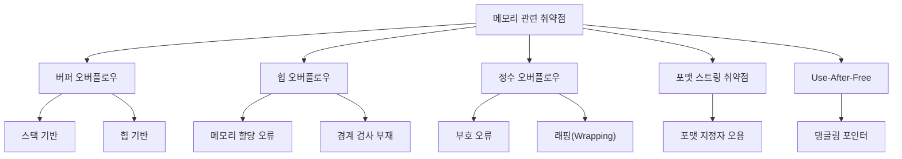
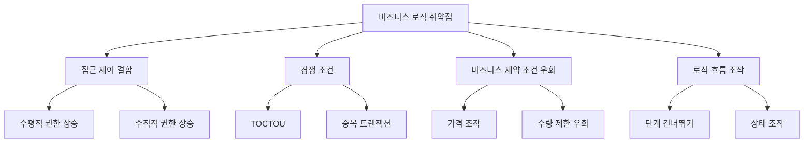
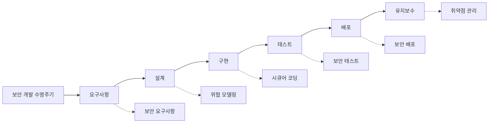

# 응용프로그램 취약점

## 시스템 취약점

### 개요
응용프로그램 취약점은 소프트웨어 보안의 중요한 영역으로, 운영체제 위에서 실행되는 프로그램의 결함이나 약점을 의미합니다. 이 장에서는 응용프로그램 취약점의 유형, 주요 공격 사례, 그리고 이에 대한 대응 방안에 대해 살펴봅니다.

### 응용프로그램 취약점의 이해

#### 응용프로그램 취약점의 정의
응용프로그램 취약점은 소프트웨어의 설계, 구현, 또는 구성상의 결함으로, 공격자가 프로그램의 정상적인 동작을 방해하거나 권한 없는 기능에 접근할 수 있는 보안 약점을 말합니다:

- **취약점의 특성**:
  - 특정 소프트웨어에 국한됨
  - 사용자 권한으로 실행되는 경우가 많음
  - 다양한 공격 벡터 제공
  - 패치 적용이 지연되는 경우가 많음
  - 운영체제 취약점보다 더 흔하게 발견됨

#### 응용프로그램 취약점과 운영체제 취약점의 차이
응용프로그램 취약점과 운영체제 취약점은 몇 가지 중요한 차이점이 있습니다:

1. **영향 범위**:
   - 운영체제 취약점: 시스템 전체에 영향
   - 응용프로그램 취약점: 주로 해당 응용프로그램에 국한

2. **권한 수준**:
   - 운영체제 취약점: 종종 시스템/관리자 권한으로 실행
   - 응용프로그램 취약점: 주로 사용자 권한으로 실행

3. **패치 관리**:
   - 운영체제 취약점: 중앙 집중식 패치 관리 가능
   - 응용프로그램 취약점: 개별 응용프로그램마다 다른 패치 관리 필요

### 주요 응용프로그램 취약점 유형

#### 메모리 관련 취약점
메모리 관련 취약점은 프로그램의 메모리 관리 오류로 인해 발생하며, 가장 심각한 보안 위협 중 하나입니다:

1. **버퍼 오버플로우(Buffer Overflow)**:
   - 할당된 메모리 경계를 넘어 데이터가 쓰여질 때 발생
   - 스택 기반 버퍼 오버플로우와 힙 기반 버퍼 오버플로우로 구분
   - 공격자가 임의 코드를 실행할 수 있는 가능성 제공

2. **힙 오버플로우(Heap Overflow)**:
   - 동적 메모리 영역(힙)에서 발생하는 오버플로우
   - 메모리 할당 해제 후 사용(Use-After-Free) 취약점과 연관
   - 복잡한 익스플로잇 기법 필요

3. **정수 오버플로우(Integer Overflow)**:
   - 정수 값이 해당 데이터 타입의 최대값을 초과할 때 발생
   - 메모리 할당 크기 계산 오류로 이어질 수 있음
   - 간접적으로 버퍼 오버플로우를 유발할 수 있음

4. **포맷 스트링 취약점(Format String Vulnerability)**:
   - 사용자 입력이 포맷 문자열로 직접 사용될 때 발생
   - 메모리 읽기/쓰기, 프로그램 흐름 제어 가능
   - printf(), sprintf() 등의 함수에서 주로 발생

5. **Use-After-Free 취약점**:
   - 메모리가 해제된 후에도 해당 포인터를 계속 사용할 때 발생
   - 메모리 손상 및 임의 코드 실행 가능
   - 최신 브라우저와 복잡한 응용프로그램에서 자주 발견

#### 입력 검증 취약점
입력 검증 취약점은 사용자 또는 외부 소스로부터 받은 데이터를 적절히 검증하지 않을 때 발생합니다:

1. **SQL 인젝션(SQL Injection)**:
   - 사용자 입력이 SQL 쿼리의 일부로 실행될 때 발생
   - 데이터베이스 조회, 수정, 삭제 등의 무단 작업 가능
   - 인증 우회, 데이터 유출, 데이터베이스 손상 위험

2. **크로스 사이트 스크립팅(XSS)**:
   - 웹 애플리케이션에서 사용자 입력이 적절한 검증 없이 출력될 때 발생
   - 저장형(Stored), 반사형(Reflected), DOM 기반 XSS로 구분
   - 세션 탈취, 피싱, 악성 코드 배포 등에 활용

3. **명령어 인젝션(Command Injection)**:
   - 사용자 입력이 시스템 명령어의 일부로 실행될 때 발생
   - 운영체제 수준의 명령어 실행 가능
   - 시스템 접근 및 제어 권한 획득 위험

4. **XML 외부 엔티티 인젝션(XXE)**:
   - XML 파서가 외부 엔티티를 처리할 때 발생
   - 서버 파일 접근, 서비스 거부, 내부 네트워크 스캔 가능
   - 웹 서비스, API, 문서 처리 시스템에서 발생

5. **LDAP 인젝션(LDAP Injection)**:
   - 사용자 입력이 LDAP 쿼리에 삽입될 때 발생
   - 디렉토리 서비스 정보 유출 및 인증 우회 가능
   - 기업 환경의 인증 시스템에서 심각한 위험

#### 인증 및 세션 관리 취약점
인증 및 세션 관리 취약점은 사용자 신원 확인 및 세션 유지 과정의 결함으로 발생합니다:

1. **약한 인증 메커니즘**:
   - 취약한 비밀번호 정책
   - 다중 인증 부재
   - 계정 잠금 정책 미흡
   - 안전하지 않은 비밀번호 저장

2. **세션 관리 취약점**:
   - 세션 ID 노출 또는 예측 가능
   - 세션 고정(Session Fixation) 취약점
   - 세션 타임아웃 미설정
   - HTTPS 미사용으로 인한 세션 하이재킹 위험

3. **인증 우회 취약점**:
   - 직접 객체 참조(IDOR) 취약점
   - 강제 브라우징(Forced Browsing)
   - 백엔드 인증 검증 부재
   - 인증 로직 결함

#### 비즈니스 로직 취약점
비즈니스 로직 취약점은 애플리케이션의 핵심 기능과 관련된 논리적 오류로 발생합니다:

1. **접근 제어 결함**:
   - 수평적 권한 상승(동일 권한 사용자의 데이터 접근)
   - 수직적 권한 상승(상위 권한 기능 접근)
   - 불충분한 기능 수준 접근 제어
   - API 엔드포인트 보호 미흡

2. **경쟁 조건(Race Condition)**:
   - 시간적 취약점으로, 동시 요청 처리 시 발생
   - TOCTOU(Time Of Check to Time Of Use) 취약점
   - 중복 트랜잭션 처리 가능
   - 자원 경쟁으로 인한 데이터 불일치

3. **비즈니스 제약 조건 우회**:
   - 가격 조작
   - 수량 제한 우회
   - 할인 코드 재사용
   - 프로모션 규칙 우회

4. **로직 흐름 조작**:
   - 단계 건너뛰기
   - 처리 순서 변경
   - 상태 조작
   - 클라이언트 측 검증 우회

### 주요 응용프로그램별 취약점 특성

#### 웹 애플리케이션 취약점
웹 애플리케이션은 가장 흔하게 공격 대상이 되는 응용프로그램 유형입니다:

- **웹 애플리케이션 특유의 취약점**:
  - 크로스 사이트 요청 위조(CSRF)
  - 서버 측 요청 위조(SSRF)
  - 불안전한 직접 객체 참조(IDOR)
  - 크로스 오리진 리소스 공유(CORS) 설정 오류
  - 클라이언트 측 보안 우회

- **주요 공격 사례**:
  - Equifax 데이터 유출(Apache Struts 취약점)
  - Facebook 계정 탈취(CSRF 취약점)
  - Capital One 데이터 유출(SSRF 취약점)

#### 데스크톱 애플리케이션 취약점
데스크톱 애플리케이션은 로컬 시스템 자원에 직접 접근할 수 있어 특별한 위험이 있습니다:

- **데스크톱 애플리케이션 특유의 취약점**:
  - DLL 하이재킹/사이드로딩
  - 권한 상승 취약점
  - 로컬 파일 포함 취약점
  - 안전하지 않은 리소스 접근
  - 부적절한 설치 권한

- **주요 공격 사례**:
  - Adobe Reader 취약점(CVE-2021-21017)
  - Microsoft Office 매크로 악용
  - 7-Zip 압축 해제 취약점

#### 모바일 애플리케이션 취약점
모바일 애플리케이션은 개인 정보와 민감한 데이터를 다루는 경우가 많습니다:

- **모바일 애플리케이션 특유의 취약점**:
  - 안전하지 않은 데이터 저장
  - 취약한 통신
  - 부적절한 플랫폼 사용
  - 클라이언트 측 인젝션
  - 리버스 엔지니어링 취약점

- **주요 공격 사례**:
  - Strandhogg 취약점(Android)
  - iOS Jailbreak 취약점
  - WhatsApp 원격 코드 실행 취약점

### 응용프로그램 취약점 대응 방안

#### 보안 개발 수명주기(SDLC) 적용
보안을 고려한 개발 프로세스는 취약점을 사전에 방지합니다:

- **주요 SDLC 활동**:
  - 보안 요구사항 정의
  - 위협 모델링
  - 보안 코드 리뷰
  - 정적/동적 애플리케이션 보안 테스팅(SAST/DAST)
  - 취약점 관리 및 추적

- **시큐어 코딩 가이드라인**:
  - 입력 데이터 검증
  - 출력 데이터 인코딩
  - 매개변수화된 쿼리 사용
  - 안전한 인증 및 세션 관리
  - 적절한 오류 처리

#### 취약점 스캐닝 및 테스트
정기적인 취약점 검사는 보안 위험을 조기에 발견하는 데 중요합니다:

- **주요 테스트 방법**:
  - 정적 애플리케이션 보안 테스팅(SAST)
  - 동적 애플리케이션 보안 테스팅(DAST)
  - 인터랙티브 애플리케이션 보안 테스팅(IAST)
  - 퍼징(Fuzzing)
  - 침투 테스트(Penetration Testing)

- **효과적인 취약점 관리**:
  - 취약점 심각도 평가
  - 패치 우선순위 설정
  - 취약점 추적 및 관리
  - 패치 검증

#### 런타임 보호 기술
런타임 보호 기술은 취약점이 악용되는 것을 방지하는 추가 방어 계층을 제공합니다:

- **주요 런타임 보호 기술**:
  - 주소 공간 배치 무작위화(ASLR)
  - 데이터 실행 방지(DEP/NX)
  - 스택 카나리(Stack Canary)
  - 제어 흐름 무결성(CFI)
  - 런타임 애플리케이션 자체 보호(RASP)

- **웹 애플리케이션 방화벽(WAF)**:
  - 알려진 공격 패턴 차단
  - 비정상 트래픽 탐지
  - 가상 패치 적용
  - API 보호

#### 패치 및 업데이트 관리
응용프로그램의 정기적인 업데이트는 취약점 노출을 최소화합니다:

- **효과적인 업데이트 관리**:
  - 소프트웨어 인벤토리 관리
  - 자동 업데이트 활성화
  - 패치 적용 우선순위 설정
  - 레거시 소프트웨어 관리 전략
  - 패치 적용 테스트 및 롤백 계획

### 좀 더 알아보기: 신흥 응용프로그램 취약점 동향

#### 클라우드 네이티브 애플리케이션 취약점
클라우드 환경에서 실행되는 애플리케이션은 새로운 유형의 취약점에 노출됩니다:

- **컨테이너 보안 취약점**:
  - 컨테이너 이미지 취약점
  - 컨테이너 이스케이프
  - 권한 설정 오류
  - 공유 네임스페이스 위험

- **서버리스 함수 취약점**:
  - 함수 권한 과다 부여
  - 종속성 취약점
  - 이벤트 인젝션
  - 함수 실행 시간 공격

#### API 보안 취약점
API는 현대 애플리케이션의 핵심 구성 요소로, 특별한 보안 고려사항이 필요합니다:

- **주요 API 취약점**:
  - 불충분한 인증 및 권한 부여
  - 과도한 데이터 노출
  - 리소스 제한 부재
  - 잘못된 자산 관리
  - BOLA(Broken Object Level Authorization)

#### 인공지능 및 머신러닝 취약점
AI/ML 시스템은 새로운 유형의 보안 위협에 직면하고 있습니다:

- **AI/ML 특유의 취약점**:
  - 적대적 예제(Adversarial Examples)
  - 데이터 중독(Data Poisoning)
  - 모델 추출(Model Extraction)
  - 추론 공격(Inference Attacks)
  - 백도어 공격(Backdoor Attacks)

### 5가지 키워드로 정리하는 핵심 포인트
1. **메모리 취약점**: 버퍼 오버플로우, 힙 오버플로우, Use-After-Free 등 메모리 관리 오류로 인한 취약점으로 코드 실행 위험
2. **입력 검증 취약점**: SQL 인젝션, XSS, 명령어 인젝션 등 사용자 입력 데이터의 부적절한 처리로 인한 취약점
3. **인증 및 세션 관리**: 약한 인증 메커니즘, 세션 하이재킹, 인증 우회 등 사용자 신원 확인 및 세션 유지 과정의 결함
4. **비즈니스 로직 취약점**: 접근 제어 결함, 경쟁 조건, 비즈니스 제약 조건 우회 등 애플리케이션의 핵심 기능 관련 논리적 오류
5. **보안 개발 수명주기(SDLC)**: 요구사항 정의부터 유지보수까지 모든 개발 단계에 보안을 통합하는 체계적인 접근 방식

### 확인 문제
1. 다음 중 메모리 관련 취약점이 아닌 것은?
    - [ ] 버퍼 오버플로우
    - [ ] 힙 오버플로우
    - [ ] SQL 인젝션
    - [ ] Use-After-Free

2. 웹 애플리케이션에서 사용자 입력이 적절한 검증 없이 출력될 때 발생하는 취약점은?
    - [ ] SQL 인젝션
    - [ ] 크로스 사이트 스크립팅(XSS)
    - [ ] 버퍼 오버플로우
    - [ ] 경쟁 조건(Race Condition)

3. 응용프로그램 보안을 강화하기 위한 방법으로 올바른 것을 모두 고르시오.
    - [ ] 모든 사용자 입력을 신뢰하고 검증 생략
    - [ ] 보안 개발 수명주기(SDLC) 적용
    - [ ] 정적 및 동적 애플리케이션 보안 테스팅 수행
    - [ ] 오류 메시지에 상세한 디버깅 정보 포함
    - [ ] 런타임 보호 기술(ASLR, DEP 등) 활용

> [정답 및 해설 보기](../answers_and_explanations.md#03-1-2)
