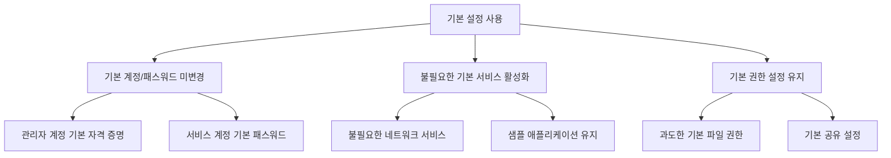
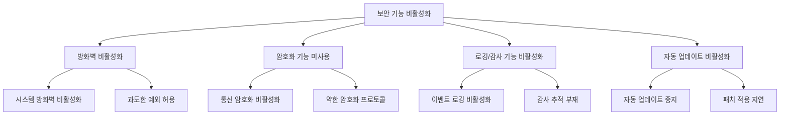
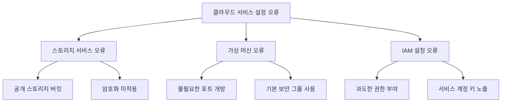

# 설정 오류 취약점

## 시스템 취약점

### 개요
설정 오류 취약점은 시스템 보안의 중요한 영역으로, 소프트웨어나 하드웨어의 기술적 결함이 아닌 부적절한 구성으로 인해 발생하는 보안 약점을 의미합니다. 이 장에서는 설정 오류 취약점의 유형, 주요 사례, 그리고 이에 대한 대응 방안에 대해 살펴봅니다.

### 설정 오류 취약점의 이해

#### 설정 오류 취약점의 정의
설정 오류 취약점은 시스템이나 응용프로그램의 부적절한 구성으로 인해 발생하는 보안 약점으로, 기술적 결함이 아닌 관리적 실수에 기인합니다:

- **설정 오류 취약점의 특성**:
  - 패치로 해결되지 않음
  - 관리자의 지식 부족이나 실수로 발생
  - 기본 설정 사용으로 인한 위험
  - 발견 및 수정이 상대적으로 용이
  - 다양한 시스템에 영향을 미침

#### 설정 오류와 다른 취약점의 차이
설정 오류 취약점은 다른 유형의 취약점과 몇 가지 중요한 차이점이 있습니다:

1. **원인**:
   - 설정 오류: 관리적 실수, 부적절한 구성
   - 소프트웨어 취약점: 코드 결함, 설계 오류

2. **해결 방법**:
   - 설정 오류: 구성 변경, 설정 최적화
   - 소프트웨어 취약점: 패치 적용, 코드 수정

3. **발견 방법**:
   - 설정 오류: 구성 검토, 보안 기준 비교
   - 소프트웨어 취약점: 코드 분석, 취약점 스캐닝

### 주요 설정 오류 취약점 유형

#### 기본 설정 사용
많은 시스템과 응용프로그램은 보안보다 편의성을 우선시하는 기본 설정으로 제공됩니다:

1. **기본 계정 및 패스워드 미변경**:
   - 관리자 계정의 기본 자격 증명 유지
   - 내장된 서비스 계정의 기본 패스워드 사용
   - 공개적으로 알려진 기본 자격 증명 사용
   - 약한 기본 패스워드 정책

2. **불필요한 기본 서비스 활성화**:
   - 사용하지 않는 네트워크 서비스 실행
   - 불필요한 시스템 기능 활성화
   - 샘플 애플리케이션 및 페이지 유지
   - 디버그 및 테스트 기능 활성화

3. **기본 권한 설정 유지**:
   - 과도한 기본 파일 권한
   - 기본 사용자 권한 프로필 사용
   - 기본 공유 설정 유지
   - 기본 보안 정책 미변경

#### 과도한 권한 부여
필요 이상의 권한을 부여하는 것은 심각한 보안 위험을 초래합니다:

1. **필요 이상의 사용자 권한**:
   - 일반 사용자에게 관리자 권한 부여
   - 직무에 불필요한 권한 할당
   - 권한 분리 원칙 미적용
   - 임시 권한의 영구화

2. **과도한 파일 시스템 권한**:
   - 중요 파일에 대한 과도한 접근 권한
   - 모든 사용자에게 쓰기 권한 부여
   - 실행 가능한 디렉토리에 쓰기 권한 부여
   - 시스템 파일에 대한 불필요한 권한

3. **서비스 계정의 과도한 권한**:
   - 서비스 실행에 관리자 권한 사용
   - 데이터베이스 접근에 루트 계정 사용
   - 애플리케이션 실행에 과도한 시스템 권한
   - 최소 권한 원칙 미적용

#### 보안 기능 비활성화
보안 기능을 비활성화하면 시스템이 다양한 공격에 취약해집니다:

1. **방화벽 비활성화**:
   - 시스템 방화벽 완전 비활성화
   - 과도하게 허용적인 방화벽 규칙
   - 불필요한 포트 개방
   - 특정 애플리케이션에 대한 예외 과다

2. **암호화 기능 미사용**:
   - 통신 암호화 비활성화(HTTP 사용)
   - 약한 암호화 프로토콜 허용(SSLv3, TLS 1.0)
   - 데이터 저장 시 암호화 미적용
   - 약한 암호화 알고리즘 사용

3. **로깅 및 감사 기능 비활성화**:
   - 시스템 이벤트 로깅 비활성화
   - 보안 관련 이벤트 로깅 미설정
   - 로그 보존 기간 부족
   - 중요 활동에 대한 감사 추적 부재

4. **자동 업데이트 비활성화**:
   - 운영체제 자동 업데이트 중지
   - 애플리케이션 업데이트 알림 비활성화
   - 보안 패치 적용 지연
   - 업데이트 서버 미구성

#### 불필요한 서비스 및 기능
불필요한 서비스와 기능은 공격 표면을 확대합니다:

1. **불필요한 네트워크 서비스**:
   - 사용하지 않는 네트워크 서비스 실행
   - 원격 관리 서비스 불필요한 활성화
   - 레거시 서비스 유지
   - 중복 서비스 실행

2. **사용하지 않는 프로토콜**:
   - 안전하지 않은 레거시 프로토콜 활성화
   - 불필요한 통신 프로토콜 허용
   - 취약한 네트워크 프로토콜 사용
   - 암호화되지 않은 프로토콜 허용

3. **테스트 및 디버그 기능**:
   - 프로덕션 환경의 디버그 모드 활성화
   - 테스트 계정 및 백도어 유지
   - 상세한 오류 메시지 표시 설정
   - 개발 도구 접근 허용

### 주요 환경별 설정 오류 사례

#### 서버 설정 오류
서버 시스템은 중요한 자산과 데이터를 호스팅하므로 설정 오류가 심각한 결과를 초래할 수 있습니다:

- **웹 서버 설정 오류**:
  - 디렉토리 리스팅 활성화
  - 기본 오류 페이지 사용(상세 정보 노출)
  - HTTP 보안 헤더 미설정(HSTS, CSP 등)
  - 불필요한 HTTP 메소드 허용(PUT, DELETE)

- **파일 서버 설정 오류**:
  - 과도한 공유 폴더 권한
  - 익명 접근 허용
  - 중요 파일에 대한 불충분한 접근 제어
  - 파일 전송 암호화 미적용

- **메일 서버 설정 오류**:
  - 오픈 릴레이 구성
  - 이메일 인증 메커니즘 미적용(SPF, DKIM, DMARC)
  - 약한 암호화 설정
  - 스팸 필터링 미흡

#### 데이터베이스 설정 오류
데이터베이스는 중요한 정보를 저장하므로 설정 오류가 데이터 유출로 이어질 수 있습니다:

- **접근 제어 설정 오류**:
  - 약한 인증 설정(기본 패스워드 사용)
  - 불필요한 원격 접속 허용
  - 과도한 데이터베이스 권한 부여
  - 공개 네트워크에 직접 노출

- **구성 설정 오류**:
  - 불필요한 기능 및 확장 활성화
  - 디버그 및 진단 정보 노출
  - 암호화 미적용(전송 및 저장 데이터)
  - 감사 로깅 비활성화

- **백업 설정 오류**:
  - 불충분한 백업 정책
  - 백업 파일에 대한 부적절한 접근 제어
  - 암호화되지 않은 백업 저장
  - 백업 복구 테스트 부재

#### 네트워크 장비 설정 오류
네트워크 장비는 조직의 통신 인프라를 구성하므로 설정 오류가 광범위한 영향을 미칠 수 있습니다:

- **라우터 및 스위치 설정 오류**:
  - 기본 관리자 자격 증명 사용
  - SNMP 커뮤니티 스트링 기본값 유지
  - 불필요한 관리 인터페이스 활성화
  - 안전하지 않은 관리 프로토콜 사용(텔넷)

- **방화벽 설정 오류**:
  - 과도하게 허용적인 규칙
  - 규칙 순서 오류
  - 기본 허용 정책 사용
  - 불필요한 서비스 허용

- **무선 네트워크 설정 오류**:
  - 약한 암호화 프로토콜 사용(WEP)
  - 기본 SSID 및 패스워드 사용
  - 관리 인터페이스 불충분한 보호
  - 게스트 네트워크 부적절한 분리

#### 클라우드 서비스 설정 오류
클라우드 환경은 특별한 설정 고려사항이 필요하며, 오류가 대규모 데이터 유출로 이어질 수 있습니다:

- **스토리지 서비스 설정 오류**:
  - 과도하게 개방된 스토리지 버킷(S3 등)
  - 공개 접근 가능한 민감 데이터
  - 불충분한 접근 제어 정책
  - 암호화 미적용

- **가상 머신 설정 오류**:
  - 불필요한 포트 개방
  - 기본 보안 그룹 설정 미변경
  - 약한 인증 메커니즘
  - 패치 미적용 이미지 사용

- **IAM 설정 오류**:
  - 과도한 권한 부여
  - 불필요한 관리자 권한 할당
  - 서비스 계정 키 노출
  - 임시 자격 증명의 과도한 수명

### 설정 오류 취약점 대응 방안

#### 보안 기준(Baseline) 수립
일관된 보안 설정을 위한 기준을 수립합니다:

- **효과적인 보안 기준 관리**:
  - 산업 표준 및 가이드라인 참조(CIS, NIST 등)
  - 환경별 맞춤형 보안 기준 수립
  - 정기적인 기준 검토 및 업데이트
  - 자동화된 기준 적용 도구 활용
  - 예외 관리 프로세스 구현

- **보안 설정 표준화**:
  - 표준 보안 구성 템플릿 개발
  - 골든 이미지 및 하드닝 스크립트 사용
  - 설정 변경 관리 프로세스 수립
  - 보안 설정 문서화

#### 설정 검토 및 감사
정기적인 설정 검토로 오류를 식별합니다:

- **주요 검토 활동**:
  - 취약점 스캐닝 및 설정 검증
  - 보안 설정 준수 감사
  - 권한 검토 및 정리
  - 불필요한 서비스 및 기능 식별
  - 침투 테스트를 통한 검증

- **효과적인 감사 방법**:
  - 자동화된 구성 검사 도구 활용
  - 체크리스트 기반 수동 검토
  - 제3자 보안 평가
  - 지속적인 모니터링 구현

#### 설정 관리 자동화
자동화를 통해 설정 오류를 최소화합니다:

- **자동화 도구 및 방법**:
  - 구성 관리 도구 활용(Ansible, Chef, Puppet 등)
  - 인프라스트럭처 코드화(IaC)
  - 컨테이너화 및 불변 인프라 구현
  - 자동화된 검증 및 교정
  - CI/CD 파이프라인에 보안 검증 통합

- **자동화 구현 전략**:
  - 점진적 자동화 도입
  - 자동화 스크립트 버전 관리
  - 자동화 프로세스 테스트
  - 롤백 메커니즘 구현

#### 최소 권한 원칙 적용
필요한 최소한의 권한만 부여하여 보안을 강화합니다:

- **효과적인 권한 관리**:
  - 역할 기반 접근 제어(RBAC) 구현
  - 권한 정기 검토 및 재인증
  - 권한 상승 프로세스 수립
  - 임시 권한 관리(Just-In-Time 접근)
  - 서비스 계정 권한 최소화

- **시스템 권한 최적화**:
  - 파일 시스템 권한 최소화
  - 애플리케이션 샌드박싱
  - 컨테이너 보안 강화
  - 네트워크 세분화 구현

### 좀 더 알아보기: 신흥 환경의 설정 오류 취약점

#### 컨테이너 및 오케스트레이션 환경
컨테이너 기술은 새로운 유형의 설정 오류 위험을 도입했습니다:

- **컨테이너 설정 오류**:
  - 권한 있는 컨테이너 실행
  - 호스트 네트워크 및 IPC 네임스페이스 공유
  - 불필요한 기능 및 권한 부여
  - 취약한 기본 이미지 사용

- **오케스트레이션 설정 오류**:
  - 불안전한 API 서버 구성
  - RBAC 미적용 또는 과도한 권한
  - 네트워크 정책 미구현
  - 시크릿 관리 부실

#### DevOps 및 CI/CD 파이프라인
자동화된 개발 및 배포 환경에서의 설정 오류는 광범위한 영향을 미칠 수 있습니다:

- **CI/CD 파이프라인 설정 오류**:
  - 민감한 자격 증명 하드코딩
  - 파이프라인 권한 과다 부여
  - 보안 검증 단계 생략
  - 불안전한 아티팩트 저장소 구성

- **인프라스트럭처 코드(IaC) 설정 오류**:
  - 보안 설정 누락
  - 하드코딩된 시크릿
  - 버전 관리 시스템의 민감 정보 노출
  - 템플릿의 과도한 권한 설정

#### IoT 및 임베디드 시스템
IoT 기기는 종종 보안보다 기능성을 우선시하여 설계됩니다:

- **IoT 설정 오류**:
  - 기본 자격 증명 미변경
  - 불필요한 서비스 및 포트 활성화
  - 암호화 미적용 또는 약한 암호화
  - 펌웨어 업데이트 메커니즘 부재

- **임베디드 시스템 설정 오류**:
  - 디버그 인터페이스 노출
  - 하드코딩된 자격 증명
  - 불충분한 인증 메커니즘
  - 물리적 보안 통제 부재

### 5가지 키워드로 정리하는 핵심 포인트
1. **기본 설정 위험**: 기본 계정/패스워드, 기본 서비스, 기본 권한 등 초기 설정을 그대로 사용하면 심각한 보안 위험 초래
2. **과도한 권한**: 최소 권한 원칙을 위반한 과도한 권한 부여는 권한 남용 및 권한 상승 공격의 가능성 증가
3. **보안 기능 비활성화**: 방화벽, 암호화, 로깅 등 중요 보안 기능의 비활성화는 다양한 공격에 취약한 환경 조성
4. **불필요한 서비스**: 불필요한 서비스, 프로토콜, 기능의 활성화는 공격 표면을 확대하고 보안 위험 증가
5. **설정 관리 자동화**: 보안 기준 수립, 정기적 검토, 자동화된 설정 관리를 통해 설정 오류 취약점 최소화 가능

### 확인 문제
1. 다음 중 설정 오류 취약점의 특성으로 가장 적절한 것은?
    - [ ] 항상 소프트웨어 패치로 해결된다
    - [ ] 기술적 결함보다는 관리적 실수에 기인한다
    - [ ] 발견 및 수정이 매우 어렵다
    - [ ] 운영체제에만 영향을 미친다

2. 다음 중 클라우드 환경의 설정 오류 취약점이 아닌 것은?
    - [ ] 과도하게 개방된 스토리지 버킷
    - [ ] 불충분한 IAM 정책
    - [ ] 메모리 버퍼 오버플로우
    - [ ] 기본 보안 그룹 설정 미변경

3. 설정 오류 취약점을 완화하기 위한 방법으로 올바른 것을 모두 고르시오.
    - [ ] 모든 사용자에게 관리자 권한 부여
    - [ ] 산업 표준 보안 기준(CIS, NIST 등) 적용
    - [ ] 정기적인 설정 검토 및 감사 수행
    - [ ] 모든 네트워크 포트 개방
    - [ ] 구성 관리 자동화 도구 활용

> [정답 및 해설 보기](../answers_and_explanations.md#03-1-3)
